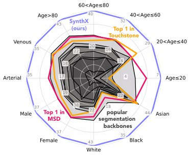

> *Generated by JarvisForResearchers Bot on 2026-06-25*

!!! tip "Why we featured this paper"
    Not yet indexed in S2 — assumed brand-new preprint

## TL;DR
BenchX is a large-scale, open benchmark comprising 85,355 abdominal CT scans. It systematically evaluates 12 tumor-detection AI models to expose performance inconsistencies arising from demographic variations and imaging protocol biases, leveraging LLMs for scalable, fine-grained metadata extraction.

## The Problem
Current state-of-the-art AI models deployed for tumor detection frequently exhibit performance degradation when encountering real-world clinical variations, specifically those related to patient demographics and differing CT imaging protocols. The existing evaluation infrastructure is insufficient because most benchmarks report only aggregate accuracy metrics, thereby obscuring critical biases stemming from population or protocol differences. Furthermore, many existing benchmarks are limited to single or few clinical sites and lack the necessary rich metadata required for systematic, granular bias analysis. Existing mitigation strategies, such as domain adaptation, often rely on narrow datasets and fail to provide a systematic assessment of group-wise performance disparities.

## Key Contributions
We introduce BenchX, a large-scale benchmark featuring fine-grained demographic and protocol annotations designed to systematically expose fairness and domain-generalization gaps in tumor detection and localization models. Our comprehensive evaluation yielded five critical observations: (i) demonstrable demographic disparities across age, sex, and race; (ii) measurable performance degradation contingent upon CT imaging protocols; (iii) amplified detection challenges associated with small tumor sizes and specific tumor locations; (iv) the identification of consistent failure patterns across multiple state-of-the-art models; and (v) validation of these findings across six distinct external cohorts, confirming generalizability. A key methodological contribution is the utilization of large language models (LLMs) to efficiently extract and structure subgroup information from unstructured clinical reports, ensuring the scalability and reproducibility of the analysis.

## How It Works


*Fig. 1: Existing tumor-detection models,
including top leaderboard performers [4,7],
show inconsistent performance across pa-
tient demographics (age, race, sex) and
imaging protocols (contrast phases). This
benchmark (BenchX) systematically mea-
sures and exposes these performance gaps.*

BenchX aggregates a dataset of 85,355 abdominal CT scans sourced from six distinct clinical cohorts: E-Coast, Merlin, PanTS, N-California, S. Europe, and N-Europe. To achieve the necessary fine-grained annotation, a semi-automated pipeline is employed. Tumor annotations are curated through a consistency-check loop, where only cases exhibiting discordant predictions between segmentation and detection models are escalated for expert review by radiologists, thereby ensuring expert-level ground truth. Crucially, a pre-trained LLM is tasked with extracting structured attributes—such as age, sex, race, and contrast phase—from the unstructured clinical reports, followed by a rigorous two-stage quality control protocol. Model evaluation is performed on this dataset using standard scan-level detection metrics (sensitivity, specificity, AUC, F1-score) without any prior fine-tuning of the evaluated models on BenchX.

### BenchX Dataset
This component constitutes the core resource: a large-scale benchmark comprising 85,355 abdominal CT scans. These scans are meticulously annotated with fine-grained metadata covering both patient demographics and specific acquisition protocols across the six contributing clinical cohorts.

### LLM Metadata Extraction
This component details the automated parsing mechanism. A pre-trained LLM is employed to convert unstructured clinical reports into a structured attribute set, adhering to a fixed schema. This process allows for the systematic extraction of variables such as race and contrast phase at scale.

### Consistency-Check Loop
This mechanism ensures annotation fidelity. It operates by filtering predictions: only instances where the segmentation model and the detection model yield discordant results trigger a manual review by a radiologist, thereby maintaining high-quality, expert-verified ground truth for tumor annotations.

## Results
The evaluation revealed significant performance heterogeneity across subgroups. The observed F1 score drop when comparing Arterial vs. Non-contrast to Venous CT was between 15–30%. Furthermore, performance for minority groups on the Merlin cohort was observed as low as 2.5%. When examining top-1 subgroup F1 scores, the E-Coast, PanTS, and N-Europe cohorts showed scores between $\ge 70\%$ and $74\%$, whereas the Merlin, N-California, and S-Europe cohorts exhibited scores between $\ge 30\%$ and $35\%$.

| Metric | Value | Baseline | Source |
| :--- | :--- | :--- | :--- |
| F1 score drop (Arterial/Non-contrast vs Venous) | 15–30% | Venous CT | Section 4.2 |
| F1 score (Minority groups on Merlin) | as low as 2.5% | N/A | Section 1 (Abstract) |
| Top-1 subgroup F1 (E-Coast, PanTS, N-Europe) | $\ge 70\%$–74% | N/A | Section 4.2 |
| Top-1 subgroup F1 (Merlin, N-California, S-Europe) | $\ge 30\%$–35% | N/A | Section 4.2 |

## Why This Matters
The findings underscore that relying solely on the overall average accuracy metric in the evaluation of medical AI systems is fundamentally misleading, as it effectively masks substantial failures occurring within specific demographic or protocol subgroups. This work establishes that rigorous, subgroup-level evaluation—spanning diverse patient demographics (age, sex, race) and varied imaging protocols (arterial, non-contrast, venous, delayed)—is not merely beneficial but critical for engineering truly robust and clinically trustworthy AI systems. Moreover, the successful application of LLMs demonstrates a viable pathway for scaling the curation of complex, fine-grained metadata from otherwise inaccessible unstructured clinical reports.

## Limitations & Open Questions
A primary limitation of this study is that the benchmark evaluation was conducted without applying any additional fine-tuning of the evaluated models specifically on the BenchX dataset. Additionally, when calculating subgroup-specific metrics, cases where the attribute was labeled as "Unknown" (e.g., for race or contrast phase) were necessarily excluded from the computation. Future work should investigate the impact of targeted domain adaptation strategies when applied to BenchX, and explore methods to impute or handle missing attribute labels more robustly within the subgroup analysis framework.

---

## Citation

**Paper:** [2606.24883](https://arxiv.org/abs/2606.24883)

```bibtex
@article{260624883,
  title   = {BenchX: Benchmarking AI Models for Cancer Detection and Localization with Demographic and Protocol Biases},
  author  = {Qi Chen and Wenxuan Li and Pedro R. A. S. Bassi and Xinze Zhou and Jakob Wasserthal and Ibrahim Ethem Hamamci et al.},
  journal = {arXiv preprint arXiv:2606.24883},
  year    = {2026},
  url     = {https://arxiv.org/abs/2606.24883}
}
```
