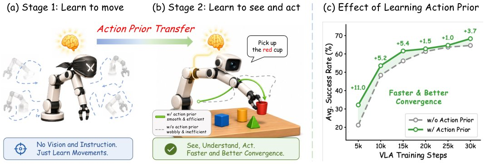

> *Generated by JarvisForResearchers Bot on 2026-06-26*

!!! tip "Why we featured this paper"
    Not yet indexed in S2 — assumed brand-new preprint

## TL;DR
We introduce a two-stage training paradigm for Vision-Language-Action (VLA) models. Stage 1 pretrains a flow-matching encoder-decoder action module exclusively on unconditioned robot action trajectories to distill explicit temporal motion priors. Stage 2 transfers these priors to the VLA framework via decoder reuse, latent distillation, and history compression, decoupling motion dynamics learning from cross-modal alignment to stabilize training and enhance policy performance across diverse embodiments.

## The Problem
Standard VLA architectures typically leverage a pre-trained Vision-Language Model (VLM) backbone, inheriting robust priors regarding visual semantics and linguistic understanding. However, the associated action module is often tasked with learning the underlying physics of motion almost from scratch. This forces the optimization process to simultaneously solve two complex, coupled problems: discovering the latent temporal dynamics of physical action and achieving effective cross-modal alignment between vision/language and action. This joint optimization is inherently unstable, particularly when deploying the system across different robotic embodiments where the action space and dynamics vary significantly.

The gaps in prior work are threefold: first, most VLA models neglect to explicitly pretrain the action module on raw motion data. Second, existing approaches that integrate action modules into foundation VLMs often optimize the entire system end-to-end via imitation learning, resulting in unstable gradients originating from an insufficiently trained action head. Third, most prior attempts to inject action priors rely on visual observations, future-state prediction, or vision-action policy learning, rather than leveraging the raw, unconditioned robot action trajectories themselves.

## Key Contributions
This work makes three primary contributions. First, we propose a novel two-stage training framework that efficiently isolates and learns action-centric robot motion dynamics prior to the computationally intensive cross-modal VLA alignment phase. Second, we introduce a flow-matching encoder-decoder action module capable of learning compact, motion-aware embeddings, which are then effectively transferred as action priors into the VLA training pipeline, yielding a crucial history context token. Third, we validate this approach across 13 distinct cross-embodiment tasks, demonstrating measurable improvements in convergence speed, final success rates, enhanced stability in long-tail scenarios, and favorable scaling behavior as the volume of available action data increases.

## How It Works


*Fig. 1: Illustration of motivation: a policy should first learn to move, and then learn to see and act. (a) In Stage 1, the
action module is trained purely on action trajectories, without any visual observation or language instruction, to efficiently
acquire a general action prior. (b) In Stage 2, t*

The methodology is structured around a sequential, two-stage training process.

In Stage 1, the core objective is to imbue the action module with a strong understanding of temporal motion structure independent of visual or linguistic context. A lightweight, flow-matching-based encoder-decoder action module is trained exclusively on unconditioned action trajectories. The training minimizes an action reconstruction objective, forcing the system to learn a compact representation of the trajectory. The encoder compresses the entire trajectory sequence into a single, dense latent embedding, while the decoder is trained to reconstruct the original action chunk conditioned on this latent state.

In Stage 2, this learned motion prior is injected into the VLA training loop through three distinct mechanisms: decoder reuse, early-stage latent distillation, and history compression. The decoder from Stage 1 is repurposed as the VLA action head. Furthermore, we supervise the VLM's predicted action feature by distilling knowledge from the encoder's structured embedding during early training. Finally, the encoder is utilized as a History Compressor, mapping sequences of past state-action trajectories into a single, temporally rich context token that is fed into the VLM. This decoupling strategy ensures that the difficult task of learning physical dynamics is solved before the complexities of cross-modal alignment are introduced, leading to smoother policy rollouts and accelerated convergence.

### Action Encoder ($E_{\phi_{enc}}$)
The Action Encoder is a Transformer-based architecture designed for trajectory summarization. It accepts a low-level trajectory $\tau = [s_t, a_t, s_{t+1}, a_{t+1}, \dots]$ as input. To generate a fixed-size, representative embedding, it prepends a learnable summary token, $cls$, alongside dataset-specific embeddings $p_k$. The output is a single dense latent embedding $z = E_{\phi_{enc}}(cls, p_k, \tau)$, which serves as the compressed representation of the entire input sequence.

### Flow-matching Action Decoder ($D_{\phi_{dec}}$)
The Flow-matching Action Decoder is conditioned directly on the latent embedding $z$ produced by the encoder. Its function is to model the continuous action distribution. It reconstructs the original action chunk $a$ by optimizing a flow-matching objective. This objective ensures that the decoder accurately maps the compressed latent state back to the high-dimensional, continuous action space.

### VLM Backbone ($\theta$)
The VLM Backbone ($\theta$) constitutes the foundation model responsible for integrating high-level semantic information. It processes the multimodal inputs: visual observations ($o_t$), linguistic instructions ($l_t$), and the temporal context token derived from the History Compressor. This backbone is the primary policy network that utilizes the motion priors provided by the action module.

### Action Module (Stage 1)
This component is the standalone system trained in the initial phase. It consists of the Action Encoder and the Flow-matching Action Decoder. Its sole objective is to acquire the Action Prior by minimizing the action reconstruction loss on raw, unconditioned action trajectories. This phase effectively disentangles the learning of temporal dynamics from the semantic grounding required for VLA.

### History Compressor
In Stage 2, the Action Encoder is repurposed as the History Compressor. Its role is to ingest sequences of past state-action trajectories and distill them into a single, fixed-size latent token, $z_{hist}$. This token encapsulates the necessary temporal context from the history, allowing the VLM to maintain a memory of past actions and states without requiring an exponentially growing input sequence length.

## Results
| Metric | Value | Baseline | Source |
| :--- | :--- | :--- | :--- |
| Convergence/Success Rates | Faster convergence, higher success rates | VLA training without action priors | Figure 1(c) |
| Long-tail Stability | Improved long-tail stability | From-scratch VLA training | Textual description |

## Why This Matters
The decoupling of motion learning from cross-modal alignment is a critical architectural advancement for robust embodied AI. By pretraining the action module on raw dynamics, we provide the VLA system with a structurally sound, physics-informed prior before it encounters the noise and ambiguity of real-world visual and linguistic data. This stabilization translates directly into faster training schedules and higher reliability, especially when deploying models across heterogeneous robotic platforms (cross-embodiment settings). The use of flow-matching provides a mathematically rigorous way to handle the continuous nature of physical actions while the History Compressor offers an efficient mechanism for long-horizon planning within the VLM's context window.

## Limitations & Open Questions
The current methodology necessitates a two-stage training process. This sequential dependency requires careful management of data pipelines and hyperparameter scheduling between the action prior learning phase and the subsequent VLA alignment phase. Furthermore, the latent distillation mechanism in Stage 2 involves gradually relaxing the constraint imposed by the encoder's structured embedding onto the VLM's predicted action feature. The precise rate and schedule of this relaxation remain an area for further investigation to optimize the transfer efficiency without introducing unnecessary noise.

---

## Citation

**Paper:** [2606.26095](https://arxiv.org/abs/2606.26095)

```bibtex
@article{260626095,
  title   = {Learning Action Priors for Cross-embodiment Robot Manipulation},
  author  = {Dong Jing and Tianqi Zhang and Jiaqi Liu and Jinman Zhao and Zelong Sun and Li Erran Li et al.},
  journal = {arXiv preprint arXiv:2606.26095},
  year    = {2026},
  url     = {https://arxiv.org/abs/2606.26095}
}
```
