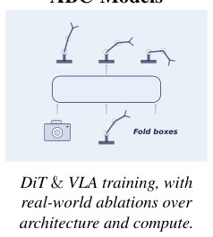

> *Generated by JarvisForResearchers Bot on 2026-06-27*

!!! tip "Why we featured this paper"
    Not yet indexed in S2 — assumed brand-new preprint

## TL;DR
ABC introduces a fully open-source stack for behavior cloning in robot manipulation, centered around the ABC-130K dataset, allowing for reproducible exploration of model architectures and training recipes.

## The Problem
Progress in robot manipulation using behavior cloning is opaque because state-of-the-art systems are often developed on proprietary datasets, and the necessary training recipes and evaluation infrastructure are not publicly available, making it difficult for researchers to reproduce results or determine key design drivers. Existing open datasets lack sufficient scale, rely on bespoke and expensive hardware platforms, or lack necessary training infrastructure and evaluation suites. Furthermore, state-of-the-art systems are often developed in industry labs on proprietary datasets, and training recipes for state-of-the-art systems rarely provide enough detail to reproduce results or determine which design choices drive performance.

## Key Contributions
The primary contributions are:
1. **ABC-130K**: The largest open-source teleoperation dataset to date, featuring 3,500 hours of data spanning over 130K episodes across 195 diverse tasks.
2. **Open-sourcing the entire stack**: This includes the hardware setup, training infrastructure, and simulation pipeline.
3. **Co-training recipe**: Providing a recipe that produces correlated simulation and real-world evaluation for reliable proxy testing.

## How It Works


*Figure 2: An overview of the ABC stack. ABC-130K provides large-scale real-world teleoperation
data. ABC-Models instantiates DiT and VLA policies and studies architecture and compute-scaling
choices through real-world ablations. ABC-Sim provides simulation environments and data for studying
sim-to-r*

The ABC stack facilitates behavior cloning by leveraging ABC-130K, a massive real-world teleoperation dataset. Researchers explore two policy families: ABC-DiT (Diffusion Transformer) and ABC-VLA (Vision-Language-Action). For ABC-DiT, variants are tested using different vision encoders (CLIP ViT-B, DINOv3 ViT-B) and conditioning schemes (CLIP-AdaLN, CLIP-Cross-Attention, DINO-Cross-Attention). For ABC-VLA, three connectors are compared: Cross Attention, Cross Attention + FAST, and Adaptive LayerNorm (AdaLN). Performance is evaluated using offline metrics (training loss, validation action error) and real-world rollouts via ABC-Eval, allowing for systematic ablation studies on architecture and compute scaling.

### ABC-130K
This dataset constitutes the foundation of the stack. It is the largest open-source teleoperation dataset, comprising 3,500 hours of real-world interaction across 130,000 episodes and 195 distinct tasks.

### ABC-Models
This component instantiates the ABC-DiT and ABC-VLA policies. It is designed to study architecture and compute-scaling choices through real-world ablations, allowing for systematic comparison between different policy designs and conditioning mechanisms.

### ABC-Sim
This component provides simulation environments and 400 hours of simulation teleoperation data. Its purpose is to enable the study of sim-to-real correlation through a co-training recipe.

### ABC-Eval
This provides a large-scale real-world evaluation suite. It includes rollouts and rubrics, encompassing over 100 hours of real-world policy rollouts, which serve as the ground truth for performance assessment.

## Results
| Metric | Value | Baseline | Source |
| :--- | :--- | :--- | :--- |
| Aggregate Mean strict success (VLA) | 32.9% | N/A | Table 1 |
| Mean progress (VLA) | 67.5% | N/A | Table 1 |
| Strict success (DiT, DINOv3-xattn CLIP-adaln) | 73.5% | N/A | Table 1 |
| Mean progress (DiT, DINOv3-xattn CLIP-adaln) | 93.1% | N/A | Table 1 |
| Real-world task success (DiT vs VLA) | DiT outperforms VLA for smaller batch sizes | VLA | Figure 5 |
| Real-world task success (DiT vs VLA) | VLA outperforms DiT for batch size 9216 | DiT | Figure 5 |

## Why This Matters
The ABC stack provides a reproducible toolkit to learn the 'ABCs of Behavior Cloning' in robot manipulation. Furthermore, the validation action error shows the strongest negative correlation with real-world performance, establishing it as a useful cheap proxy metric for initial screening. Finally, the results indicate that scaling batch size significantly impacts performance, with VLA demonstrating a larger performance jump at higher batch sizes, such as 9216.

## Limitations & Open Questions
A primary limitation is that offline metrics cannot reliably predict task success rates or reveal specific failure modes encountered during deployment. Additionally, the utility of the validation action error metric is conditional; it is only meaningful when the number of diffusion steps is held fixed across comparisons.

---

## Citation

**Paper:** [2606.27375](https://arxiv.org/abs/2606.27375)

```bibtex
@article{260627375,
  title   = {Scalable Behavior Cloning with Open Data, Training, and Evaluation},
  author  = {Arthur Allshire and Himanshu Gaurav Singh and Ritvik Singh and Adam Rashid and Hongsuk Choi and David McAllister et al.},
  journal = {arXiv preprint arXiv:2606.27375},
  year    = {2026},
  url     = {https://arxiv.org/abs/2606.27375}
}
```
