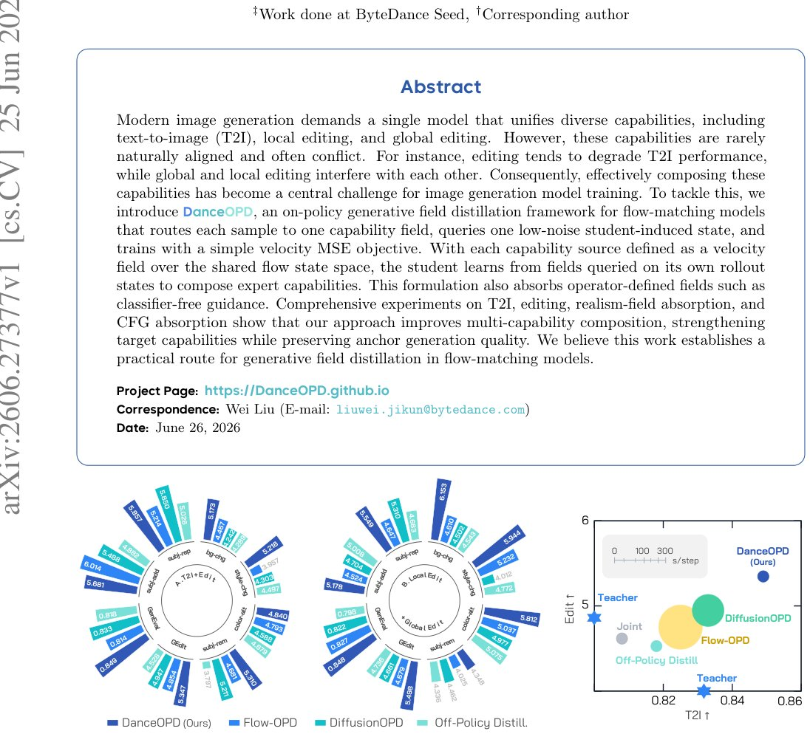

> *Generated by JarvisForResearchers Bot on 2026-06-28*

!!! tip "Why we featured this paper"
    Not yet indexed in S2 — assumed brand-new preprint

## TL;DR
DanceOPD introduces an on-policy generative field distillation framework for flow-matching models. It addresses capability interference in multi-capability generation by hard-routing samples to specific, frozen capability fields, querying these fields on student-induced states, and minimizing velocity MSE. This approach effectively manages target-field ambiguity, state-distribution mismatch, and trajectory-query correlation inherent in composing diverse generative tasks.

## The Problem
Modern generative models are increasingly expected to serve as unified platforms capable of executing diverse functions—such as text-to-image synthesis (T2I), local image editing, and global style transfer—within a single deployed instance. However, when optimizing a single model to accommodate these disparate capabilities, the underlying optimization objectives often conflict. Capabilities are rarely naturally aligned in the parameter space, and attempting to unify them through standard joint training or parameter merging typically results in capability interference, where the model performs sub-optimally across all intended functions.

## Key Contributions
We present DanceOPD, a novel framework that reframes multi-capability image generation as an on-policy generative field distillation problem. Our primary contributions are:

1. Formulating multi-capability image generation as on-policy generative field distillation and introducing DanceOPD, a hard-routed, semantic-side velocity-matching method applied to states visited by the student model.
2. Systematically identifying three critical query-induced alignment challenges—target-field ambiguity, state-distribution mismatch, and trajectory-query correlation—and demonstrating how the architecture is specifically designed to mitigate each.
3. Empirically confirming the efficacy of DanceOPD across complex composition tasks, including T2I and editing composition, as well as its ability to absorb realism and classifier-free guidance (CFG) properties.

## How It Works


*Figure 1 DanceOPD Improves Multi-Capability Composition. Left: Per-metric performance for the two composition
settings, compared with representative baselines. Right: Editing×T2I capability space for their composition, with
marker size denoting per-step training cost. DanceOPD achieves a better comp*

DanceOPD operates by treating each distinct, frozen capability source as a specialized velocity field defined over a shared generative state space. The core innovation lies in how supervision is applied to the student model ($\text{v}_\theta$) using these expert fields.

### Trainable Student ($\text{v}_\theta$)
The student model is the target of the distillation process. Its parameters are iteratively updated to assimilate the diverse capabilities encoded in the frozen sources. It operates within the shared generative state space, evolving according to the flow dynamics.

### Frozen Capability Sources ($\{\text{v}_m\}_{m=1}^M$)
We maintain a set of $M \ge 2$ frozen models, $\{\text{v}_m\}_{m=1}^M$. Each $\text{v}_m$ is pre-trained to excel at a specific capability (e.g., T2I, inpainting). Each $\text{v}_m$ defines a capability-specific velocity field $\text{v}_m(z_t, t, c)$ over the shared state space, where $c$ represents capability-specific conditioning.

### Hard-Routed Sample-Wise Field Matching
To resolve the **target-field ambiguity**—the problem of which expert field should supervise a given sample—we employ hard-routing. Each training sample is deterministically dispatched to exactly one capability field $\text{v}_m$. This ensures that the semantic identity of the sample is preserved during the distillation step, preventing the averaging or dilution of distinct capabilities that occurs in soft-mixing approaches.

### On-Policy Field Querying
To address **state-distribution mismatch**, we must ensure the supervision aligns with the state distribution the student model actually traverses during its rollout. Instead of querying the expert field on a fixed, pre-defined state, we query the selected field $\text{v}_m$ on a stop-gradient state $z'_t$ that is drawn directly from the current student rollout. This grounds the supervision in the student's own visitation distribution.

### Semantic-Side Single Query
To mitigate **trajectory-query correlation**, which arises when multiple samples along a single trajectory are correlated, we enforce the use of a single, low-noise query per sample. This query is strategically placed on the semantic side of the noise schedule, corresponding to the regime where the capability-specific information encoded in the expert fields is most concentrated, thereby maximizing the signal-to-noise ratio for the distillation objective.

The student is trained using a standard velocity Mean Squared Error (MSE) loss, $\mathcal{L}_{\text{MSE}} = \mathbb{E}_{t, z_t, c} [ \| \text{v}_\theta(z_t, t, c) - \text{v}_m(z'_t, t, c) \|^2 ]$, where the routing and querying mechanisms define the specific $\text{v}_m$ and $z'_t$ used for that sample. This simple objective naturally subsumes operator-defined guidance mechanisms, such as Classifier-Free Guidance (CFG).

## Results
The empirical evaluation demonstrates the effectiveness of the DanceOPD framework across various composition tasks and absorption capabilities.

| Metric | Value | Baseline | Source |
| :--- | :--- | :--- | :--- |
| GEditBench (T2I and editing composition) | 8.1% improvement over the best reproduced OPD baseline | Best reproduced OPD baseline | Table 1 |
| GEditBench (T2I and editing composition) | 8.5% improvement over the edit source | Edit source | Table 1 |
| Improvement over best competing composition baseline (local and global edit composition) | 16.1% | Best competing composition baseline | Table 1 |
| Improvement over local edit source (local and global edit composition) | 7.9% | Local edit source | Table 1 |
| Realism reward improvement (realism-field absorption) | 9.9% | Off-policy distillation | Table 1 |
| Student-to-teacher reward gap closure (realism-field absorption) | 85.3% | N/A | Table 1 |
| Improvement over train-only absorption (CFG absorption) | 7.6% | Train-only absorption | Table 1 |

## Why This Matters
DanceOPD provides a principled methodology for constructing highly capable, unified generative models without suffering from the inherent trade-offs of joint optimization. By decoupling the capability expertise into frozen fields and using a targeted, on-policy distillation strategy, we achieve superior performance in complex compositional tasks compared to existing methods that rely on soft mixing or external composition mechanisms. This framework moves the composition logic from an external inference-time procedure into the training objective itself, leading to a more robust and integrated final model.

## Limitations & Open Questions
It must be noted that DanceOPD does not claim global Pareto optimality across the entire space of possible training mixtures; the routing strategy is heuristic based on semantic identity. Furthermore, the current analysis does not fully explore the stress case where the inherent decorrelation provided by SDE-style noise injection only partially mitigates the challenges, suggesting avenues for future investigation into more robust state-space regularization.

---

## Citation

**Paper:** [2606.27377](https://arxiv.org/abs/2606.27377)

```bibtex
@article{260627377,
  title   = {DanceOPD: On-Policy Generative Field Distillation},
  author  = {Wei Zhou and Xiongwei Zhu and Zelin Xu and Bo Dong and Lixue Gong and Yongyuan Liang et al.},
  journal = {arXiv preprint arXiv:2606.27377},
  year    = {2026},
  url     = {https://arxiv.org/abs/2606.27377}
}
```
