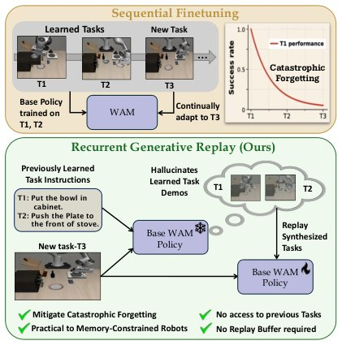

> *Generated by JarvisForResearchers Bot on 2026-06-29*

!!! tip "Why we featured this paper"
    Not yet indexed in S2 — assumed brand-new preprint

## TL;DR
Recurrent Generative Replay (REGEN) is a continual imitation learning framework that leverages World Action Models (WAMs) to synthesize pseudo-replay trajectories, enabling policy rehearsal without storing original human demonstrations.

## The Problem
World Action Models (WAMs) are effective generative frameworks for robot imitation learning. However, when these WAMs are subjected to sequential fine-tuning across a sequence of tasks, they exhibit catastrophic forgetting. Furthermore, established replay-based mitigation strategies fundamentally require access to ground-truth demonstrations from all prior tasks. In modern, memory-constrained robotics deployments, maintaining and replaying large buffers of historical, task-specific demonstrations is often infeasible.

## Key Contributions
We introduce Recurrent Generative Replay (REGEN), which is the first replay-based continual imitation learning framework to utilize the generative capabilities of WAMs to synthesize replay trajectories without requiring the storage of real demonstrations from previous tasks. We demonstrate that REGEN substantially mitigates catastrophic forgetting in both simulated and real-world manipulation settings while maintaining strong forward transfer capabilities. Finally, we identify the primary limitations preventing generated replay from perfectly matching real experience replay: namely, long-horizon degradation in visual generation and inconsistencies between predicted observations and actions.

## How It Works


*Figure 1: Overview of REGEN. Sequential fine-
tuning of WAMs leads to catastrophic forgetting
(top). REGEN leverages the WAM’s generative
capabilities to hallucinate pseudo-demonstrations
of previously learned tasks, replaying them along-
side new task data to mitigate forgetting without
storing any*

REGEN adapts a pre-trained WAM policy, $\pi_{\theta_0}$, to a novel task $T_k$ while ensuring performance retention on previously learned tasks $T_{prev}$. The core mechanism involves generating synthetic demonstrations for each $T_i \in T_{prev}$. This generation is conditioned on the task instruction $\ell_i$ and is initialized using a real observation sampled from the current task $T_k$. The process proceeds through initialization, recurrent generation, and termination. These synthetic trajectories ($\tilde{\tau}_i$) are aggregated into a replay buffer $R_k$. The policy is then updated via behavioral cloning on the combined dataset $D_k \cup R_k$, utilizing the loss: $\min_{\theta} E_{(o_t, a_t, \ell) \sim D_k \cup R_k} [L_{BC} (\pi_{\theta}(o_t, \ell), a_t)]$.

### World Action Model (WAM)
The WAM serves as the generative core. It is a framework designed to jointly model future actions ($\tilde{a}_{t:t+H}$), future visual observations ($\tilde{o}_{t+H}$), and task progress ($\tilde{r}_t$). This modeling is conditioned on the language instruction ($\ell$) and the current observation ($o_t$): $(\tilde{a}_{t:t+H}, \tilde{o}_{t+H}, \tilde{r}_t) \sim \pi_{\theta} (\cdot | o_t, \ell)$.

### Recurrent Generative Replay (REGEN)
REGEN is the overarching framework that orchestrates the replay mechanism. It recursively queries the WAM to synthesize pseudo-replay trajectories. Crucially, these trajectories are conditioned only on the prior task instructions ($\ell_i$) and observations sampled from the *current* task ($T_k$), thereby eliminating the dependency on storing the original demonstrations from $T_i$.

### Initialization Phase
The rollout process begins with an Initialization Phase. This phase seeds the generative process by using one full action chunk derived from the current-task demonstrations ($D_k$). Specifically, the rollout is initialized using real observations sampled from $D_k$ for the time steps $0 \le t < H$.

### Recurrent Generation Phase
Following initialization, the model enters the Recurrent Generation Phase. Here, the model recursively conditions on its own previously generated observations to produce a fully generative rollout. The state transition is defined as: $o_{i}^{t} = (\tilde{o}_{i}^{t-H:t}, \tilde{o}_{i}^{t}) \sim \pi_{\theta} (\cdot | o_{i}^{t-H}, \ell_i)$ for $H \le t \le T_{max}$. This self-referential generation allows the model to simulate extended sequences based on the learned dynamics.

### Termination
Trajectory generation is governed by a specific Termination criterion. The synthetic trajectory generation halts when the predicted goal reward $\tilde{r}_t$ meets two conditions simultaneously: it must exceed $0.99$ for three consecutive rollout steps, and it must attain a value of $1.0$ at least once within that three-step interval.

## Results
| Metric | Value | Baseline | Source |
| :--- | :--- | :--- | :--- |
| NBT (LIBERO-Object) | 26.1 | Seq-FT [13] | Table 1 |
| NBT (LIBERO-Goal) | 38.7 | Cosmos-Policy [2] Seq-FT | Table 2 |
| NBT (Real-World) | 60.5 | Seq-FT | Table 3 |
| Reduction in Forgetting (Real-World) | up to 50% | sequential fine-tuning | Abstract |

## Why This Matters
The introduction of REGEN provides a novel pathway to continual learning within the context of generative world models. By providing a generative interface to simulate past tasks, it bypasses the significant memory overhead associated with storing large buffers of real demonstrations. The empirical results demonstrate that REGEN significantly reduces catastrophic forgetting compared to naive sequential fine-tuning, achieving performance levels that approach those of privileged experience replay methods.

## Limitations & Open Questions
The current implementation faces two primary limitations that restrict the quality of the pseudo-replay: first, there is degradation in the visual fidelity of future observations during long-horizon recurrent generation. Second, there are observable inconsistencies between the predicted future observations and the corresponding generated actions. Future work must focus on enhancing the WAM's ability to maintain visual fidelity over extended time horizons and enforcing tighter coupling constraints between predicted observations and actions during the recurrent rollout.

---

## Citation

**Paper:** [2606.27374](https://arxiv.org/abs/2606.27374)

```bibtex
@article{260627374,
  title   = {World Action Models Enable Continual Imitation Learning with Recurrent Generative Replays},
  author  = {Manish Kumar Govind and Dominick Reilly and Smit Patel and Hieu Le and Srijan Das},
  journal = {arXiv preprint arXiv:2606.27374},
  year    = {2026},
  url     = {https://arxiv.org/abs/2606.27374}
}
```
