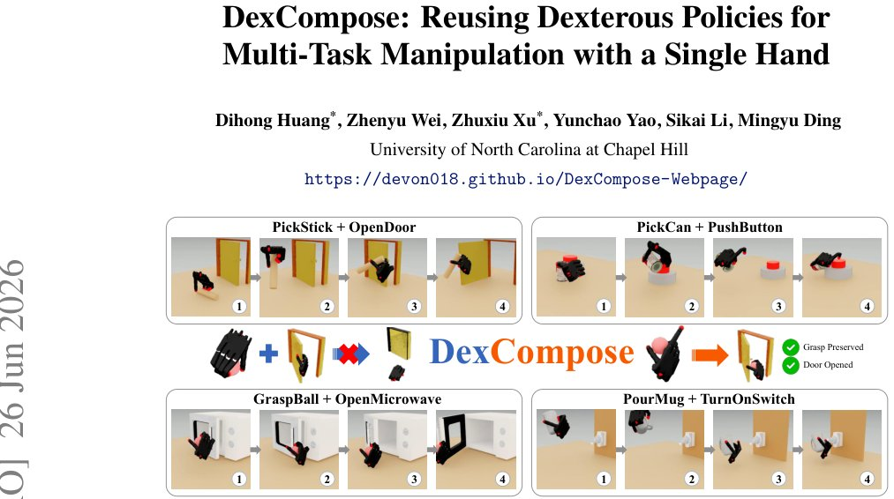

> *Generated by JarvisForResearchers Bot on 2026-06-30*

!!! tip "Why we featured this paper"
    Brand new preprint (2026) — accepted

## TL;DR
DexCompose introduces a role-aware residual composition framework to combine pretrained dexterous manipulation policies for multi-task execution. It addresses destructive interference by explicitly managing finger-level action ownership using dual residual stabilization, allowing two full-hand policies to operate concurrently without joint policy retraining.

## The Problem
Composing dexterous manipulation policies to execute multiple tasks with a single hand presents a significant challenge. When introducing a secondary task, the demands imposed on overlapping fingers and contact modes often conflict with the requirements of maintaining the initial manipulation outcome. This conflict leads to destructive interference, where the execution of the new task compromises the stability or success of the preceding task.

The limitations of prior work are evident:
1. Existing finger-aware methods typically mandate predefined finger allocations or rely on downstream task compositions during grasp generation, data construction, or policy training, severely limiting scalability across diverse task combinations.
2. Simply chaining independently trained policies is inherently unreliable. The downstream policy, controlling the entire hand, frequently overwrites the precise finger motions necessary to maintain the grasp established by the upstream policy.
3. Training a dedicated policy for every composite task scales poorly, necessitating $n \times m$ policies if $n$ grasp-maintenance skills and $m$ downstream interactions are considered.

## Key Contributions
We introduce three primary contributions to address these limitations:
1. We present a post-hoc composition framework for pretrained dexterous manipulation policies. This framework models composite manipulation as an action allocation problem where the preservation of the initial grasp and the execution of the downstream interaction must be reconciled within the constraints of a single high-DoF multi-fingered hand.
2. We propose DexCompose, a role-aware residual pipeline. This pipeline integrates training-free finger attribution, explicit action ownership assignment, and dual residual stabilization to compose two pretrained full-hand policies without requiring policy training for the complete task pair.
3. We empirically validate DexCompose across 16 composite manipulation tasks, demonstrating a substantial performance improvement over both simple policy chaining and unmasked residual baselines.

## How It Works


*Figure 1: DexCompose composes dexterous skills through role-aware finger ownership. By sep-
arating grasp preservation from downstream interaction with asymmetric residuals, the framework
reduces destructive interference and enables robust multi-skill manipulation.*

DexCompose operates through a two-stage process: discovery and composition.

For the **discovery** stage, we determine the necessary finger support for the initial task. Finger attribution identifies which fingers are essential for preserving the Task-A grasp by executing release tests on successful post-task states, yielding a task-specific mask, $m^*$.

For the **composition** stage, we employ a dual residual stabilizer. A bounded Task-A residual ($\Delta q_A^t$) is responsible for maintaining the held-object configuration ($q_{ref}$) specifically on the fingers identified as preserved. Concurrently, a bounded Task-B residual ($\Delta a_B^t$) adapts the downstream policy ($\pi_B$) within its assigned action subspace. The final composed action, $a_{comp}^t$, is synthesized using fixed ownership masks ($M^*_A, M^*_B$), thereby enabling the concurrent execution of both tasks.

### Task A Policy ($\pi_A$)
This is the initial pretrained diffusion policy responsible for executing the first skill. The physical outcome of this skill—the grasp—must be preserved throughout the subsequent interaction.

### Task B Policy ($\pi_B$)
This is the second pretrained diffusion policy responsible for executing the downstream interaction skill. It dictates the motion required for the secondary task.

### Finger Attribution
This component utilizes release tests performed on successful post-grasp states. The objective is to identify the minimal set of fingers required to maintain the Task-A grasp, which results in the task-specific mask $m^*$.

### Bounded Task-A Residual ($\Delta q_A^t$)
This lightweight residual module, parameterized by $\pi_{A}^{res}$, is designed to counteract disturbances and preserve the held-object configuration ($q_{ref}$). Its formulation is: $\Delta q_A^t = \beta_A \odot \tanh(\pi_{A}^{res}(o_t, m^*))$.

### Bounded Task-B Residual ($\Delta a_B^t$)
This residual correction is learned specifically within the action subspace owned by Task B. Its formulation is: $\Delta a_B^t = M^*_B \odot \tanh(\beta_B \odot \pi_{B}^{res}(o_t, a_B^t, m^*))$.

### Task-aware Allocation Agent
This agent is responsible for selecting the final mask $m^*$. It synthesizes information from $\{m, Pret(m), Pclean(m), \eta_B(m)\}$ to achieve an optimal balance between ensuring grasp stability, achieving clean release quality, and maintaining residual dexterity.

## Results
The empirical evaluation demonstrates the efficacy of the DexCompose framework:

| Metric | Value | Baseline | Source |
| :--- | :--- | :--- | :--- |
| Average Composite Success Rate | 77.4% | N/A | Abstract |
| Composite Success Rate (GraspBall + OpenDoor) | $82.69\pm8.33$ | Ours-ZS | Table 1 |
| Mean Composite Success Rate | $77.43\pm2.64$ | N/A | Table 1 |

## Why This Matters
The practitioner takeaways highlight the practical implications of this work. For complex sequential manipulation, explicit action ownership—i.e., precise finger allocation—is critical to preventing destructive interference between concurrent tasks. Furthermore, the dual residual stabilization mechanism, which dedicates one residual to preservation and another to adaptation, proves key to achieving high composite success rates when reusing frozen, pretrained policies. Crucially, this framework enables composition at inference time without necessitating the full retraining of the base policies, offering a scalable methodology for skill reuse in robotic systems.

## Limitations & Open Questions
The current implementation has noted limitations. Specifically, the method requires the collection of 4096 held states for each Task A skill to adequately support the stabilization and cross-task composition procedures. Additionally, we observed that the performance of the Decomposed Action Space baseline exhibits substantial variation across different task combinations, suggesting inherent brittleness in that approach. Future work should investigate methods to reduce the state collection overhead and enhance the robustness of allocation strategies across diverse task pairings.

---

## Citation

**Paper:** [2606.28323](https://arxiv.org/abs/2606.28323)

```bibtex
@article{260628323,
  title   = {DexCompose: Reusing Dexterous Policies for Multi-Task Manipulation with a Single Hand},
  author  = {Dihong Huang and Zhenyu Wei and Zhuxiu Xu and Yunchao Yao and Sikai Li and Mingyu Ding},
  journal = {arXiv preprint arXiv:2606.28323},
  year    = {2026},
  url     = {https://arxiv.org/abs/2606.28323}
}
```
