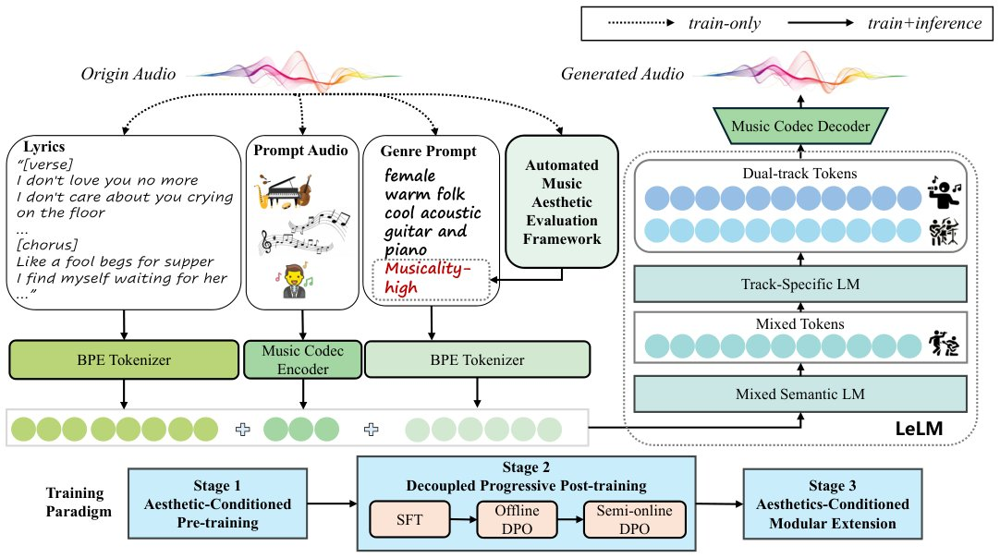

> *Generated by JarvisForResearchers Bot on 2026-07-01*

!!! tip "Why we featured this paper"
    Brand new preprint (2026) — accepted

## TL;DR
LeVo 2 introduces a hybrid LLM-Diffusion framework that resolves the inherent tension between maintaining global song coherence and capturing fine-grained, track-specific acoustic detail. It achieves this via hierarchical modeling—where a Mixed Semantic LM handles high-level planning, and a parallel Track-Specific LM refines vocal and accompaniment details—coupled with an aesthetics-guided, progressive post-training schedule.

## The Problem
The generation of full-length, coherent musical compositions presents a significant architectural challenge. A successful system must simultaneously ensure global musicality, accurately render intricate vocal and accompaniment acoustics, and adhere strictly to textual prompts. Current methodologies are constrained by a structural trade-off: tokenizing the entire composition into a single stream using mixed tokens tends to obscure the necessary track-specific acoustic fidelity due to vocabulary limitations and mutual acoustic masking. Conversely, approaches that attempt to model tracks separately result in prohibitively long input sequences, which severely degrades the model's capacity for long-range musical planning and instruction following. Furthermore, existing preference alignment techniques often suffer from gradient conflicts when attempting to optimize multiple, sometimes competing, objectives simultaneously, and they typically rely solely on static, offline paired datasets.

## Key Contributions
LeVo 2 addresses these limitations through three primary contributions:
1. **Hierarchical Modeling:** The framework decomposes the generation task by having the Mixed Semantic LM manage global semantic planning via mixed tokens, while the Track-Specific LM predicts vocal and accompaniment tokens in parallel for localized, track-specific refinement.
2. **Aesthetics-Guided Training:** We introduce an automated music aesthetic evaluation framework that assigns musicality-tier conditions during the pre-training phase, embedding musical priors directly into the model's foundational knowledge.
3. **Progressive Post-Training:** We implement a staged refinement process—SFT followed by large-scale offline DPO, and concluding with closed-loop semi-online DPO—to systematically improve generation quality, controllability, and musicality while mitigating optimization conflicts.

## How It Works


*Fig. 1.
Overview of LeVo 2. LeLM performs hierarchical semantic planning over mixed and dual-track tokens, while the diffusion-based Music Codec
reconstructs the generated tokens into full-length song audio. The bottom panel summarizes the training paradigm: pre-training establishes global semantic
*

LeVo 2 operates on a hybrid LLM-Diffusion paradigm. The process begins with the **Mixed Semantic LM**, which functions as the global planner, outputting mixed tokens ($S_m$) that encode high-level structural elements such as melody, rhythm, and tempo. These hidden states are then passed to the **Track-Specific LM**. This module operates in parallel, predicting the vocal tokens ($S_v$) and accompaniment tokens ($S_a$) independently, conditioned on the contextual embeddings provided by the Mixed Semantic LM. This parallel prediction allows for fine-grained acoustic detail capture without the sequence length explosion associated with joint modeling. Finally, the **Music Codec**, a diffusion-based system, synthesizes the sequence of mixed, vocal, and accompaniment tokens into the final, high-fidelity song waveform. The training regimen is structured in three phases: pre-training utilizing the **Automated Music Aesthetic Evaluation Framework** to inject musicality priors; progressive post-training to decouple optimization objectives; and modular extension for targeted acoustic refinement.

### Mixed Semantic LM
This component is implemented as a decoder-only Transformer architecture. Its function is strictly supervisory at the macro level; it predicts mixed tokens ($S_m$) designed to encapsulate the overarching structural and semantic blueprint of the desired music. This abstraction layer allows the model to maintain a global view of the composition's trajectory.

### Track-Specific LM
This module is designed to be lightweight relative to the global planner. It receives the contextualized hidden states from the Mixed Semantic LM and operates to predict two distinct streams in parallel: $S_v$ (vocal tokens) and $S_a$ (accompaniment tokens). This parallel structure is key to isolating and refining acoustic details for each track type without forcing them into a single, overly long sequence.

### Music Codec
This is the generative realization stage. It employs a diffusion-based architecture. Its role is to map the discrete token sequences—comprising $S_m$, $S_v$, and $S_a$—into continuous, high-fidelity audio waveforms. The diffusion process enables the reconstruction of complex acoustic textures from the structured token representations.

### Automated Music Aesthetic Evaluation Framework
This framework is integral to the pre-training phase. It functions as an external oracle, analyzing large-scale datasets to assign specific musicality-tier conditions to the data samples. By conditioning the model on these tiers, we effectively inject a quantifiable prior regarding desirable musical qualities directly into the initial training distribution.

## Results
| Metric | Value | Baseline | Source |
| :--- | :--- | :--- | :--- |
| Overall Musicality, Melody, Arrangement, Instrumental Sound Quality, Vocal Sound Quality, and Structure | Significantly outperforms all open-source baselines across all dimensions | Open-source baselines | Extensive experiments |

## Why This Matters
The LeVo 2 architecture provides a principled mechanism for navigating the fundamental trade-off in generative music AI: the tension between high-level structural coherence and low-level acoustic fidelity. By decoupling these concerns hierarchically, we circumvent the scalability bottlenecks of monolithic sequence modeling while avoiding the semantic ambiguity of overly coarse tokenization. Furthermore, the staged, progressive post-training regimen offers a robust methodology for aligning complex generative models with nuanced human preferences, a capability often brittle in single-stage optimization loops.

## Limitations & Open Questions
The current implementation necessitates a complex, multi-stage training paradigm, involving initial pre-training, followed by sequential fine-tuning steps (SFT $\rightarrow$ offline DPO $\rightarrow$ semi-online DPO), and subsequent modular extension. This complexity increases the engineering overhead significantly. Additionally, the inherent reliance on the hierarchical structure demands meticulous management of the information flow; ensuring that the high-level semantic guidance from the Mixed Semantic LM is sufficiently rich yet not overly restrictive to the fine-grained predictions of the Track-Specific LM remains a critical area for ongoing investigation.

---

## Citation

**Paper:** [2606.30642](https://arxiv.org/abs/2606.30642)

```bibtex
@article{260630642,
  title   = {LeVo 2: Stable and Melodious Song Generation via Hierarchical Representation Modeling and Progressive Post-Training},
  author  = {Shun Lei and Huaicheng Zhang and Dapeng Wu and Yaoxun Xu and Lishi Zuo and Wei Tan et al.},
  journal = {arXiv preprint arXiv:2606.30642},
  year    = {2026},
  url     = {https://arxiv.org/abs/2606.30642}
}
```
