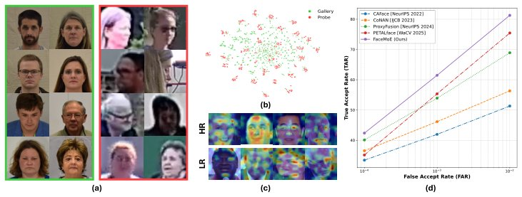

> *Generated by JarvisForResearchers Bot on 2026-07-02*

!!! tip "Why we featured this paper"
    Brand new preprint (2026) — accepted

## TL;DR
FaceMoE integrates a Mixture of Experts (MoE) mechanism into the transformer encoder's MLP layers. This design utilizes a top-k router to sparsely activate specialized experts, enabling resolution-aware feature extraction for low-resolution face recognition (LR-FR) while mitigating catastrophic forgetting and bridging the domain gap between HR gallery and LR probe images.

## The Problem
Low-resolution face recognition (LR-FR) presents several interconnected challenges. Primarily, the degraded nature of probe images leads to poor feature extraction and aggregation capabilities. Second, there is a significant domain gap between the high-resolution (HR) images typically used for training the gallery and the low-resolution (LR) images encountered during inference. Finally, when fine-tuning models on these LR datasets, there is a substantial risk of catastrophic forgetting, where the model loses generalizable knowledge acquired during pre-training.

Existing approaches have limitations. Methods focused on feature fusion, such as CAFace, CoNAN, and ProxyFusion, are fundamentally constrained by the quality of the underlying feature encoders they employ. Furthermore, while PETALface [41] introduced quality-adaptive dual low-rank modules, its efficacy in the low-resolution domain remains inferior to contemporary state-of-the-art methods. Crucially, prior research has not explored the application of Mixture of Experts (MoE) architectures specifically for the LR-FR task.

## Key Contributions
We introduce FaceMoE, a modified transformer encoder that incorporates sparsely activated FFN experts. This architecture efficiently adapts to low-resolution datasets while simultaneously minimizing catastrophic forgetting and addressing the domain gap inherent in LR-FR. We propose a top-k router responsible for assigning each input token to a subset of FFN experts, which facilitates resolution-aware feature extraction by allowing experts to specialize in distinct semantic facial regions. The empirical validation demonstrates superior performance of FaceMoE across eleven diverse datasets, encompassing HR, mixed-quality, and LR scenarios.

## How It Works


*Fig. 1: (a) BRIAR gallery and probe. (b) Domain difference between gallery and probe.
(c) Activation maps corresponding to LR and HR images. (d) SOTA results on BRIAR
Protocol 3.1.*

FaceMoE modifies the standard transformer block by replacing the monolithic Feed-Forward Network (FFN) with a Mixture of Experts (MoE) layer. This layer consists of $N$ distinct expert MLPs. The process begins with the **Top-k Router**, which computes routing scores $z_t$ for every input token $x_t$ via a linear projection $W_r$. The router then selects the indices corresponding to the top-$k$ scoring experts, normalizing these logits into routing probabilities $w_{i_j}(x_t)$. The final output $y_t$ for the token is computed as a convex combination of the outputs from the selected experts. Training stability is maintained through a composite objective function: $\mathcal{L}_{\text{total}} = \mathcal{L}_{\text{face}} + \lambda_z \mathcal{L}_z + \lambda_b \mathcal{L}_{\text{balance}}$, where $\mathcal{L}_{\text{face}}$ is the CosFace loss, $\mathcal{L}_z$ is the router z-loss, and $\mathcal{L}_{\text{balance}}$ is the load balancing loss.

### MoE-MLP Layer
This component substitutes the conventional FFN within a transformer block. It is structured around $N$ expert MLPs. Each individual expert $f_i(x_t)$ is implemented as a two-layer fully connected network, utilizing GELU activation. The parameters for expert $i$ are defined by weights $\{W_{i,1}, W_{i,2}\}$ and biases $\{b_{i,1}, b_{i,2}\}$.

### Top-k Router
The **Top-k Router** is responsible for dynamic expert selection. For an input token $x_t$, it calculates the expert selection logits $z_t = x_t W_r$. It then employs the $\mathrm{TopK}(z_t)$ operation to identify the indices of the $k$ experts with the highest logits. These logits are subsequently normalized using softmax to yield the routing probabilities $w_{i_j}(x_t)$ for the selected experts.

### Expert $i$ ($f_i$)
An individual expert, denoted $f_i$, is a parameterized MLP defined by $\theta_i$. Its operation on an input token $x_t$ is given by the expression: $f_i(x_t) = W_{i,2} \cdot \sigma (W_{i,1} x_t + b_{i,1}) + b_{i,2}$, where $\sigma$ is the GELU activation function.

### Router z-loss ($\mathcal{L}_z$)
This regularization term is designed to control the magnitude of the routing logits. It penalizes large values in $z_t$ across the batch $B$ and sequence length $T$: $\mathcal{L}_z = \lambda_z \cdot \frac{1}{B \cdot T} \sum_{b=1}^B \sum_{t=1}^T \| z_{b,t} \|_2^2$.

### Load Balancing Loss ($\mathcal{L}_{\text{balance}}$)
To ensure that no single expert becomes disproportionately utilized, the **Load Balancing Loss** promotes uniform expert utilization. It is formulated as: $\mathcal{L}_{\text{balance}} = \lambda_b \cdot N \cdot \frac{1}{(B \cdot T)^2} \sum_{i=1}^N \left ( \sum_{b=1}^B \sum_{t=1}^T p_{b,t,i} \right ) \cdot \left ( \sum_{b=1}^B \sum_{t=1}^T \mathbb {1}\left [ i \in \mathrm {TopK}(z_{b,t}) \right ] \right )$.

## Results
| Metric | Value | Baseline | Source |
| :--- | :--- | :--- | :--- |
| Performance | significantly outperforms state-of-the-art methods | state-of-the-art methods | Abstract |

## Why This Matters
The integration of MoE into the transformer encoder provides a mechanism for scaling model capacity without a proportional increase in computational cost. The use of a top-k router allows for sparse expert activation, which translates to a 2.17$\times$ increase in model capacity while incurring only a 1.66$\times$ increase in FLOPs. This efficiency is critical for deploying complex models in resource-constrained environments. Furthermore, by allowing experts to specialize in different semantic facial regions, FaceMoE achieves resolution-aware feature extraction, directly addressing the core difficulty of LR-FR.

## Limitations & Open Questions
A primary limitation noted is the lack of specific quantitative performance metrics across the eleven evaluated datasets; the paper only asserts that the method "significantly outperforms" existing SOTA. Additionally, the training procedure is complex, relying on a composite objective function involving three distinct loss components ($\mathcal{L}_{\text{face}}$, $\mathcal{L}_z$, and $\mathcal{L}_{\text{balance}}$). This necessitates meticulous and careful hyperparameter tuning for the weighting factors ($\lambda, \lambda_z, \lambda_b$) to ensure stable convergence.

---

## Citation

**Paper:** [2606.32040](https://arxiv.org/abs/2606.32040)

```bibtex
@article{260632040,
  title   = {FaceMoE: Mixture of Experts for Low-Resolution Face Recognition},
  author  = {Kartik Narayan and Vishal M. Patel},
  journal = {arXiv preprint arXiv:2606.32040},
  year    = {2026},
  url     = {https://arxiv.org/abs/2606.32040}
}
```
