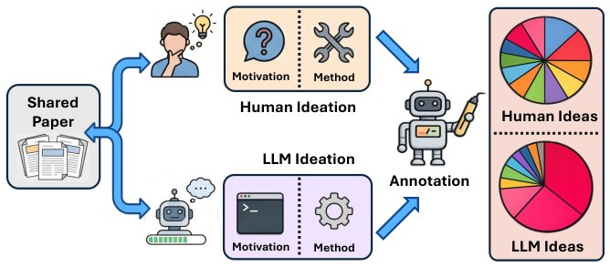

> *Generated by JarvisForResearchers Bot on 2026-07-03*

!!! tip "Why we featured this paper"
    Brand new preprint (2026) — accepted

## TL;DR
We introduce a framework to quantify the distributional gap between research ideas generated by Large Language Models (LLMs) and those realized by human researchers. By employing a two-axis research-taste taxonomy (Opportunity Pattern and Method Paradigm), we demonstrate that LLM-generated ideas are systematically concentrated around 'bridge-like' opportunities and 'synthesis' methods, diverging from the broader distribution observed in human-written scientific literature.

## The Problem
Current methodologies for evaluating LLM-generated research ideas typically assess individual outputs based on discrete metrics such as novelty, feasibility, or perceived impact. This approach is insufficient because it fails to address the fundamental question of how the *aggregate distribution* of LLM-generated ideas compares to the distribution of ideas that actually constitute published human research. Specifically, prior work has not investigated whether the overall pattern of LLM ideation mirrors the distribution of ideas found in human-written scientific papers, necessitating a shift from individual idea assessment to a complementary distributional analysis of research taste.

## Key Contributions
This work makes three primary contributions:
1. Building a large-scale evaluation framework specifically designed for ideation derived from high-quality human research papers.
2. Introducing a two-axis research-taste taxonomy that profiles research ideas based on their underlying opportunity pattern and chosen method paradigm.
3. Quantifying the divergence between human and LLM ideas, revealing that LLM outputs exhibit a disproportionate concentration around 'bridge-like' opportunities and 'synthesis' methods.

## How It Works


*Figure 1: Overview of our research-taste gap analysis. From a shared literature context, humans contribute the
paper idea while LLMs generate new ideas from the same prior works. Each idea is decomposed into a motivation
and a method, then annotated with a research-taste taxonomy. Comparing the resu*

The core of the framework operates on a constrained literature-grounded ideation task. In this setup, LLMs are tasked with generating a research idea—comprising a motivation ($m_i$) and a proposed method ($s_i$)—conditioned on a small set of related prior work titles and abstracts, thereby mimicking the grounding process of human scientific writing. Human ideas are extracted directly from published papers. Both the human and LLM-generated ideas are subsequently annotated using the two-dimensional Research-Taste Taxonomy. This taxonomy captures two orthogonal dimensions: the Opportunity Pattern (addressing *why* a study is needed) and the Method Paradigm (addressing *how* the gap is addressed). Distributional comparisons between the two sets of annotated ideas are performed using metrics such as Total Variation Distance (TVD), Jensen-Shannon Divergence (JSD), and normalized entropy to characterize the systematic shift in the LLM output distribution relative to the established human research taste distribution.

### Literature-Grounded Ideation Task
Each instance in the evaluation set is defined by a set of related prior works, $X_i = \{(t_{i1}, a_{i1}), \dots, (t_{ik}, a_{ik})\}$, where $t$ denotes the title and $a$ denotes the abstract. The target output for the ideation task is a research idea $y_i = (m_i, s_i)$, where $m_i$ is the formulated motivation and $s_i$ is the proposed methodological approach.

### Research-Taste Taxonomy
This taxonomy is structured around two axes. The first axis, Opportunity Pattern, categorizes the underlying rationale for the research (e.g., Puzzle / Contradiction, Bridge Opportunity). The second axis, Method Paradigm, describes the approach taken to address the identified gap (e.g., Synthesis / Unification, Formal Derivation).

### LLM-Assisted Extraction Pipeline
This pipeline is employed to systematically derive the core research idea from a published paper. Furthermore, it is used to reverse-engineer the 4 to 8 most highly relevant prior studies that underpin the human-authored paper, ensuring the human data is similarly grounded.

### LLM Annotator (GPT-5.4-mini)
This specific LLM instance is utilized for the large-scale annotation process. It is tasked with labeling every human and LLM-generated idea with primary and secondary labels corresponding to both the Opportunity Pattern and Method Paradigm axes. Additionally, it provides diagnostic scores related to the quality of the idea's construction, such as surface stitching, bottleneck specificity, and boilerplate content.

## Results
The distributional analysis reveals systematic biases in LLM ideation relative to human research taste.

| Metric | Value | Baseline | Source |
| :--- | :--- | :--- | :--- |
| Opportunity Pattern Entropy (Human) | above 0.92 | N/A | Table 1 |
| Opportunity Pattern Entropy (LLM) | ranges from 0.550 to 0.758 | Human | Table 1 |
| Method Paradigm Entropy (Human) | above 0.92 | N/A | Table 1 |
| Method Paradigm Entropy (LLM) | ranges from 0.723 to 0.879 | Human | Table 1 |
| Bridge Opportunity Labeling (Human) | 12.1% | LLM | Section 4.2 |
| Bridge Opportunity Labeling (LLM) | 47.1% to 64.2% | Human | Section 4.2 |
| Synthesis/Unification Method (Human) | 5.1% | LLM | Section 4.2 |
| Synthesis/Unification Method (LLM) | 22.5% to 38.7% | Human | Section 4.2 |

## Why This Matters
The findings indicate that while LLMs are capable of generating coherent research ideas, their output distribution is not representative of the full spectrum of human scientific inquiry. The significant concentration of LLM ideas around 'bridge-like' opportunities and 'synthesis' methods suggests a tendency to excel at combining extant knowledge structures. However, this concentration implies a potential deficit in generating the broader range of framing gaps—such as deep contradictions or novel puzzle formulations—that characterize much of high-impact human research. Furthermore, the entropy metrics confirm that the LLM distribution is less diffuse across the research taste space than the human distribution.

## Limitations & Open Questions
The current analysis is constrained by the literature-grounded ideation task; this setup may not fully capture the characteristics of truly open-ended, unconstrained ideation. Additionally, the reliance on an LLM annotator (GPT-5.4-mini) for the large-scale labeling process, despite internal validation checks, represents an inherent dependency in the pipeline. Future work should investigate whether these distributional biases persist when LLMs are tasked with generating ideas without explicit grounding in prior literature.

---

## Citation

**Paper:** [2607.01233](https://arxiv.org/abs/2607.01233)

```bibtex
@article{260701233,
  title   = {Measuring the Gap Between Human and LLM Research Ideas},
  author  = {Ziyu Chen and Yilun Zhao and Arman Cohan},
  journal = {arXiv preprint arXiv:2607.01233},
  year    = {2026},
  url     = {https://arxiv.org/abs/2607.01233}
}
```
