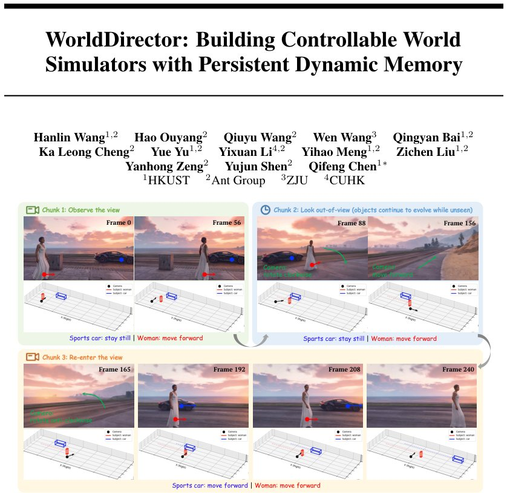

> *Generated by JarvisForResearchers Bot on 2026-07-04*

!!! tip "Why we featured this paper"
    Brand new preprint (2026) — accepted

## TL;DR
WorldDirector is a controllable video world model framework that achieves persistent dynamic object memory by explicitly decoupling 3D semantic motion orchestration from visual generation, using an LLM as a central orchestrator.

## The Problem
The challenge in video generation is maintaining 'Object Permanence' and 'Dynamic Object Memory'—ensuring dynamic entities persist and execute physical movements independently of camera visibility, and that their visual identity remains intact upon re-entry.

Prior work exhibits several shortcomings. Existing methods relying on explicit tracking mechanisms scale poorly and incur prohibitive computational overhead. Approaches relying on implicit trajectory extrapolation from generative priors fail during prolonged camera diversions, leading to trajectory collapse or identity errors. Furthermore, prior work often entangles physical dynamics with pixel rendering, failing to guarantee strict physical logic and appearance stability.

## Key Contributions
We make three primary contributions:
1. Explicitly decoupling semantic motion orchestration from visual generation by leveraging an LLM to coordinate 3D trajectories with camera movements.
2. Introducing an Appearance Binding mechanism that injects RGB dynamic object features from context as visual anchors to prevent identity distortion.
3. Employing a causal autoregressive architecture with persistent dynamic memory to support complex and extended events.

## How It Works


*Figure 1: Controllable world simulation with persistent dynamic memory via WorldDirector.
By decoupling 3D semantic orchestration from latent video synthesis, our framework autoregressively
generates long-horizon videos via causal chunks, ensuring rigorous dynamic memory and object
permanence. Pleas*

WorldDirector operates by using an LLM to translate user instructions into 3D bounding box and camera trajectories, which are then projected into 2D location conditions ($\mathbf{B}$). These conditions, alongside appearance conditions ($\mathbf{A}$) derived from contextual frames, guide a causal autoregressive video generation process built upon the LingBot-World-Base model. To manage memory, retrieved contextual frames ($\mathbf{M}$) are prepended to the noisy latent sequence, and an asymmetric attention mask prevents context pollution. The Temporal Drop Mechanism is used to compel natural motion synthesis driven by trajectories, while the Spatial-Aware Weighted Cross-Attention mechanism ensures fine-grained control by grounding entity-specific text prompts to their corresponding visual regions.

### LLM
The LLM functions as the central orchestrator. Its role is to interpret high-level user instructions and translate them into concrete, actionable 3D trajectories for all relevant entities, alongside the corresponding camera trajectories required to frame the scene.

### Location Condition B
This component encodes the precise spatiotemporal trajectories of 2D bounding boxes for all entities. These trajectories are rendered as identity-preserving, color-coded masks, providing the generative model with explicit geometric constraints on where entities must be at every timestep.

### Appearance Condition A
This condition provides sparse RGB features extracted from contextual frames. Its purpose is to maintain dynamic object appearance consistency across the generated sequence, acting as a visual anchor to prevent identity distortion during periods of occlusion or long-term memory recall.

### Multi-Granularity Prompts P
This input consists of two parts: a global prompt ($p_{global}$) that summarizes the overall narrative intent of the video, and a set of fine-grained textual descriptions ($\{p_i\}_k$) that detail the specific semantic behaviors of individual entities.

### Contextual Memory Frames M
These frames are retrieved from a memory bank via a dual-stream selection strategy. They are paired with their corresponding location and appearance conditioning data, allowing the model to condition its generation on past, relevant states.

### 3D VAE
The 3D VAE is responsible for encoding both the location ($\mathbf{B}$) and appearance ($\mathbf{A}$) conditions into latent tokens. These derived latent tokens are then concatenated with the primary noisy latent sequence input to the autoregressive generator.

### Temporal Drop Mechanism $\mathcal{D}_{\tau}(\mathbf{A})$
This mechanism implements a sparse sampling strategy applied specifically to the appearance condition $\mathbf{A}$. It ensures that dense appearance information is retained for the initial 16 frames, after which only one reference frame is retained for every six-frame interval, managing computational load while preserving key appearance anchors.

### Spatial-Aware Weighted Cross-Attention mechanism
This mechanism enforces fine-grained control by performing a targeted spatial weighting. It identifies the visual tokens within the latent space that correspond to each entity's 2D bounding box trajectory and applies a specific spatial weight bias to the pre-softmax attention logits, ensuring the model attends correctly to the relevant visual regions for each entity.

## Results
(No key results were provided in the outline.)

## Why This Matters
The core insight here is that robust object permanence in generative models requires separating *what* an object is doing (semantic motion, governed by 3D planning) from *how* it looks (visual appearance, governed by contextual conditioning). By using an LLM to dictate the physics and geometry, and then using explicit, decoupled conditioning ($\mathbf{B}$ and $\mathbf{A}$) to guide the visual synthesis, WorldDirector provides a framework capable of supporting complex, temporally extended interactions where entities must maintain identity through occlusion.

## Limitations & Open Questions
The framework currently relies on a pre-trained LingBot-World-Base model, meaning its capabilities are bounded by the pre-training distribution of that base model. Furthermore, the data curation pipeline presents a significant engineering hurdle; it requires generating 15-second videos with precise camera parameters specifically designed to induce target disappearances and reappearances to effectively train the memory retrieval components.

---

## Citation

**Paper:** [2607.02517](https://arxiv.org/abs/2607.02517)

```bibtex
@article{260702517,
  title   = {WorldDirector: Building Controllable World Simulators with Persistent Dynamic Memory},
  author  = {Hanlin Wang and Hao Ouyang and Qiuyu Wang and Wen Wang and Qingyan Bai and Ka Leong Cheng et al.},
  journal = {arXiv preprint arXiv:2607.02517},
  year    = {2026},
  url     = {https://arxiv.org/abs/2607.02517}
}
```
