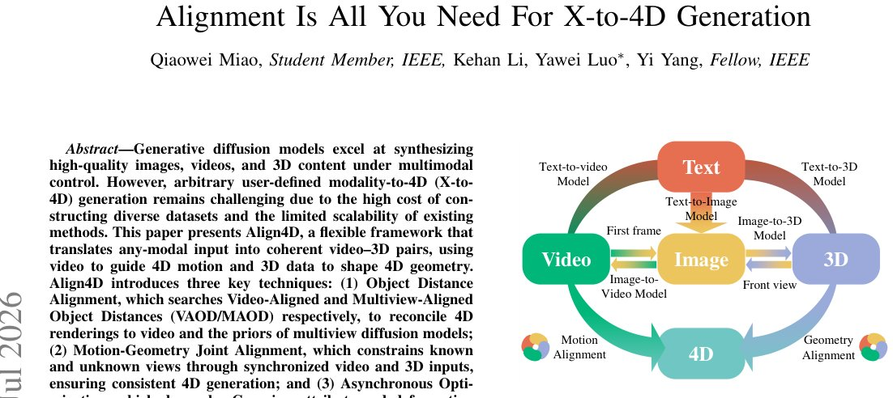

> *Generated by JarvisForResearchers Bot on 2026-07-05*

!!! tip "Why we featured this paper"
    Brand new preprint (2026) — accepted

## TL;DR
Align4D is a framework designed to translate arbitrary inputs—text, images, video, or 3D data—into coherent video-3D pairs. It achieves this by reformulating the generation task as an alignment problem, utilizing Object Distance Alignment (VAOD and MAOD), Motion-Geometry Joint Alignment (MGJA), and Asynchronous Optimization to reconcile diverse input modalities with underlying 4D representations.

## The Problem
Arbitrary user-defined modality-to-4D (X-to-4D) generation remains challenging due to the high cost of constructing diverse datasets and the limited scalability of existing methods, as current methods typically focus on single-modal inputs. Specifically, prior work exhibits distinct weaknesses: Text-to-4D methods often lack a strong sense of realism and purpose; Image-to-4D methods fail to effectively provide motion guidance; Video-to-4D methods compromise structural consistency; and 3D-to-4D methods lack temporal coherence.

## Key Contributions
This work makes three primary contributions:
1. Proposing an X-to-4D generation framework that supports arbitrary input modalities (text, images, videos, and 3D data).
2. Introducing a novel object distance alignment method to search for Video-Aligned Object Distance (VAOD) and Multiview-Aligned Object Distance (MAOD).
3. Constructing X4D, a first quadruple dataset to benchmark X-to-4D generation capabilities.

## How It Works


*Fig. 1.
Align4D transforms an arbitrary input into a coherent Video-3D
pair by sequentially leveraging multiple off-the-shelf models. Within this
X-to-4D generation framework, Align4D focuses on rigorously aligning the
4D object’s temporal motion with the video prior and its spatial geometry
with th*

Align4D reformulates X-to-4D generation as a task of aligning 4D assets with synchronized video and 3D data using matched object distances. The framework leverages off-the-shelf pretrained diffusion models to convert diverse inputs into a coherent Video-3D pair. The process proceeds through three main stages: Object Distance Alignment, Motion-Geometry Joint Alignment, and Asynchronous Optimization.

### Video-Aligned Object Distance (VAOD)
VAOD is determined by sweeping the object distance $d' \in D = [d_{min}, d_{max}]$. The specific distance $d_{VA}$ is selected as the value that yields the global minimum of the squared error $\lVert x_{d'}^{\theta_1} - I_1 \rVert_2^2$, where $x_{d'}^{\theta_1}$ represents the front-view rendering at distance $d'$ and $I_1$ is the first frame of the input video.

### Multiview-Aligned Object Distance (MAOD)
MAOD is found by searching for a local minimum of the modified SDS loss ($L_{SDS}$). This search is performed when rendering four orthogonal views and utilizing the video frame $I_1$ as the image control condition for the multiview diffusion model.

### Motion-Geometry Joint Alignment (MGJA)
MGJA is the module responsible for aligning the 4D model. It employs VAOD when the viewpoint is known, and it utilizes a single multiview diffusion model, guided by MAOD and conditioned on the input video frames, to generate representations for unknown viewpoints.

### Asynchronous Optimization
This strategy decouples the training of the Gaussian attribute network and the deformation network. This separation is implemented to ensure a more robust convergence during the optimization process.

## Results
| Metric | Value | Baseline | Source |
| :--- | :--- | :--- | :--- |
| Quality and Consistency | state-of-the-art | N/A | Abstract |

## Why This Matters
The practitioner takeaways highlight several key insights for multimodal 4D generation. First, decoupling the problem into 3D geometry generation and temporal motion generation proves to be a viable strategy. Second, the object distance alignment mechanisms (VAOD/MAOD) are shown to be crucial for reconciling 4D renderings with independent video and 3D diffusion priors. Finally, the use of asynchronous optimization can demonstrably improve convergence and fidelity by separating the refinement of motion and geometry parameters.

## Limitations & Open Questions
Two primary limitations are noted. First, existing methods frequently rely on manual, empirical settings for object distance, which can lead to floating artifacts or distortions in the output. Second, the process of optimizing 4D targets while simultaneously utilizing multiple diffusion priors is inherently unstable and computationally expensive.

---

## Citation

**Paper:** [2607.02516](https://arxiv.org/abs/2607.02516)

```bibtex
@article{260702516,
  title   = {Alignment Is All You Need For X-to-4D Generation},
  author  = {Qiaowei Miao and Kehan Li and Yawei Luo and Yi Yang},
  journal = {arXiv preprint arXiv:2607.02516},
  year    = {2026},
  url     = {https://arxiv.org/abs/2607.02516}
}
```
