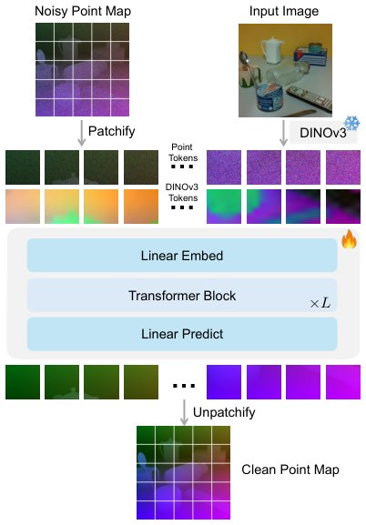

> *Generated by JarvisForResearchers Bot on 2026-07-07*

!!! tip "Why we featured this paper"
    Brand new preprint (2026) — accepted

## TL;DR
PointDiT introduces a minimalist pixel-space Diffusion Transformer that operates directly on raw 3D point map patches, conditioned on DINOv3 image tokens, to achieve superior monocular geometry estimation without the overhead of latent spaces or complex hybrid architectures.

## The Problem
Monocular geometry estimation requires mapping a single 2D RGB image to a dense 3D point map, which is inherently ill-posed due to scale and depth ambiguities. Existing methods either use complex hybrid architectures that yield over-smoothed geometry or rely on Latent Diffusion Models (LDMs) that suffer from information loss during VAE encoding/decoding. Specifically, deterministic regression models often predict the mean of the output distribution, resulting in over-smoothed geometry lacking high-frequency detail. Furthermore, LDMs require compressing point maps into a latent space via a Variational Autoencoder (VAE), which is non-trivial for geometric data and causes information loss. Finally, existing pixel-space diffusion models for depth estimation often use the v-prediction target, which performs worse than x-prediction for this task.

## Key Contributions
The primary contributions of this work are threefold:
1. Introduction of a minimalist pixel-space Diffusion Transformer built on a plain ViT that operates directly on raw 3D point map patches.
2. Training the diffusion backbone entirely from scratch, eliminating the need for point map tokenizers used in latent diffusion approaches.
3. Employing an x-prediction objective (predicting the clean point map directly) which is shown to be highly effective for geometric data.

## How It Works


*Figure 1. PointDiT. A minimalist pixel-space Diffusion Trans-
former operating directly on raw point map patches, conditioned
on image tokens from a pre-trained DINOv3. The 3D point map
(H × W × 3) is visualized as an RGB image, with color encoding
the spatial (X, Y, Z) coordinates.*

PointDiT models conditional point map generation $p(x|c)$ using a flow matching framework parameterized by a Vision Transformer (ViT). The noisy point map $z_t$ is patchified and tokenized, while the input image $c$ is encoded using a frozen DINOv3 encoder, with features from four uniformly spaced intermediate layers concatenated to form $T_c$. These tokens are fused with the point map tokens $T_z$ via channel-wise concatenation before being processed by the ViT. The network $F_\theta$ is trained to predict the clean point map $\hat{x}$ from $z_t, t, c$. The optimization uses a velocity loss $L_{fm}$ derived from $\hat{x}$ and the ground-truth velocity target $u_t = x - \epsilon$, supplemented by a relative point loss $L_{rel}$ to emphasize local detail.

### Plain ViT
The Plain ViT serves as the core pixel-space Diffusion Transformer. It accepts the noisy point map $z_t$, the time step $t$, and the conditioning image $c$ as its inputs to perform the denoising operation within the flow matching framework.

### Point Map Patchification
This component partitions the noisy point map $z_t \in \mathbb{R}^{H \times W \times 3}$ into non-overlapping $p \times p$ patches. This process yields the set of point map tokens $T_z = \phi(\text{Patchify}(z_t)) \in \mathbb{R}^{N \times D}$, which serve as the input sequence for the Transformer.

### DINOv3 Encoder
The DINOv3 Encoder is a frozen general-purpose feature extractor utilized to encode the conditioning image $c$. Specifically, features extracted from four uniformly spaced intermediate layers of the encoder are concatenated to form the image tokens $T_c$.

### Image and Point Map Fusion
This mechanism integrates the visual context into the geometric representation. It fuses the image tokens $T_c \in \mathbb{R}^{N \times 4D}$ and point map tokens $T_z \in \mathbb{R}^{N \times D}$ via channel-wise concatenation to form $T_{in} \in \mathbb{R}^{N \times 5D}$. This fused representation is subsequently projected down to the target dimension $D$ before entering the main Transformer blocks.

### Linear Prediction Head
The Linear Prediction Head is responsible for reconstructing the final geometry. It projects the output tokens $T_{out} \in \mathbb{R}^{N \times D}$ back to the flattened patch dimension $3p^2$. This is followed by an unpatchification operation to yield the full-resolution estimated point map $\hat{x} \in \mathbb{R}^{H \times W \times 3}$.

## Results
| Metric | Value | Baseline | Source |
| :--- | :--- | :--- | :--- |
| Structural details recovery | PointDiT recovers intricate, thin structures such as the chair more faithfully than GeometryCrafter (latent diffusion) and MoGe-2 (deterministic regression) | GeometryCrafter / MoGe-2 | Figure 2(b) |

## Why This Matters
The architectural choices made in PointDiT address fundamental bottlenecks in current monocular geometry estimation pipelines. By operating directly in pixel space, the model circumvents the information bottlenecks inherent in VAE-based latent diffusion models, allowing for the preservation of high-frequency geometric detail. Furthermore, the adoption of the x-prediction objective provides a more direct and effective training signal for tasks requiring precise data reconstruction, which is critical for accurate 3D structure recovery.

## Limitations & Open Questions
The model's point map predictions are affine-invariant, meaning they are recovered up to an unknown scale and shift. Additionally, the training process requires a rectified sampling strategy (setting $t=0$ with probability $p_{zero} = 0.1$) to calibrate the model to the pure-noise distribution encountered at inference.

---

## Citation

**Paper:** [2607.02515](https://arxiv.org/abs/2607.02515)

```bibtex
@article{260702515,
  title   = {PointDiT: Pixel-Space Diffusion for Monocular Geometry Estimation},
  author  = {Haofei Xu and Rundi Wu and Philipp Henzler and Nikolai Kalischek and Michael Oechsle and Fabian Manhardt et al.},
  journal = {arXiv preprint arXiv:2607.02515},
  year    = {2026},
  url     = {https://arxiv.org/abs/2607.02515}
}
```
