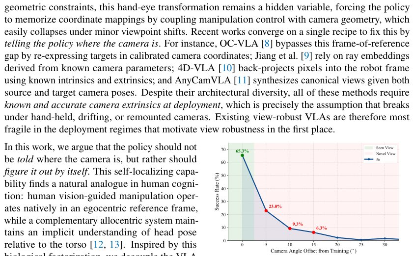

> *Generated by JarvisForResearchers Bot on 2026-07-08*

!!! tip "Why we featured this paper"
    Brand new preprint (2026) — accepted

## TL;DR
CamVLA introduces a calibration-free, single-view Vision-Language-Action (VLA) model that achieves viewpoint robustness by explicitly regressing the 6-DoF hand-eye matrix, thereby decoupling action generation into camera-centric predictions from the robot base frame.

## The Problem
Existing view-robust VLA policies suffer from fragility because they necessitate explicit knowledge of camera extrinsics. This requirement is often untenable in practical robotic deployments where camera mounting or positioning is subject to change. Standard VLAs inherently predict actions relative to the robot base frame, which implicitly couples the manipulation control policy with the fixed camera geometry. Furthermore, prior attempts at view robustness, such as OC-VLA, 4D-VLA, and AnyCamVLA, all mandate accurate, pre-known camera extrinsics at the time of execution. The critical gap remains the lack of a self-localizing alternative capable of inferring necessary camera geometry solely from a single monocular RGB image.

## Key Contributions
We identify that the prevailing assumption across existing view-robust VLA approaches—the requirement for known camera extrinsics—is a significant deployment bottleneck. We address this by proposing CamVLA, a novel, calibration-free, depth-free, single-view VLA framework. CamVLA achieves robustness by decoupling the camera-centric action generation from the camera-perspective geometric grounding, subsequently recombining these components via a deterministic geometric transformation. Comprehensive evaluation across both simulated and real-world scenarios demonstrates that CamVLA achieves substantial improvements in success rate over established VLA baselines ($\pi_0$ and GR00T N1.7) across diverse, unseen camera configurations.

## How It Works


*Figure 1: The Viewpoint Trap in VLAs. Conven-
tional VLA (e.g., π0) trained on a single viewpoint
exhibits extreme spatial brittleness, where a mere
15◦camera shift drops success rates to 6.3%.*

CamVLA factorizes the end-to-end VLA policy into two parallel processing streams: an Action Head and a Geometric Head. The Action Head is tasked with predicting the delta action ($\Delta A_{c,t}$) natively within the local camera frame, which is inherently pose-independent. Simultaneously, the Geometric Head regresses the 6-DoF hand-eye matrix, $T_t \in SE(3)$, which defines the transformation between the camera frame and the robot base frame. These two outputs are then integrated using a deterministic geometric transformation to yield the final action ($\Delta A_{b,t}$) expressed in the robot base frame. This architectural decoupling isolates the effects of viewpoint variation into the learned $T_t$, enabling generalization without external calibration inputs.

### Image Encoder
The Image Encoder is responsible for processing the raw Image Observation, $I_t \in \mathbb{R}^{H \times W \times 3}$. This component extracts the foundational visual features necessary for subsequent representation learning.

### VLM Backbone
The VLM Backbone operates on the combined input of the Image Tokens derived from the Image Encoder and the tokens representing the Language Instruction, $L$. Its function is to synthesize rich, multimodal representations that encode both the visual context and the semantic goal of the task.

### Action Head
The Action Head takes the fused visual and language representations and predicts the camera-centric delta action, $\Delta A_{c,t} = [\Delta p_{c,t}, \Delta r_{c,t}, g_t]$. Crucially, this prediction is formulated entirely within the local camera frame, making it invariant to the camera's absolute pose relative to the robot base.

### Geometric Head
The Geometric Head consumes the visual features from the VLM Backbone and is trained to regress the full 6-DoF hand-eye matrix, $T_t \in SE(3)$. This matrix explicitly models the geometric relationship between the camera coordinate system and the robot base coordinate system, effectively localizing the camera pose relative to the robot.

### Deterministic Geometric Transformation
This final stage combines the outputs of the two heads. It utilizes the predicted rotation $R_t \in SO(3)$ extracted from $T_t$ to transform the camera-centric translation and rotation components ($\Delta p_{c,t}, \Delta r_{c,t}$) into the robot base frame. The transformation is defined as $\Delta p_{b,t} = R_t \Delta p_{c,t}$ and $\Delta r_{b,t} = R_t \Delta r_{c,t}$, resulting in the final robot base-frame action, $\Delta A_{b,t}$.

## Results
The empirical evaluation demonstrates significant performance gains across various testing conditions:

| Metric | Value | Baseline | Source |
| :--- | :--- | :--- | :--- |
| Mean Success Rate (Unseen Viewpoints) | 51.4% | 33.2% | Table 1 |
| Slide Block Success Rate (Unseen Viewpoints) | 44.5% | 18.3% | Table 1 |
| Mean Success Rate (Real-World, 0° Offset) | 79.0% | 63.3% | Table 2 |
| Mean Success Rate (Real-World, 15° Offset) | 29.3% | 16.0% | Table 2 |

## Why This Matters
For deploying robotic systems in unstructured or dynamic environments, the reliance on perfect, pre-calibrated sensor configurations is a major engineering hurdle. CamVLA provides a pathway to deploy VLA policies where such calibration is infeasible or impractical. By learning the necessary geometric transformation implicitly from the visual input, the framework shifts the burden from external system setup to internal model inference. This capability is vital for achieving true generalization in real-world robotic manipulation tasks.

## Limitations & Open Questions
We note two primary limitations. First, the model exhibits a marked degradation in performance when the viewpoint offset in real-world tests exceeds $15^\circ$. Second, the Geometric Head regresses the full 6-DoF matrix $T_t$, but the translation vector $\tau_t$ within this matrix has no physical impact on the final action execution; viewpoint errors are consequently confined exclusively to the predicted rotation $R_t$. Future work should investigate methods to constrain or refine the translation regression within the Geometric Head to improve overall geometric fidelity.

---

## Citation

**Paper:** [2607.05396](https://arxiv.org/abs/2607.05396)

```bibtex
@article{260705396,
  title   = {From Fixed to Free Cameras: Calibration-Free View-Robust Vision-Language-Action Model},
  author  = {Wenhao Li and Xueying Jiang and Quanhao Qian and Deli Zhao and Shijian Lu and Gongjie Zhang et al.},
  journal = {arXiv preprint arXiv:2607.05396},
  year    = {2026},
  url     = {https://arxiv.org/abs/2607.05396}
}
```
