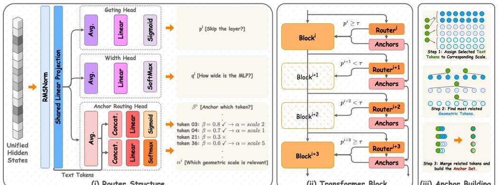

> *Generated by JarvisForResearchers Bot on 2026-07-09*

!!! tip "Why we featured this paper"
    Brand new preprint (2026) — accepted

## TL;DR
ELSA3D introduces elastic semantic anchoring to unify 3D understanding and generation by structuring language and geometric reasoning jointly along matched abstraction scales using Anchor Tokens and a lightweight per-block router. This moves beyond flat token concatenation, allowing structured, scale-aware interaction between semantic and geometric modalities.

## The Problem
Unified 3D foundation models currently face a fundamental limitation in handling text-3D interaction. The prevailing paradigm involves concatenating text and 3D tokens into a single, flat sequence. This monolithic representation forces the model to rely solely on self-attention to infer cross-modal correspondences, which inherently collapses critical structural cues (coarse geometry) and fine geometric details into an undifferentiated feature space.

The gap is threefold:
1. Existing methods treat text and 3D tokens as a single sequence, relying on attention to implicitly discover cross-modal links.
2. While recent advances have made 3D representations inherently multiscale, the reasoning architectures have not evolved to exploit this multiscale nature.
3. There is a lack of a unified design that explicitly structures language reasoning and geometric reasoning to interact coherently across different levels of abstraction.

## Key Contributions
We introduce ELSA3D, a unified 3D understanding-and-generation model designed to structure language reasoning and geometric reasoning along matched abstraction scales. Our contributions are threefold:

1. **ELSA3D Framework:** We propose ELSA3D, a unified architecture that explicitly structures the interaction between language and geometry across matched abstraction scales.
2. **Anchor Tokens:** We introduce Anchor Tokens, a sparse and dynamic cross-modal interface. These tokens ground selected semantic tokens to scale-specific 3D evidence and subsequently write the fused language-geometry signal back into the main representation.
3. **Elastic Routing:** We design an elastic routing mechanism that jointly governs block execution, MLP width, anchor selection, and geometric scale assignment. This enables elastic computation and structured semantic-geometric reasoning under a single, unified routing scheme.

## How It Works


*Figure 1: ELSA3D overview. ELSA3D is built around elastic semantic anchoring, where routing jointly
controls computation and semantic–geometric grounding. (i) The router has three heads: a Gating Head (pi,
skip or run), a Width Head (qi, MLP width), and an Anchor Routing Head (βi, αi, which text tok*

ELSA3D operates by integrating a multiscale representation of 3D geometry with a structured semantic trace. The 3D geometry is encoded using a multiscale octree VQ-VAE, where tokens are explicitly tagged with scale information. Language is decomposed into a Semantic Trace comprising Global, Structure, and Appearance components.

The core mechanism involves Anchor Tokens acting as sparse, transient cross-modal mediators. A lightweight per-block router dictates which semantic tokens are relevant and to which geometric scale they should be grounded. The selected semantic token cross-attends to the scale-specific geometric evidence, forming an anchor. This anchor is then injected back into the persistent sequence via a modulated cross-attention mechanism, allowing both text and 3D tokens to absorb the fused, scale-aware signal.

### Scale-aware octree VQ-VAE
This component is responsible for encoding the 3D scene. It utilizes a multiscale octree structure. Crucially, every content token generated by this VQ-VAE is augmented with a learned positional embedding, $E^{(s)}_{\text{pos}}[v]$, and carries a deterministic scale tag, $s_{\text{det}}^s$, indicating its spatial resolution context.

### Semantic Trace
Language input is not treated as a flat sequence. Instead, it is organized into a Semantic Trace, which partitions the semantic information into three distinct, interacting aspects: Global (capturing high-level category and silhouette), Structure (encoding mass distribution and proportions), and Appearance (detailing material, color, and texture).

### Anchor Tokens
Anchor Tokens are transient, block-local units. They are formed when a specific semantic token, $t_{i,m}$, is selected by the router and fused with scale-specific geometric evidence, $e_{i,m}$. This evidence is retrieved via cross-attention: $e_{i,m} = \text{CrossAttn}(t_{i,m}, G_{i,\alpha_{i,m}})$. The resulting anchor is then computed via a small MLP: $a_{i,m} = \text{MLP}_{\text{anchor}}([t_{i,m}; e_{i,m}])$.

### Lightweight Per-Block Router ($R_i$)
Attached to every block $B_i$, this router manages the computational flow and cross-modal grounding. It is a three-headed mechanism that simultaneously controls three aspects: computation (via the Gating Head $\ell_i$), computational capacity (via the Width Head $u_i$), and cross-modal grounding (via the Anchor Routing Head $\beta_{i,m}, \pi_{i,m}$).

#### Gating Head ($\ell_i$)
This head determines the execution probability for block $B_i$. The probability is calculated as $p_i = \sigma(\ell_i)$, and the block executes only if $p_i \ge \tau$, where $\tau=0.5$.

#### Width Head ($u_i$)
This head controls the computational depth of the block. It selects the MLP width from a discrete set $\mathcal{W} = \{1/4, 1/2, 3/4, 1\}$ by generating a binary channel mask $m(\hat{w}_i)$.

#### Anchor Routing Head ($\beta_{i,m}, \pi_{i,m}$)
This head performs the critical decision-making for anchoring. It outputs a token-specific prediction $\beta_{i,m}$ indicating whether semantic token $t_{i,m}$ should instantiate an anchor. Furthermore, it outputs a preference distribution $\pi_{i,m}$ over the available geometric scales $S$, guiding the retrieval process.

## Results
The performance of ELSA3D, compared against the strongest unified baselines, demonstrates significant gains across various tasks while simultaneously achieving substantial computational efficiency.

| Metric | Value | Baseline | Source |
| :--- | :--- | :--- | :--- |
| CLIP (Image-conditioned 3D generation) | +2.74 | strongest unified baseline | Section 4 |
| FD (Image-conditioned 3D generation) | -2.03 | strongest unified baseline | Section 4 |
| CLIP (Text-conditioned 3D generation) | +1.35 | strongest unified baseline | Section 4 |
| FD (Text-conditioned 3D generation) | -4.05 | strongest unified baseline | Section 4 |
| Sentence-BERT (3D captioning) | +3.56 | strongest unified baseline | Section 4 |
| FLOPs reduction (Ablation) | 1081G to 632G | dense cross-modal fusion | Section 4 |
| Inference latency reduction (Ablation) | 29.8s to 17.2s | dense cross-modal fusion | Section 4 |

## Why This Matters
The findings confirm that explicitly structuring the interaction between language and geometry along matched abstraction scales is a superior paradigm compared to relying on flat token concatenation. The elastic routing mechanism proves highly effective, allowing the model to dynamically prune unnecessary computation (via block skipping and width adjustment) while ensuring that cross-modal attention is precisely focused only where semantic-geometric alignment is required. Anchor Tokens provide the necessary sparse, high-fidelity interface to ground abstract language concepts onto specific, scale-aware geometric evidence, leading to measurable improvements in both generation quality and computational efficiency.

## Limitations & Open Questions
Two primary limitations must be noted. First, the implementation of non-differentiable operations, such as block skipping ($\delta_i$) and hard scale assignment ($\alpha_{i,m}$), necessitates the use of a Straight-Through Estimator during training. Second, the current framework relies on a two-stage training pipeline: the octree VQ-VAE must be trained prior to the unified LLM training phase. Future work should investigate end-to-end training strategies to mitigate the dependency on this staged approach.

---

## Citation

**Paper:** [2607.06565](https://arxiv.org/abs/2607.06565)

```bibtex
@article{260706565,
  title   = {ELSA3D: Elastic Semantic Anchoring for Unified 3D Understanding and Generation},
  author  = {Tianjiao Yu and Xinzhuo Li and Yifan Shen and Onkar Susladkar and Yuanzhe Liu and Xiaona Zhou et al.},
  journal = {arXiv preprint arXiv:2607.06565},
  year    = {2026},
  url     = {https://arxiv.org/abs/2607.06565}
}
```
