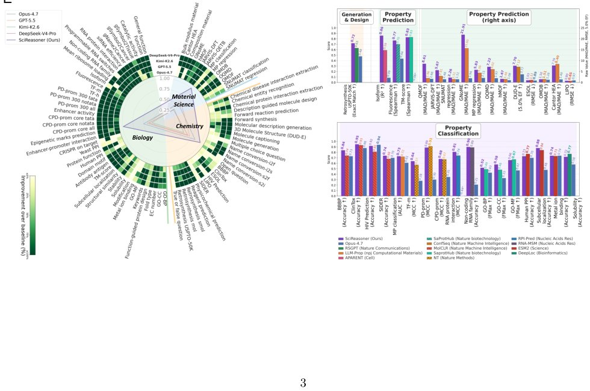

> *Generated by JarvisForResearchers Bot on 2026-07-10*

!!! tip "Why we featured this paper"
    Brand new preprint (2026) — accepted

## TL;DR
SciReasoner is a multimodal foundation model designed for native structural reasoning across proteins, small molecules, and inorganic crystals. It achieves this by discretizing complex structural information—coordinates, topologies, and connectivities—into a unified, structure-aware vocabulary that is integrated directly into an autoregressive LLM. Post-training reinforcement learning is used to ground these structural tokens as addressable evidence within a Chain-of-Thought (CoT) framework, enabling inspectable, mechanistic explanations.

## The Problem
Mechanistically explaining structure-property relationships across biology, chemistry, and materials science necessitates interpreting structural evidence through established scientific principles. Current AI paradigms encounter significant hurdles in this domain. Specifically, existing systems either maintain a strict separation between the native structural representation and the evidence-linked reasoning process, or they reduce complex, high-dimensional structures into linear strings. This string compression inherently discards the addressable physical evidence necessary for rigorous scientific inference. Furthermore, domain-specific models are typically engineered as black-box predictors, yielding scores without exposing the intermediate structural evidence that informed their decision.

## Key Contributions
We introduce SciReasoner, a multimodal scientific foundation model engineered for native structural reasoning across proteins, small molecules, and inorganic crystals. Our primary technical contributions are threefold: first, the development of a unified structure-aware vocabulary that discretizes coordinates, topologies, and periodic connectivities, thereby treating structural tokens as discrete, addressable units of evidence. Second, we engineered a multi-stage training pipeline culminating in a post-training framework for self-bootstrapped native structural reasoning. This framework employs reinforcement learning to explicitly connect the semantic meaning of structural vocabulary tokens to a Chain-of-Thought (CoT) generation strategy, ensuring reasoning trajectories are traceable to physical evidence.

## How It Works


*Please provide the figure you would like me to analyze.*

SciReasoner operates by unifying disparate scientific inputs—proteins, small molecules, and crystals—into a shared cross-modal latent space mediated by the structure-aware vocabulary. Domain-specific encoders are responsible for transforming the native physical objects into structured textual representations compatible with this vocabulary. These representations are then fed into the LLM Backbone alongside natural language instructions. The training proceeds through three distinct stages: Stage 1 (Warm-up), Stage 2 (Full-parameter Multimodal Training), and Stage 3 (Annealing Training). Crucially, the model's reasoning capability is finalized in the post-training phase, which utilizes reinforcement learning to ground structural tokens as verifiable evidence within the CoT, allowing for the inspection of the reasoning path.

### Structure-aware vocabulary
This vocabulary serves as the common substrate for all modalities. It is not merely a token set but a carefully constructed lexicon encompassing local motifs, specific 3D geometric descriptors, atomic bond types, and crystal space group information. Its design mandate is to preserve the inherent physical and biochemical integrity of the input structures, ensuring that a token refers to a specific, addressable physical feature rather than a generalized linguistic concept.

### Domain-specific encoders
These components act as modality translators. They are specialized converters responsible for mapping the native structure of a given scientific object into the structured textual format dictated by the structure-aware vocabulary. For small molecules, this is handled by ConfSeq; for proteins, Foldseek is employed; and for inorganic crystals, SLICES is utilized. The output of these encoders is a structured sequence that retains the physical integrity of the original object while being consumable by the LLM Backbone.

### LLM Backbone
This is the central autoregressive transformer architecture. It ingests the sequence composed of structure-aware tokens (derived from the domain-specific encoders) interleaved with natural language prompts and instructions. Its function is to process this multimodal input, generating coherent, contextually grounded outputs that satisfy the scientific query, whether that is a prediction or a mechanistic explanation.

### Stage 1: Warm-up Training
This initial training phase is designed to stabilize the integration process. Its objective is to anchor the newly introduced structure-aware tokens to fundamental topological, geometric, and chemical semantics. This is performed without aggressively perturbing the pre-trained linguistic knowledge embedded within the LLM Backbone, preventing catastrophic forgetting of general language capabilities.

### Stage 2: Full-parameter Multimodal Training
In this phase, the model undergoes comprehensive multimodal training. The focus shifts to developing the robust interface between the structural information and the linguistic instruction set. The model learns how to interpret the structured tokens in the context of natural language queries, effectively learning the cross-modal mapping required for scientific tasks.

### Stage 3: Annealing Training
This stage refines the model's ability to perform deep reasoning. It is characterized by an increased proportion of question-answer (QA)-style data in the training mix. This shift biases the model towards generating explanatory narratives rather than simple feature extraction, thereby fostering native structural reasoning capabilities.

### Intra-domain structural evidence grounding
This is a critical post-training step executed by domain-specific experts. It explicitly teaches the model how to treat the structural tokens not just as input features, but as verifiable evidence units within the context of reasoning specific to their domain (e.g., a specific bond type in a molecule, or a specific residue interaction in a protein).

### Cross-domain reasoning consolidation
The final post-training step integrates the specialized knowledge gained during the intra-domain grounding. Expert-generated reasoning traces and the capabilities learned within each domain are consolidated into the final SciReasoner model, enabling it to reason coherently across the boundaries of proteins, molecules, and crystals.

## Results
| Metric | Value | Baseline | Source |
| :--- | :--- | :--- | :--- |
| Fmax (Cellular Component annotation) | 0.55 | 0.42 | Abstract |
| Single-step retrosynthesis accuracy | 0.72 | 0.63 | Abstract |
| Mean Fmax (DeepFRI-GO) | 0.59 | 0.52 (SaProt) | Section 2.2.1 |
| Accuracy (subcellular localization) | 0.88 | 0.84 (ESM2) | Section 2.2.1 |
| Isoform R2 (RNA function) | 0.86 | 0.59 | Section 2.2.1 |
| RNA protein interaction MCC | 0.81 | 0.74 | Section 2.2.1 |
| 5.0% enrichment factor (DUD-E) | 7.70 | 7.12 | Section 2.2.1 |
| R2 (formation-energy parity plot) | 0.895 | N/A | Section 2.2.4 |

## Why This Matters
The development of SciReasoner addresses a fundamental bottleneck in applying large-scale AI to scientific discovery: the inability to bridge high-dimensional physical structure with symbolic, mechanistic explanation. By enforcing the representation of structure as addressable, discrete evidence within the LLM's context, we move beyond correlational pattern matching toward genuine structural inference. This capability is vital for accelerating hypothesis generation in fields where the relationship between atomic arrangement and macroscopic function is non-trivial and requires rigorous, traceable justification.

## Limitations & Open Questions
The current evaluation suggests that high benchmark performance can sometimes be achieved by the model exploiting homology, scaffold, or template-level shortcuts, which warrants further investigation into true inductive reasoning versus pattern matching. Furthermore, the model exhibits a strong dependency on the quality and presence of structural inputs; ablating these inputs results in a consistent and significant degradation of performance, indicating that the structural encoding remains a critical, rather than fully redundant, component of the architecture.

---

## Citation

**Paper:** [2607.07708](https://arxiv.org/abs/2607.07708)

```bibtex
@article{260707708,
  title   = {Accurate, Interdisciplinary and Transparent Structure-property Understanding with Deep Native Structural Reasoning},
  author  = {Chen Tang and Yizhou Wang and Jianyu Wu and Lintao Wang and Shixiang Tang and Pengze Li et al.},
  journal = {arXiv preprint arXiv:2607.07708},
  year    = {2026},
  url     = {https://arxiv.org/abs/2607.07708}
}
```
