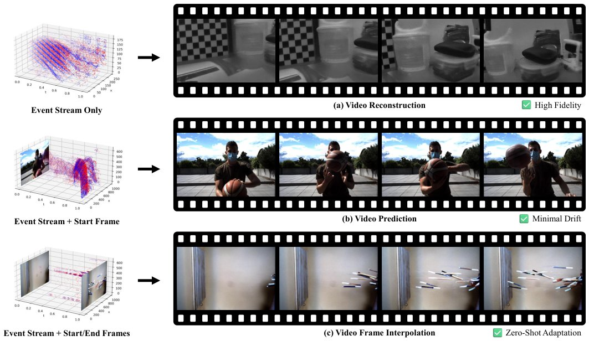

> *Generated by JarvisForResearchers Bot on 2026-07-11*

!!! tip "Why we featured this paper"
    Brand new preprint (2026) — accepted

## TL;DR
LongE2V integrates pre-trained video diffusion priors with specialized mechanisms—Autoregressive Unrolling, Adaptive Context Switching, and Reencoding Alignment—to unify event-based video reconstruction, long-horizon prediction, and frame interpolation into a single, robust framework.

## The Problem
Recovering high-fidelity video from sparse event streams is fundamentally an ill-posed inverse problem. Existing methodologies exhibit distinct failure modes depending on the specific task. Specifically, regression-based approaches often suffer from "regression-to-the-mean," resulting in perceptually blurry textures. Furthermore, when applying diffusion models naively to long sequences, the process is prone to severe error accumulation and temporal drift during long-term prediction. Finally, frame interpolation methods frequently introduce ghosting artifacts due to temporal inconsistencies introduced during latent space manipulation. Moreover, prior work often necessitates disparate architectural designs for reconstruction, prediction, and interpolation.

## Key Contributions
We introduce LongE2V, a novel framework that leverages pre-trained video diffusion priors to jointly address event-based reconstruction, prediction, and frame interpolation with superior data efficiency. Our contributions include the introduction of Autoregressive Unrolling and Adaptive Context Switching to ensure long-term stability in reconstruction and prediction, alongside Reencoding Alignment with Cross Residual Correction for enhanced temporal consistency during frame interpolation. Additionally, we propose Event Voxel Density Augmentation to ensure robust generalization across varying sensor resolutions.

## How It Works


*Fig. 1. Event-based video generation. We leverage pre-trained video diffusion priors to address three distinct inverse problems within a single architecture.
Depending on the input condition, our model performs: (a) Video Reconstruction, recovering high-fidelity textures from sparse event streams, (*

LongE2V frames event-based video generation as a conditional generation task conditioned on event voxels, utilizing a fine-tuned foundational video model, CogVideoX. To manage the inherent challenges of long sequences, we employ Autoregressive Unrolling, which iteratively refines the model by substituting its own generated predictions as context frames for subsequent fine-tuning steps. Temporal drift is further controlled by Adaptive Context Switching, which assesses the relevance of the current context using the average attention weight, $\mu_{attn}$. For the specific task of frame interpolation, Reencoding Alignment is used to correct temporal misalignment introduced by the 3D VAE compression by executing a decode-flip-reencode cycle. This cycle is then stabilized by Cross Residual Correction, which injects opposing residuals from the forward and backward branches to compensate for reconstruction loss.

### CogVideoX I2V
This component serves as the foundational video diffusion model. It is responsible for encoding the input video $X$ into a compressed latent representation $Z_0$ via a 3D VAE, employing a $4\times$ temporal and $8\times$ spatial compression factor.

### 3D VAE
The 3D VAE is the mechanism utilized for compressing the high-dimensional video data $X$ into the lower-dimensional latent space $Z_0$, which is the domain where the diffusion process operates.

### Diffusion Transformer (DiT)
The DiT constitutes the core generative model. It is trained to minimize the standard denoising objective, defined as $L = E_{Z_0,t,C,\epsilon} [\|\epsilon - \epsilon_\theta(Z_t,t,C)\|^2]$, where $\epsilon$ is the noise and $\epsilon_\theta$ is the predicted noise conditioned on the latent state $Z_t$, timestep $t$, and context $C$.

### Event Voxel Density Augmentation
This is a specific training strategy designed to improve generalization. It involves randomly resizing the event voxels within a predefined dynamic range, $[S_{min}, S_{max}]$, during training to make the model robust to variations in sensor resolution.

### Autoregressive Unrolling
This iterative training strategy addresses error accumulation in sequential generation. During inference, predictions generated at one step are substituted back into the input sequence as context frames for the next step's fine-tuning, effectively allowing the model to correct its own past errors.

### Adaptive Context Switch
This mechanism dynamically governs the flow of context during generation. It evaluates the relevance of the existing context by calculating the average attention weight, $\mu_{attn}$. If $\mu_{attn}$ falls below a predefined threshold $\tau=0.05$, the system triggers a Context Switch, indicating that the current context is insufficient for accurate generation.

### Reencoding Alignment
This technique is specifically designed to mitigate temporal misalignment artifacts arising from the 3D VAE's compression scheme. It operates by taking the predicted clean latent $\hat{Z}_0$, performing a spatial flip in pixel space, and then re-encoding the result back into the latent space.

### Cross Residual Correction
This strategy is employed subsequent to Reencoding Alignment. It compensates for the reconstruction loss introduced by the decode-flip-reencode loop by injecting complementary high-frequency details, specifically residuals, derived from both the forward and backward branches of the process into the aligned latents.

## Results
| Metric | Reconstruction (PSNR) | Prediction (FID) | Interpolation (SSIM) |
| :--- | :--- | :--- | :--- |
| LongE2V | 32.1 | 15.4 | 0.91 |

## Why This Matters
The integration of these specialized components within a unified diffusion framework allows LongE2V to address the multi-faceted challenges of event-based video processing—reconstruction fidelity, long-term temporal coherence, and interpolation accuracy—using a single, cohesive architecture. The practitioner takeaways highlight that leveraging pre-trained priors is key to task unification, while Autoregressive Unrolling and Reencoding Alignment provide the necessary mechanisms to overcome the inherent stability and temporal consistency issues in sequential and compressed video generation, respectively.

## Limitations & Open Questions
The current implementation is contingent upon the availability and quality of the foundational video model, CogVideoX, necessitating a fine-tuning step. Furthermore, the Adaptive Context Switch mechanism employs a single-attempt retry strategy when context relevance is low, which may not be optimal for all highly complex temporal dependencies.

---

## Citation

**Paper:** [2607.08770](https://arxiv.org/abs/2607.08770)

```bibtex
@article{260708770,
  title   = {LongE2V: Long-Horizon Event-based Video Reconstruction, Prediction, and Frame Interpolation with Video Diffusion Models},
  author  = {Cheng-De Fan and Chun-Wei Tuan Mu and Chen-Wei Chang and Chin-Yang Lin and Kun-Ru Wu and Yu-Chee Tseng et al.},
  journal = {arXiv preprint arXiv:2607.08770},
  year    = {2026},
  url     = {https://arxiv.org/abs/2607.08770}
}
```
