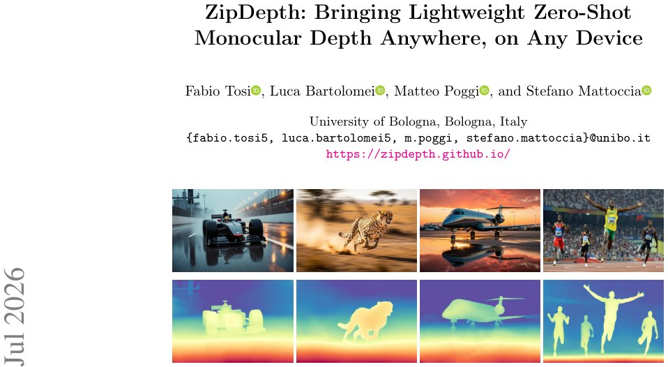

> *Generated by JarvisForResearchers Bot on 2026-07-12*

!!! tip "Why we featured this paper"
    Brand new preprint (2026) — accepted

## TL;DR
ZipDepth is a compact monocular depth network that achieves real-time, zero-shot cross-domain generalization by distilling knowledge from large foundation models into an efficient, reparameterizable encoder-decoder architecture.

## The Problem
Monocular depth estimation requires accurate, dense depth maps for deployment in real-world robotic and computer vision systems. The current landscape presents a dichotomy: high-accuracy foundation models achieve robust zero-shot generalization but are computationally prohibitive, demanding hundreds to thousands of GFLOPs and tens of high-end GPUs for inference. Conversely, lightweight models, which are suitable for embedded and mobile platforms, are typically restricted to single-domain, self-supervised training paradigms, leading to catastrophic failure when encountering domain shifts. The fundamental challenge is the incompatibility between achieving high efficiency and maintaining robust zero-shot generalization capability.

## Key Contributions
We address the challenge of zero-shot generalization in lightweight monocular depth estimation. Our primary contributions are:

1.  We demonstrate that efficiency and cross-domain accuracy are not mutually exclusive when both training data diversity and architectural design are carefully considered.
2.  We propose ZipDepth, a compact encoder–decoder architecture that integrates reparameterizable convolutional blocks with hardware-adaptive convex upsampling, resulting in full-resolution depth maps within a 6.1M-parameter budget.
3.  We show that ZipDepth's unified design achieves the superior accuracy–efficiency trade-off among lightweight models, despite being trained using only two consumer GPUs.

## How It Works


*Fig. 1: ZipDepth generalizes zero-shot across diverse and challenging scenes. Top row:
input RGB; bottom row: predicted depth at real-time rates even on a 15 W Jetson Orin
NX (34 FPS with PyTorch Eager FP32, up to 77 FPS with TensorRT FP16).*

ZipDepth operates as a two-component system: a four-stage hierarchical encoder and a streamlined decoder. The encoder is designed for feature extraction across multiple scales, while the decoder reconstructs the dense depth map using scale-aware fusion and hardware-specific upsampling.

### Split stem
The initial layer of the network employs a Split stem. This layer is specifically designed to retain the intermediate activation at $1/2$-resolution ($\mathbf{s}_{1/2}$) and pass it directly as a dedicated skip connection to the decoder. This early feature injection aids in preserving fine-grained spatial information critical for high-resolution reconstruction.

### Reparameterizable unit
The Reparameterizable unit is the core computational primitive of the encoder. During the training phase, this unit maintains three parallel branches: a $3\times3$ convolution, a $1\times1$ convolution, and an identity mapping. These branches are designed such that at inference time, they algebraically fuse into a single, standard $3\times3$ convolution, thereby maintaining computational efficiency without sacrificing the representational power gained during training.

### Multi-scale context (Stage 2)
Stage 2 of the encoder incorporates mechanisms to expand the receptive field efficiently. It appends a lightweight parallel-dilation module, utilizing depthwise convolutions ($\operatorname{DWConv}_{r=1}$ and $\operatorname{DWConv}_{r=2}$), which allows the network to cover an effective receptive field up to $5\times5$ without incurring the computational cost of large standard convolutions.

### Strip-pooling attention (Stage 2)
To capture long-range dependencies, Stage 2 replaces conventional attention mechanisms with Strip-pooling attention. This mechanism employs a symmetric sigmoid gate, enabling the network to explicitly model and aggregate contextual information across both horizontal and vertical dimensions.

### Channel and global context (Stage 3)
Stage 3 enhances feature semantics by incorporating two modules. First, Squeeze-and-Excitation (SE) channel attention is applied to recalibrate channel-wise feature responses. Second, a Global Context block (GCB) is integrated, which aggregates scene-level context by performing softmax-weighted spatial pooling over the feature maps.

### SPPF + Cross-Scale
Following Stage 3, the network utilizes a lightweight Spatial Pyramid Pooling–Fast (SPPF) block to aggregate multi-scale spatial information. This is immediately followed by a bidirectional cross-scale module, which facilitates the exchange of refined information between Stage 3 and Stage 4, ensuring feature consistency across different hierarchical levels.

### Progressive Decoder
The Progressive Decoder is responsible for upsampling and refining the depth map. It fuses multi-scale features retrieved from the encoder in a coarse-to-fine manner. This fusion process employs lightweight fusion modules, systematically decreasing the channel widths from $3C_{dec}$ at the deepest stride (32) down to $C_{dec}$ at the shallower stride (4) as the feature map resolution increases.

### Hardware-adaptive convex upsampling
The final stage, Hardware-adaptive convex upsampling, generates the full-resolution inverse-depth map. This component is designed for deployment flexibility. It dynamically selects the appropriate upsampling path: a GPU/TensorRT path utilizing PixelShuffle for high-performance GPU execution, or an NPU/mobile path employing a learned gate to blend nearest-neighbour and bilinear upsampling operators for constrained hardware.

## Results
The efficiency and accuracy profile of ZipDepth is summarized below:

| Metric | Value | Baseline | Source |
| :--- | :--- | :--- | :--- |
| Parameters (Inference) | 6.1M | N/A | Table 1 |
| Inference Speed (Jetson Orin NX) | 34 FPS with PyTorch Eager FP32, up to 77 FPS with TensorRT FP16 | N/A | Fig. 1 |

## Why This Matters
ZipDepth provides a viable pathway for deploying state-of-the-art depth estimation on resource-constrained edge devices. By successfully distilling the generalization capabilities of massive foundation models into a network with only 6.1M parameters, we bridge the gap between research-grade accuracy and practical, real-time deployment. The hardware-adaptive upsampling ensures that the model maintains high throughput regardless of the target inference engine (e.g., TensorRT vs. mobile NNAPI).

## Limitations & Open Questions
The current implementation of the Hardware-adaptive convex upsampling presents a dependency constraint: the NPU/mobile path relies on standard Conv2D and interpolation operators, whereas the GPU/TensorRT path requires operators like unfold, softmax, and PixelShuffle. Furthermore, the entire design is constrained by the necessity that all architectural choices must utilize operators with native support across TensorRT, CoreML, and NNAPI runtimes, which limits the scope of potential architectural experimentation.

---

## Citation

**Paper:** [2607.08771](https://arxiv.org/abs/2607.08771)

```bibtex
@article{260708771,
  title   = {ZipDepth: Bringing Lightweight Zero-Shot Monocular Depth Anywhere, on Any Device},
  author  = {Fabio Tosi and Luca Bartolomei and Matteo Poggi and Stefano Mattoccia},
  journal = {arXiv preprint arXiv:2607.08771},
  year    = {2026},
  url     = {https://arxiv.org/abs/2607.08771}
}
```
