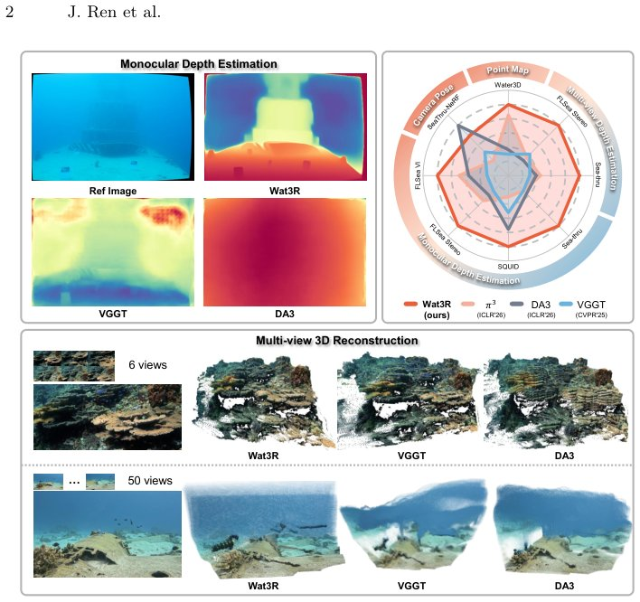

> *Generated by JarvisForResearchers Bot on 2026-07-13*

!!! tip "Why we featured this paper"
    Brand new preprint (2026) — accepted

## TL;DR
Wat3R is a semi-supervised learning framework that adapts pre-trained, feed-forward 3D reconstruction models (like VGGT) from air to underwater scenes. It achieves this without requiring any annotated underwater data by leveraging unlabeled real underwater video footage and introducing a Cross-View Consistent Loss to enforce geometric coherence across degraded views.

## The Problem
Estimating accurate 3D geometry in underwater environments presents significant technical hurdles. These challenges stem primarily from the physical properties of water, specifically light attenuation and scattering, which severely degrade visual information. Compounding this is the critical scarcity of large-scale, high-quality 3D annotations specific to underwater settings. This data bottleneck prevents the direct training of robust, generalizable 3D reconstruction models tailored for the underwater domain.

The limitations of prior work are evident: many pioneering methods necessitate massive, dense annotations that are practically infeasible to acquire underwater. Furthermore, directly deploying powerful feed-forward models trained exclusively on terrestrial datasets results in substantial generalization failure due to the pronounced domain shift between air and water. Existing underwater research often circumvents this by relying on synthetic data generation or by employing reconstruction methods that require precise knowledge of camera poses or iterative optimization procedures.

## Key Contributions
We introduce three primary contributions to address these limitations:

1. **Wat3R Framework:** We propose Wat3R, the first semi-supervised framework based on VGGT that successfully generalizes to diverse underwater scenes without demanding any ground-truth 3D annotations from the target domain.
2. **Cross-View Consistent Loss:** We introduce a Cross-View Consistent Loss. This mechanism allows the model to learn robust geometric cues even in heavily degraded image regions by aggregating and enforcing consistency across information derived from other related views.
3. **Water3D Dataset:** We construct Water3D, a novel underwater multi-view dataset that provides comprehensive 3D annotations, including depth and camera pose, covering a variety of challenging underwater conditions.

## How It Works


*Fig. 1: Wat3R reconstructs from the open-domain underwater images in a feed-
forward manner without requiring any underwater 3D annotations. Our Wat3R
achieves significant enhancement in both single-view and multi-view tasks. Statistic
results also reveal the superior performance of our Wat3R agains*

Wat3R operates within a Mean Teacher semi-supervised paradigm to facilitate the domain adaptation of the VGGT model. The training regimen utilizes two distinct data streams: labeled synthetic data and unlabeled real data.

The labeled data is generated synthetically by applying simplified underwater imaging models to existing on-land datasets, utilizing DA3MONO-LARGE for the necessary depth estimation. The unlabeled data is sourced directly from real underwater video footage.

The core training loop involves the Student Network, which is optimized using two types of supervision: a standard supervised loss applied to the synthetic, labeled data, and consistency losses applied to the real, unlabeled data. The Teacher Network plays a crucial role in stabilizing the pseudo-label generation process; its parameters are updated via an Exponential Moving Average (EMA) of the Student Network's weights.

To specifically counteract the geometric degradation inherent in underwater imagery, we incorporate the Cross-View Geometry Consistency Loss. This loss function operates by backprojecting the depth predictions generated by the Teacher Network into other available views. It then enforces geometric coherence across these views using a static mask, which is derived via K-means clustering applied to the Teacher's depth map.

### VGGT
The VGGT serves as the foundational model. It is a feed-forward 3D reconstruction architecture that has been pre-trained on extensive, large-scale 3D-annotated datasets collected in terrestrial environments. This pre-training imbues the model with strong, generalizable geometric priors regarding scene structure.

### Teacher Network
The Teacher Network is responsible for generating stable, high-quality pseudo-supervision for the Student Network. It produces estimations for depth, camera parameters, and point maps. Its weights are maintained through an Exponential Moving Average (EMA) of the Student Network's weights, ensuring that the supervisory signals remain consistent and less prone to high-frequency noise during training.

### Student Network
The Student Network is the primary learner in Wat3R. Its objective is to learn the geometry representations specific to the underwater domain. It achieves this by simultaneously receiving supervision from the Teacher Network (via consistency losses on real data) and direct supervision from the synthetic, labeled data.

### Cross-View Consistent Loss
This loss function is specifically designed to mitigate the impact of information loss caused by environmental degradation (attenuation and scattering). It integrates geometric cues from multiple related views. The mechanism involves backprojecting the Teacher's depth predictions into neighboring views and penalizing discrepancies, constrained by a static mask derived from K-means clustering applied to the Teacher's depth map.

### Water3D
Water3D is a constructed, domain-specific multi-view dataset. It is critical for comprehensive evaluation as it contains diverse underwater scenes and provides complete 3D annotations, including ground-truth depth and camera pose information.

## Results
The performance of Wat3R is evaluated against the baseline VGGT model on the constructed Water3D dataset.

| Metric | Value | Baseline | Source |
| :--- | :--- | :--- | :--- |
| RMSE$\downarrow$ | 0.290 | VGGT [40] | Table 1 (Shuffle 10-view Evaluation) |
| RMSE$\downarrow$ | 0.720 | VGGT [40] | Table 1 (Full Subsequence Evaluation) |

## Why This Matters
The findings demonstrate that semi-supervised learning provides a viable and effective paradigm for adapting powerful, pre-trained 3D models to data-scarce, highly specialized domains such as underwater vision. Specifically, the introduction of the Cross-View Consistency Loss proves to be an effective mechanism for robustly mitigating the severe information loss induced by environmental factors like attenuation and scattering. Furthermore, the creation of domain-specific, annotated datasets, exemplified by Water3D, underscores the necessity of such resources for rigorous and meaningful evaluation in specialized robotics and computer vision applications.

## Limitations & Open Questions
The current implementation of Wat3R has two primary limitations. First, the simulation of underwater degradations relies on using a simplified version of the revised underwater imaging model, which may not capture the full complexity of real-world optical phenomena. Second, the Cross-View Consistency Loss employs a conservative setting, specifically $k = N-2$, when constructing the static mask, which might constrain the model's ability to leverage all available cross-view information optimally. Future work should investigate more adaptive masking strategies and potentially incorporate more physically accurate underwater rendering models.

---

## Citation

**Paper:** [2607.08772](https://arxiv.org/abs/2607.08772)

```bibtex
@article{260708772,
  title   = {Wat3R: Underwater 3D Geometry Learning without Annotations},
  author  = {Jiangwei Ren and Xingyu Jiang and Zijie Song and Wei Xu and Hongkai Lin and Dingkang Liang et al.},
  journal = {arXiv preprint arXiv:2607.08772},
  year    = {2026},
  url     = {https://arxiv.org/abs/2607.08772}
}
```
