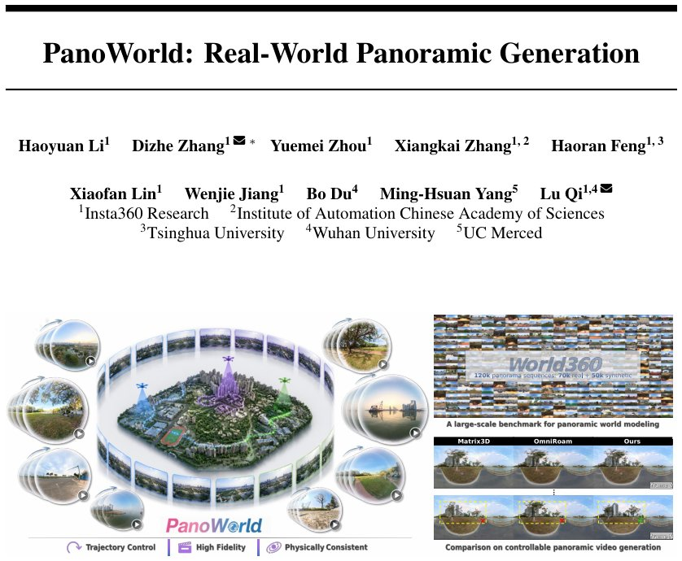

> *Generated by JarvisForResearchers Bot on 2026-07-14*

!!! tip "Why we featured this paper"
    Brand new preprint (2026) — accepted

## TL;DR
PanoWorld is a diffusion-based framework designed for high-fidelity and controllable panoramic video generation. It addresses the inherent challenges of maintaining geometric and radiometric consistency across space and time in omnidirectional video by explicitly leveraging the rotation-equivariant nature of panoramic representations. This is achieved through two primary innovations: Dense Panoramic Ray-Conditioning (DPRC) for view-dependent geometric modeling and Geometry-aware Memory Augmentation (GMA) for robust, long-horizon memory retrieval.

## The Problem
The generation of coherent panoramic world models faces significant hurdles in ensuring physical consistency—specifically geometry and illumination—across both spatial and temporal dimensions. A critical weakness in prior approaches is the reliance on perspective-based memory mechanisms. When applied to panoramic data, these mechanisms fail to handle severe geometric distortions and the viewpoint shifts induced by rotation, leading to misaligned and unreliable memory retrieval. Furthermore, existing panoramic video generators exhibit difficulties in complex outdoor environments, struggling to maintain structural and radiometric fidelity. Finally, standard baselines for long-horizon video generation are often limited in scope, failing to capture necessary long-range temporal dependencies.

## Key Contributions
We introduce PanoWorld, a novel diffusion-based panoramic world model engineered to manage long-range memory by exploiting the rotation-equivariant properties inherent in omnidirectional representations. Our contribution centers on two specialized modules: Dense Panoramic Ray-Conditioning (DPRC), which provides dense geometric conditioning, and Geometry-aware Memory Augmentation (GMA), which enhances the fidelity of memory retrieval. To validate these claims, we constructed World360, a large-scale benchmark dataset comprising 70K real-world clips and 50K high-fidelity simulations derived from AirSim360.

## How It Works


*Figure 1: PanoWorld is a novel framework for high-fidelity and controllable panoramic video gener-
ation. Our approach achieves precise trajectory control across complex movements while maintaining
high-fidelity visual synthesis with physical consistency in diverse real-world environments.*

PanoWorld operates by reframing the camera trajectory problem. We decouple the rotational component, treating it as a purely geometric transformation, from the translational component. This simplification allows the core diffusion model to concentrate its learning capacity on modeling translation-induced parallax.

### Wan2.2 backbone
The foundation of PanoWorld is the Wan2.2 backbone. This architecture serves as the base generative model, which is subsequently fine-tuned using Low-Rank Adaptation (LoRA) to adapt it specifically to the constraints and data characteristics of panoramic video synthesis.

### Dense Panoramic Ray-Conditioning (DPRC)
DPRC is the mechanism responsible for modeling view-dependent translation by treating the generative process as a dynamic light-field evolution enabled by equirectangular geometry. It achieves this through two sub-processes: Spherical Ray Unprojection and Motion Manifold Construction. By mapping input pixels to unit rays, DPRC constructs a motion manifold defined by local orthonormal bases and associated translation vectors, effectively encoding how the scene geometry changes as the viewpoint translates.

### Geometry-aware Memory Augmentation (GMA)
GMA is designed to enforce long-horizon persistence by establishing a shared representational space for both the query and the memory features. This is achieved via the Unified Projection for Query and Memory. This shared space allows the attention mechanism to retrieve historical features based on precise 3D ray correspondence. The retrieval process is further refined using Confidence-Guided Gating and Fusion.

### PRoPE Encoding
Projective Positional Embeddings (PRoPE) are employed to encode the transformed ray $\hat{r}_t$. The function of PRoPE is to align the query features and the retrieved memory features into a common, geometrically consistent space, which is crucial for effective cross-attention.

### Confidence-Guided Gating
This module quantifies the reliability of the retrieved memory. It calculates a retrieval confidence score, $c$, based on the maximal attention affinity between the current query and the candidate memory features. This confidence score $c$ then dictates the fusion ratio, blending the retrieved memory feature ($F_{mem}$) with the base diffusion feature ($F_{base}$) to produce the final, context-aware output feature.

The entire framework is optimized through a structured, three-stage pipeline: first, Panoramic Video Fine-tuning, which utilizes LoRA and a Latitude-Aware Reconstruction Loss; second, View-Dependent Motion Learning, driven by DPRC; and third, Memory-Anchored Coherence, which leverages GMA and Confidence-Guided Gating.

## Results
| Metric | Value | Baseline | Source |
| :--- | :--- | :--- | :--- |
| Performance | outperforming alternative methods by a large margin | Imagine360, Matrix-3D, and OmniRoam | Extensive experiments on World360 |

## Why This Matters
The ability to generate high-fidelity, geometrically consistent panoramic video is a prerequisite for robust applications in autonomous navigation, virtual reality environments, and large-scale scene understanding. By explicitly addressing the rotation-equivariance of omnidirectional data and integrating geometric constraints directly into the memory mechanism, PanoWorld moves beyond the limitations of perspective-centric models. The practitioner takeaway is clear: for panoramic generation, decoupling rotation from translation simplifies the learning objective while preserving geometric integrity. Furthermore, the success demonstrates that leveraging rotation-equivariance is a necessary step toward building truly robust, long-range memory models in this domain.

## Limitations & Open Questions
Current limitations stem partly from the available data landscape. Existing large-scale real datasets predominantly feature planar, street-level motion, which often results in ambiguous or fixed altitude information. Additionally, the construction of the World360 benchmark necessitates a hybrid approach, combining real-world data collection with high-fidelity simulation. Future work must address the generalization of GMA to scenarios with highly variable altitude changes and explore methods to integrate non-Euclidean geometric priors more deeply into the diffusion sampling process.

---

## Citation

**Paper:** [2607.09661](https://arxiv.org/abs/2607.09661)

```bibtex
@article{260709661,
  title   = {PanoWorld: Real-World Panoramic Generation},
  author  = {Haoyuan Li and Dizhe Zhang and Yuemei Zhou and Xiangkai Zhang and Haoran Feng and Xiaofan Lin et al.},
  journal = {arXiv preprint arXiv:2607.09661},
  year    = {2026},
  url     = {https://arxiv.org/abs/2607.09661}
}
```
