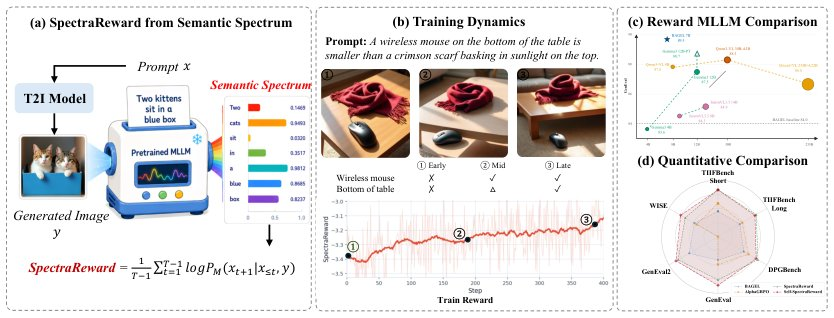

> *Generated by JarvisForResearchers Bot on 2026-07-15*

!!! tip "Why we featured this paper"
    Brand new preprint (2026) — accepted

## TL;DR
SpectraReward provides a training-free mechanism to derive a reward signal for text-to-image (T2I) reinforcement learning by quantifying the image-conditioned prompt log-likelihood using a frozen, pretrained Multimodal Large Language Model (MLLM). Self-SpectraReward extends this by using the policy's internal understanding branch as the reward source, demonstrating that intrinsic alignment can yield performance competitive with, or exceeding, larger external reward models.

## The Problem
Designing a practical reward model for image generation that is both efficient and reliable, especially one that avoids expensive human preference annotations and reward-model fine-tuning, remains challenging. Current approaches suffer from significant overhead: methods relying on human preference annotations require costly data collection and iterative refinement. While zero-shot methods utilizing pretrained MLLMs exist, they are susceptible to noise stemming from judge calibration. Furthermore, complex question-decomposition pipelines introduce substantial engineering complexity by necessitating a multi-stage process.

## Key Contributions
We introduce SpectraReward, a training-free and off-the-shelf reward function. This function repurposes any pretrained MLLM into a reward model for T2I generation by calculating the image-conditioned prompt-token likelihood. We also introduce Self-SpectraReward, a specialized instantiation where the policy's own understanding branch within a unified multimodal model serves as the reward model, establishing a closed-loop self-improving framework. Finally, we conduct a broad image-generation RL study demonstrating that the benefits of scaling the reward model are not monotonic, and that a well-aligned self-reward model can match or even outperform significantly larger external models.

## How It Works


*Figure 1: Overview of SpectraReward. (a) Pretrained MLLMs naturally induce a semantic spectrum
that measures how well a generated image aligns with the prompt. SpectraReward aggregates this
into a reward for T2I RL. (b) During RL training, SpectraReward steadily increases together with
visible impro*

SpectraReward operates by treating the frozen pretrained MLLM, $M$, as an inverse question-answering system. Given a generated image $y$ and a text prompt $x$, the system performs a single teacher-forced forward pass on $x$ conditioned on $y$. The resulting token-level likelihoods constitute the semantic spectrum. The scalar reward, $R_M(x, y)$, is computed as the mean image-conditioned prompt log-likelihood: $R_M(x, y) = \frac{1}{T-1} \sum_{t=1}^{T-1} \log p_M(x_{t+1} | x_{\le t}, y)$. Self-SpectraReward specializes this by substituting the external MLLM $M$ with the policy's own understanding branch, $G_{und}^\theta$, creating a closed-loop system that capitalizes on the intrinsic alignment between the generation and understanding branches.

### Text-to-Image Policy ($G_\theta$)
This is the generator model responsible for sampling an image $y$ conditioned on the input prompt $x$, i.e., $y \sim G_\theta(\cdot | x)$. This policy is the agent being optimized via reinforcement learning.

### Frozen Pretrained MLLM ($M$)
This external MLLM is utilized within SpectraReward to compute the reward signal. Its role is passive; it performs a single, teacher-forced forward pass over the prompt $x$ conditioned on the generated image $y$ to yield the likelihood scores.

### Semantic Spectrum
This is the token-wise likelihood profile generated by the MLLM. It quantifies, on a token-by-token basis, the degree to which the visual evidence present in the generated image $y$ supports the semantic content described by the prompt $x$ across the sequence of prompt tokens.

### Self-SpectraReward Mechanism
This mechanism is the instantiation where the policy's own understanding branch, $G_{und}^\theta$, is leveraged to act as the reward MLLM. This allows for a closed-loop system where the reward signal is derived internally from the policy's own learned representations, given images sampled by the generation branch, $G_{gen}^\theta$.

## Results
| Metric | Value | Baseline | Source |
| :--- | :--- | :--- | :--- |
| TIIF-Bench (BAGEL policy) | +10.0 | BAGEL baseline | Section 4.2 |
| GenEval (BAGEL policy) | +4.3/5.5 | BAGEL baseline | Section 4.2 |
| GenEval (Self-SpectraReward vs SpectraReward) | +1.2 | SpectraReward with the best MLLM backbone | Section 4.2 |
| GenEval2 (Self-SpectraReward vs SpectraReward) | +2.1 | SpectraReward with the best MLLM backbone | Section 4.2 |
| WISE (Self-SpectraReward vs SpectraReward) | +2 | SpectraReward with the best MLLM backbone | Section 4.2 |

## Why This Matters
For T2I RL, SpectraReward establishes a viable, training-free pathway to circumvent the high cost associated with traditional Reinforcement Learning from Human Feedback (RLHF). Furthermore, the Self-SpectraReward framework suggests a powerful paradigm shift in Unified Multimodal Models (UMMs): utilizing the model's intrinsic understanding branch for self-rewarding can lead to superior reward-policy alignment, potentially surpassing the performance ceiling set by much larger, externally trained reward models. This indicates that distributional alignment, rather than sheer reward model scale, is a critical determinant of RL success.

## Limitations & Open Questions
The methodology is inherently dependent on the MLLM's pretraining knowledge. This reliance may introduce latent language priors into the reward signal, priors that are only effectively neutralized when employing group-relative RL techniques. Moreover, the empirical performance of SpectraReward is directly contingent upon the quality and alignment of the specific MLLM backbone selected for the task.

---

## Citation

**Paper:** [2607.11886](https://arxiv.org/abs/2607.11886)

```bibtex
@article{260711886,
  title   = {Read It Back: Pretrained MLLMs Are Zero-Shot Reward Models for Text-to-Image Generation},
  author  = {Runhui Huang and Qihui Zhang and Zhe Liu and Yu Gao and Jie Wu and Hengshuang Zhao},
  journal = {arXiv preprint arXiv:2607.11886},
  year    = {2026},
  url     = {https://arxiv.org/abs/2607.11886}
}
```
