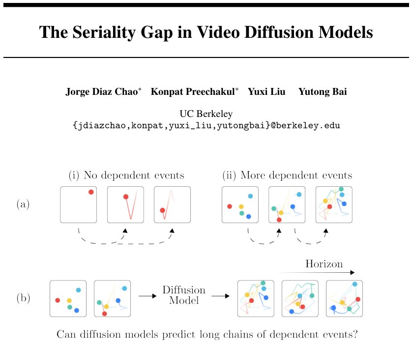

> *Generated by JarvisForResearchers Bot on 2026-07-16*

!!! tip "Why we featured this paper"
    Brand new preprint (2026) — accepted

## TL;DR
Video diffusion models exhibit a "seriality gap" when predicting long chains of dependent events, such as those arising from hard-sphere dynamics. Increasing the total compute via more denoising steps does not resolve this degradation. We demonstrate that for deterministic systems, the denoising process does not introduce scalable serial computation beyond the fixed capacity of the backbone. Architectural modifications enforcing temporal serialization, like autoregressive masking, yield superior performance gains over simply increasing diffusion steps.

## The Problem
The central question addressed here is whether video diffusion models can accurately predict arbitrarily long chains of dependent events, given that their iterative denoising process lacks the necessary scalable serial computation for such tasks. While video diffusion models have shown impressive capabilities in generating visually coherent sequences, their performance degrades significantly when the required prediction horizon necessitates complex, sequential reasoning—a characteristic of many physical simulations. Prior work has noted persistent failures in physical consistency, yet the underlying computational bottleneck remains unresolved: it is unclear if the model's capacity scales with the dependency chain length inherent in complex dynamics.

## Key Contributions
This work makes three primary contributions. First, we introduce a video-prediction testbed grounded in hard-sphere dynamics. This allows us to systematically study dependent-event prediction while controlling for visual content variability and varying the serial complexity of the underlying physics. Second, we identify the "seriality gap": bidirectional video diffusion models degrade as the chain of dependent events lengthen, even when the total computational budget increases, and this degradation is not mitigated by simply adding more denoising steps. Third, we provide a theoretical proof demonstrating that, for deterministic video prediction tasks, the denoising steps do not contribute scalable serial computation beyond what the underlying backbone has already computed.

## How It Works


*Figure 1: Dependent-event prediction exposes the seriality gap. (a) Hard-sphere dynamics separate
non-serial from serial video prediction. (i) In the single-ball control, any future state can be computed
directly from the initial state, without resolving intermediate states. (ii) With multiple balls*

The study leverages hard-sphere dynamics as a minimal, deterministic system where the serial complexity is directly mapped to the sequence of ball-ball collisions. We compare standard bidirectional video diffusion models against variants that enforce more serial computation, specifically autoregressive or blockwise approaches. The core finding hinges on the observation that while the total compute scales with the prediction horizon $f$, the local physical error $\Delta x(5)$ for the bidirectional models remains stubbornly high. Theoretically, we establish that for deterministic processes, the future state is uniquely determined by the initial state. Consequently, if the backbone architecture is sufficiently expressive, a single evaluation of the score-network should theoretically suffice to recover the future, implying that the iterative denoising steps do not provide the necessary *scalable* serial computation.

### Bidirectional video diffusion
This represents the standard paradigm for video prediction, where the model jointly predicts future frames across the entire temporal span during the denoising process. This architecture is inherently parallelizable across the time dimension during inference, which is advantageous for visual coherence but structurally ill-suited for tasks demanding strict sequential dependency resolution.

### Autoregressive/Blockwise generation
These variants address the seriality issue by modifying the attention mechanism. They replace the full temporal attention mechanism with FlexAttention masks that enforce block-causality over the temporal latent frames (Block-k). This forces the model to compute predictions in a strictly sequential or block-wise manner, mimicking the structure required by inherently serial physical processes.

### DiT-style video diffusion models
The baseline models are adapted from the architecture proposed by Wan2.1. This involves operating within the VAE latent space, where the input videos are downsampled by a factor of $8\times$ spatially and $4\times$ temporally. This latent representation is then processed by the Diffusion Transformer (DiT) structure.

## Results
The empirical evaluation demonstrates a clear divergence in performance between the standard bidirectional approach and the serially constrained variants as the dependency chain length increases.

| Metric | Value | Baseline | Source |
| :--- | :--- | :--- | :--- |
| Rollout-5 Error $\Delta x(5)$ | 0.20 | N/A | Table 1 |
| Rollout-5 Error $\Delta x(5)$ | 0.24 | 0.20 | Table 1 |
| Rollout-5 Error $\Delta x(5)$ | 0.09 | 0.27 | Table 2 |
| Rollout-5 Error $\Delta x(5)$ | 0.22 | 0.24 | Figure 3 (top left) |

## Why This Matters
The findings have direct implications for the design of generative models intended for scientific or engineering simulation. The "seriality gap" indicates that simply scaling up the computational resources (i.e., increasing the number of denoising steps) in a diffusion framework is an insufficient heuristic for solving problems that are fundamentally sequential in nature. The results strongly suggest that for tasks requiring rigorous physical or logical chaining, architectural constraints that enforce temporal serialization—such as those found in autoregressive or blockwise factorization—provide a more fundamental and effective mechanism for improving predictive accuracy than merely increasing the model's iterative refinement budget.

## Limitations & Open Questions
The current study is constrained by its reliance on hard-sphere dynamics, which represents a minimal, idealized setting. While the identified seriality bottleneck is robust in this setting, we cannot claim that this bottleneck is universally present or insurmountable in richer, more complex physical environments. Furthermore, the theoretical proof of the seriality gap relies on the strict assumption of deterministic physical processes and perfect observability of the system state. Future work must investigate how this gap manifests or closes when stochasticity or partial observability is introduced into the prediction task.

---

## Citation

**Paper:** [2607.13031](https://arxiv.org/abs/2607.13031)

```bibtex
@article{260713031,
  title   = {The Seriality Gap in Video Diffusion Models},
  author  = {Jorge Diaz Chao and Konpat Preechakul and Yuxi Liu and Yutong Bai},
  journal = {arXiv preprint arXiv:2607.13031},
  year    = {2026},
  url     = {https://arxiv.org/abs/2607.13031}
}
```
