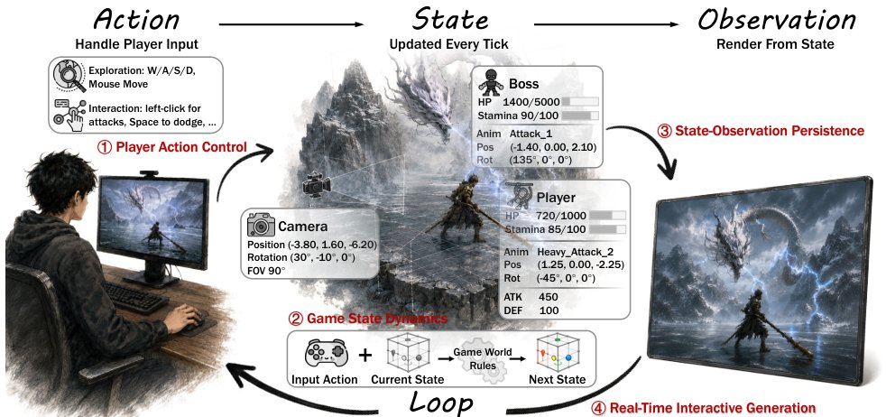

> *Generated by JarvisForResearchers Bot on 2026-07-17*

!!! tip "Why we featured this paper"
    Brand new preprint (2026) — accepted

## TL;DR
This work formalizes interactive game world modeling by structuring existing research around the fundamental action-state-observation loop. It systematically reviews approaches across four dimensions—action control, state dynamics, state persistence, and real-time generation—and introduces a scalable data engine built on $90+$ hours of $Black Myth: Wukong$ gameplay data, complete with frame-aligned actions and ground-truth states.

## The Problem
The objective of constructing interactive game worlds that exhibit coherent behavior in response to player input is fundamentally constrained by the need for interaction outcomes to adhere to underlying game rules. This necessitates that consequences persist across long temporal horizons and that the entire generation process operates within real-time constraints. Current research often addresses these components in isolation, leading to fragmented understanding of the necessary architectural components for robust, interactive simulation.

## Key Contributions
We introduce a unified framework for interactive game world modeling, which is explicitly grounded in the action-state-observation loop. This framework organizes the field along four critical dimensions: player action control, game state dynamics, state-observation persistence, and real-time interactive generation. Furthermore, we provide a systematic review of existing methodologies across these four dimensions, analyzing their respective strengths and trade-offs. Crucially, we developed a scalable data engine for $Black Myth: Wukong$, resulting in the collection of over 90 hours of gameplay videos annotated with frame-aligned player actions, ground-truth game states, and rich structured/semantic metadata.

## How It Works


*Figure 1 Interactive game worlds as an action-state-observation loop. Player inputs update the internal game state
according to game rules, and the resulting state is rendered into observations that continuously feed back to the player.*

The paper structures the problem space by centering the recurrent action-state-observation loop. This loop dictates that player inputs modify the internal game state according to established game rules, and the resulting state is subsequently rendered into observable data. We analyze the implementation choices within this loop across four distinct dimensions.

### Action-State-Observation Loop
This loop serves as the organizing principle for all interactive game world modeling efforts. It formalizes the sequence: $\text{Observation} \rightarrow \text{Action} \rightarrow \text{State Update} \rightarrow \text{New Observation}$. The efficacy of the model hinges on how each component—the input action, the state representation, the memory mechanism, and the generation process—is implemented within this cycle.

### Player Action Control Families
This dimension categorizes how player intent is represented to drive the simulation. We identify three primary families: geometric trajectories, which encode movement paths (e.g., MotionCtrl [74]); motor signals, which represent low-level control inputs (e.g., Oasis [11]); and semantic events, which abstract actions into high-level concepts (e.g., Pandora [80]). The choice here dictates the level of abstraction available for controlling the simulation.

### Game State Dynamics Formulations
This concerns how the underlying game state is represented internally. We delineate three approaches: states entangled in observations, where the state is implicitly defined by the visual input (implicit simulators); states as learned latents, where a recurrent model tracks the state evolution; and states as explicit descriptions, where the state is maintained in a symbolic or textual format.

### Memory Mechanisms
This addresses state-observation persistence, which is critical for long-horizon coherence. We classify mechanisms into two types: memory as stored observations, where past frames or states are indexed and retrieved; and memory as estimates of the present, where the system dynamically updates its belief about the current state based on incoming data.

### Real-Time Generation Techniques
This dimension focuses on computational efficiency during interaction. Techniques are grouped based on whether they target reducing generation latency—such as employing step-reduction or streaming methods—or reducing conditioning latency, which allows the conditioning context to evolve dynamically during the rollout process.

## Results
No quantitative results were provided in the outline.

## Why This Matters
The findings underscore that for developing next-generation game engines, the interaction paradigm must be conceptualized through the lens of the action-state-observation loop rather than merely as a video generation task. Furthermore, the work highlights that data scarcity is a primary impediment; achieving state-aware modeling necessitates the availability of explicit, temporally aligned state annotations, a gap addressed by our custom data engine. Finally, the analysis confirms that the selection of the state representation—be it implicit, latent, or explicit—directly determines the inherent trade-offs between visual fidelity, interpretability, and strict adherence to the game's governing rules.

## Limitations & Open Questions
A significant limitation in state-free formulations is that the state is effectively confined to a recent observation window, which severely compromises the guarantee of spatial and logical consistency over time. Conversely, maintaining explicit states requires access to large-scale, state-annotated gameplay data, which remains prohibitively scarce. Finally, the inherent nature of high-frequency interactions in game worlds means that small, incremental state changes accumulate rapidly, demanding memory mechanisms capable of making updates that are both highly efficient and reliably accurate.

---

## Citation

**Paper:** [2607.14076](https://arxiv.org/abs/2607.14076)

```bibtex
@article{260714076,
  title   = {From Pixels to States: Rethinking Interactive World Models as Game Engines},
  author  = {Zhen Li and Zian Meng and Shuwei Shi and Mingliang Zhai and Jiaming Tan and Chuanhao Li et al.},
  journal = {arXiv preprint arXiv:2607.14076},
  year    = {2026},
  url     = {https://arxiv.org/abs/2607.14076}
}
```
