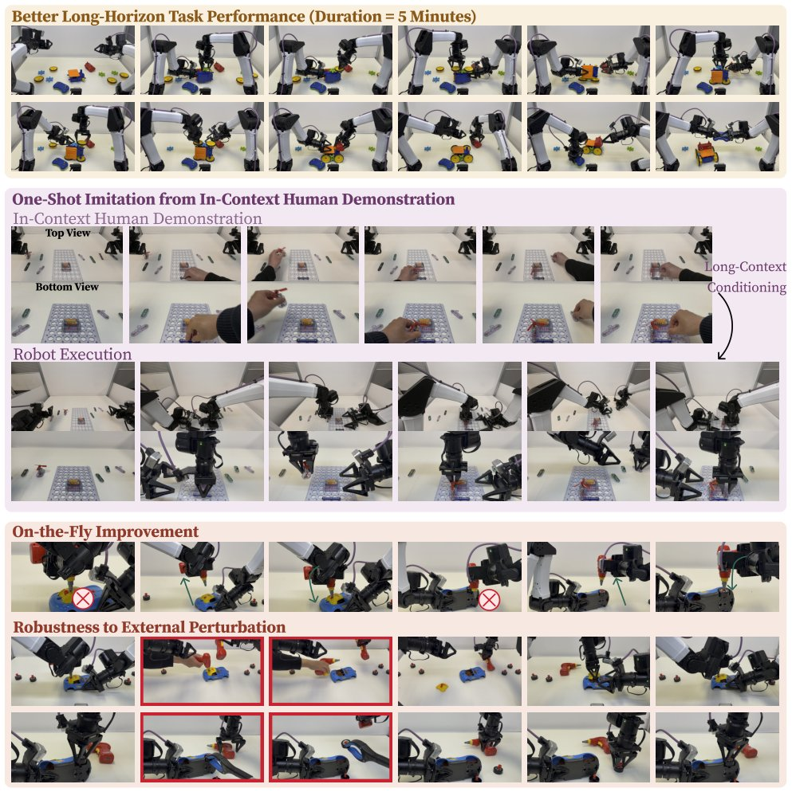

> *Generated by JarvisForResearchers Bot on 2026-07-18*

!!! tip "Why we featured this paper"
    Brand new preprint (2026) — accepted

## TL;DR
RoboTTT introduces Test-Time Training (TTT) into Vision-Language-Action (VLA) policies, enabling the scaling of visuomotor context up to 8K timesteps. This is achieved by allowing recurrent state components (fast weights) to be updated via gradient descent during inference, effectively compressing long histories into weight space. This architecture unlocks capabilities such as one-shot in-context imitation and on-the-fly policy improvement without incurring increased inference latency.

## The Problem
Contemporary robot foundation models are fundamentally constrained by their reliance on single-step or short-history visuomotor context windows. This limitation severely restricts their capacity to effectively learn from, or exploit, the arbitrarily long temporal dependencies inherent in complex robotic tasks. Specifically, this short-context constraint impedes the realization of capabilities such as one-shot in-context imitation derived from extended human video demonstrations, the ability to perform on-the-fly policy refinement, and achieving robust closed-loop performance across multi-stage, long-horizon operational sequences.

## Key Contributions
We introduce Test-Time-Training Robot Policies (RoboTTT) to scale the available visuomotor context length to 8K timesteps. We demonstrate that this long-context conditioning unlocks novel capabilities, including effective one-shot in-context imitation and demonstrable on-the-fly policy improvement. Furthermore, we establish that scaling the pretraining context length yields a consistent and measurable gain in the closed-loop performance of robot foundation models.

## How It Works


*Figure 1: RoboTTT, a long-context visuomotor policy that integrates Test-Time Training (TTT) into robot foundation
models, with context scaled to 8K timesteps. RoboTTT exhibits capabilities such as one-shot in-context imitation from
human videos and on-the-fly policy improvement.*

RoboTTT operationalizes long-context modeling by integrating Test-Time Training (TTT) directly into the structure of VLA policies. The core innovation is transforming the recurrent state of the model into a set of "fast weights." Unlike traditional frozen slow weights, these fast weights are amenable to gradient descent updates during both the standard training phase and the inference phase. This mechanism allows the model to compress extensive temporal histories into the parameter space of these fast weights. To facilitate the necessary long context, the training recipe employs a combination of sequence action forcing and Truncated Backpropagation Through Time (TBPTT). Architecturally, the TTT layers are strategically positioned downstream of the self- and cross-attention mechanisms within the Diffusion Transformer (DiT) action head. To ensure that the model retains its foundational VLA capabilities while adapting to heterogeneous contexts—such as those provided by human video demonstrations via DAgger Distillation—a learned tanh gating mechanism is employed.

### Vision-Language Model (VLM) backbone
The VLM backbone is responsible for generating the necessary vision-language (VL) tokens, denoted as $\Phi_t$, which serve as the primary input representation for the robot trajectory at each timestep $t$.

### Diffusion Transformer (DiT) action head
The DiT action head is the module responsible for predicting the action chunk $A_t$ over an $H$-step horizon. Crucially, this head incorporates the TTT layers immediately following the self-attention and cross-attention layers, allowing the contextual information derived from TTT to modulate the action prediction process.

### TTT Layers
The TTT Layers are the mechanism through which information is processed across the time dimension. They operate by updating the fast weights ($W_t$) via gradient descent, as formalized in Equation 1. This update process is what enables the model to dynamically adapt its internal state based on the observed history.

### Fast Weights ($W_t$)
The Fast Weights ($W_t$) constitute the parameters of a small, dedicated neural network, $f_W(\cdot)$. These parameters are designed to be updated iteratively using gradient descent during both the initial training phase and subsequent inference steps. Their function is to serve as a compressed, dynamic encoding of the contextual information accumulated over the trajectory history.

### Register Tokens ($R_t$)
Register Tokens ($R_t$) are a set of $N=16$ learned tokens that are prepended to the input sequence at every timestep. These tokens are designed to attend globally to all other tokens in the sequence, thereby acting as a persistent carrier of the accumulated VL information across the temporal dimension.

### Tanh Gating Mechanism
The Tanh Gating Mechanism provides a controlled integration point for the TTT contribution. It is implemented as a learned mechanism, $\tanh(\alpha)$, which gates the output derived from the TTT layers ($O_{TTT}$) before it is combined with the standard attention output ($O_{attn}$), following the formulation: $O = \tanh(\alpha) \odot O_{TTT} + O_{attn}$ (Equation 3). This gating allows the model to selectively incorporate the context-aware updates from TTT without corrupting the robust representations learned by the base VLA architecture.

## Results
| Metric | Value | Baseline | Source |
| :--- | :--- | :--- | :--- |
| Overall task performance improvement | 87% | single-step context baseline | Table 1 |
| Task completion score (Gear Bot) | 79% | GR00T N1.7 (single-step context) | Figure 7 |
| Task completion score (Gear Bot) | 42% | GR00T N1.7 (single-step context) | Figure 7 |
| Task completion score (Gear Bot) | 56% | GDN | Figure 7 |
| Task completion score (Gear Bot) | 63% higher task completion score | same model pretrained with 1K-timestep context | Abstract |

## Why This Matters
The ability to scale visuomotor context to 8K timesteps via RoboTTT represents a significant step toward building truly general-purpose robotic agents. By allowing the model to dynamically update its internal state during inference, we achieve in-context adaptation without the prohibitive computational overhead associated with maintaining massive, fixed-context attention mechanisms. This capability directly enables the exploitation of rich, long-form data like human demonstrations for one-shot learning, while simultaneously providing a mechanism for the agent to self-correct and improve its policy iteratively during execution.

## Limitations & Open Questions
The current implementation is highly dependent on specific, carefully engineered training recipes, notably sequence action forcing and DAgger Distillation, which must be managed rigorously. Furthermore, the architectural complexity introduced by the fast weight updates necessitates careful management of the gradient flow across the time steps to ensure stable and efficient operation. Future work must address the scalability and robustness of the fast weight update mechanism under highly noisy or adversarial input streams.

---

## Citation

**Paper:** [2607.15275](https://arxiv.org/abs/2607.15275)

```bibtex
@article{260715275,
  title   = {RoboTTT: Context Scaling for Robot Policies},
  author  = {Yunfan Jiang and Yevgen Chebotar and Ruijie Zheng and Fengyuan Hu and Yunhao Ge and Jimmy Wu et al.},
  journal = {arXiv preprint arXiv:2607.15275},
  year    = {2026},
  url     = {https://arxiv.org/abs/2607.15275}
}
```
