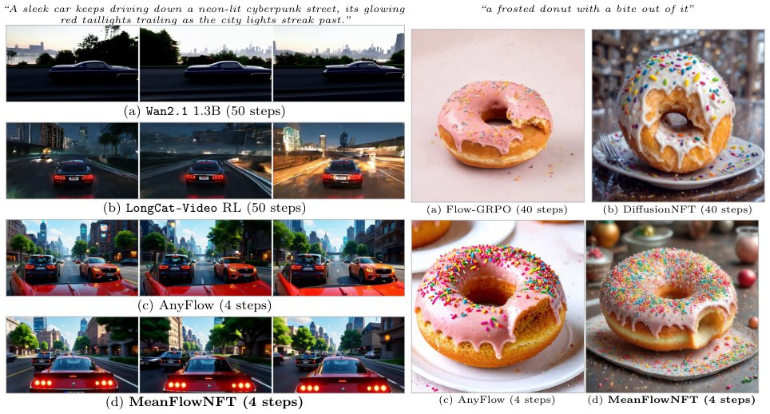

> *Generated by JarvisForResearchers Bot on 2026-07-19*

!!! tip "Why we featured this paper"
    Brand new preprint (2026) — accepted

## TL;DR
MeanFlowNFT introduces a forward-process Reinforcement Learning framework that adapts the DiffusionNFT objective to MeanFlow generators. It achieves this by constructing an induced instantaneous-velocity predictor, $V_\theta$, from the existing average-velocity network, $u_\theta$. This allows for efficient RL tuning that leverages the theoretical benefits of instantaneous velocity optimization while preserving MeanFlow's fast, few-step sampling characteristic.

## The Problem
The application of efficient forward-process Reinforcement Learning (RL) methods, such as DiffusionNFT, to MeanFlow generators presents a conceptual mismatch. DiffusionNFT is designed to optimize instantaneous velocities, whereas MeanFlow generators inherently sample using average velocities over a time interval. Furthermore, prior work on RL for MeanFlow has been sparse, and existing GRPO-based methods for flow models often necessitate a stochastic policy and complex per-step likelihood estimation, which are incompatible with MeanFlow's design goals.

## Key Contributions
We make three primary contributions. First, we propose MeanFlowNFT, which is the first forward-process RL framework for MeanFlow generators. This is achieved by applying the DiffusionNFT-style objective to an induced instantaneous-velocity predictor derived directly from the MeanFlow average-velocity network. Second, we provide theoretical guarantees demonstrating that, under idealized conditions, the optimum of this induced predictor aligns with the DiffusionNFT improved-policy target, and this policy improvement is provably transferable to MeanFlow's average-velocity generator. Third, we present comprehensive experimental results confirming that MeanFlowNFT consistently improves upon MeanFlow baselines and surpasses prior few-step methods, including multi-step RL-tuned diffusion models, while utilizing fewer sampling steps.

## How It Works


*Figure 1: Qualitative comparisons on Wan2.1 1.3B.
Each row shows 3 frames sampled uniformly over
time.*

MeanFlowNFT bridges the gap between instantaneous velocity optimization (the domain of DiffusionNFT) and average velocity sampling (the domain of MeanFlow) by mathematically constructing an induced instantaneous-velocity predictor, $V_\theta(x_t, s, t)$, from the MeanFlow average-velocity predictor, $u_\theta(x_t, s, t)$. This construction relies on the MeanFlow identity (Equation (3)). The resulting predictor is defined as:
$$V_\theta(x_t, s, t) \triangleq u_\theta(x_t, s, t) + (t - s) [\partial_t u_\theta(x_t, s, t) + (\partial_x u_\theta)(x_t, s, t) b_{v\theta}(x_t, t)]$$
The DiffusionNFT-style objective, $L_{\text{MFNFT}}(\theta)$ (Equation (9)), is then applied directly to $V_\theta$ to guide the training process. A critical implementation detail is that the total-derivative term within the definition of $V_\theta$ is wrapped in a stop-gradient operation, and practical approximations, such as finite differences, are employed to maintain MeanFlow's inherent few-step efficiency during inference.

### MeanFlow Generator ($u_\theta$)
The MeanFlow Generator, denoted $u_\theta$, is responsible for predicting the average velocity, $u(x_t, s, t)$, over a specified time interval $[s, t]$. This prediction is the foundation of MeanFlow's efficiency, as it allows for few-step sampling. The state transition is governed by:
$$x_{t_{i-1}} = x_{t_i} - (t_i - t_{i-1}) u_\theta(x_{t_i}, t_{i-1}, t_i) \quad \text{(Equation (4))}$$

### Induced Instantaneous-Velocity Predictor ($V_\theta$)
This component is the core innovation. $V_\theta$ is mathematically derived from $u_\theta$ using the MeanFlow identity (Equation (8)). It represents the instantaneous velocity that the DiffusionNFT objective targets:
$$V_\theta(x_t, s, t) \triangleq u_\theta(x_t, s, t) + (t - s) [\partial_t u_\theta(x_t, s, t) + (\partial_x u_\theta)(x_t, s, t) b_{v\theta}(x_t, t)]$$
This $V_\theta$ is the quantity that is optimized during the RL training phase.

### DiffusionNFT-style Objective ($L_{\text{MFNFT}}(\theta)$)
This loss function (Equation (9)) dictates the RL training. It operates on the instantaneous predictors $V_\theta$ by contrasting implicit 'positive' ($V^+_\theta$) and 'negative' ($V^-_\theta$) predictors against the true conditional velocity, $v_t$.

### Reference Predictor ($u_{\text{old}}$)
The Reference Predictor, $u_{\text{old}}$, serves as a static anchor during the optimization. It is typically maintained as an Exponential Moving Average (EMA) of the current $u_\theta$. This frozen predictor is used to define the implicit positive and negative predictors ($V^+_{\text{old}}, V^-_{\text{old}}$) required by the objective.

## Results
The empirical evaluation demonstrates the efficacy of MeanFlowNFT across various benchmarks.

| Metric | Value | Baseline | Source |
| :--- | :--- | :--- | :--- |
| VBench score (Wan2.1) | 84.33 | 50-step LongCat-Video RL | Abstract |
| Outperformance on SD3.5-M | 6 of 8 | prior state-of-the-art RL-tuned few-step generators | Abstract |

## Why This Matters
MeanFlowNFT provides a mechanism to inject the rigorous optimization power of forward-process RL methods, like DiffusionNFT, into the framework of MeanFlow. Crucially, it achieves this without incurring the computational overhead associated with generating full reverse-process trajectories or estimating likelihoods, which are prerequisites for many RL methods. By decoupling the optimization space (instantaneous velocity) from the sampling space (average velocity), the method successfully preserves MeanFlow's characteristic fast, few-step inference capability while achieving state-of-the-art performance.

## Limitations & Open Questions
The theoretical guarantees underpinning MeanFlowNFT are established within an idealized mathematical setting. In practical deployment, the necessity of approximating the total-derivative term in Equation (8) via methods like finite differences introduces approximation error. Future work should focus on developing stable, differentiable approximations for this total-derivative term that do not rely on explicit finite differencing, thereby closing the gap between the idealized theoretical optimum and the practical implementation.

---

## Citation

**Paper:** [2607.15273](https://arxiv.org/abs/2607.15273)

```bibtex
@article{260715273,
  title   = {MeanFlowNFT: Bringing Forward-Process RL to Average-Velocity Generators},
  author  = {Yushi Huang and Xiangxin Zhou and Jun Zhang and Liefeng Bo and Tianyu Pang},
  journal = {arXiv preprint arXiv:2607.15273},
  year    = {2026},
  url     = {https://arxiv.org/abs/2607.15273}
}
```
