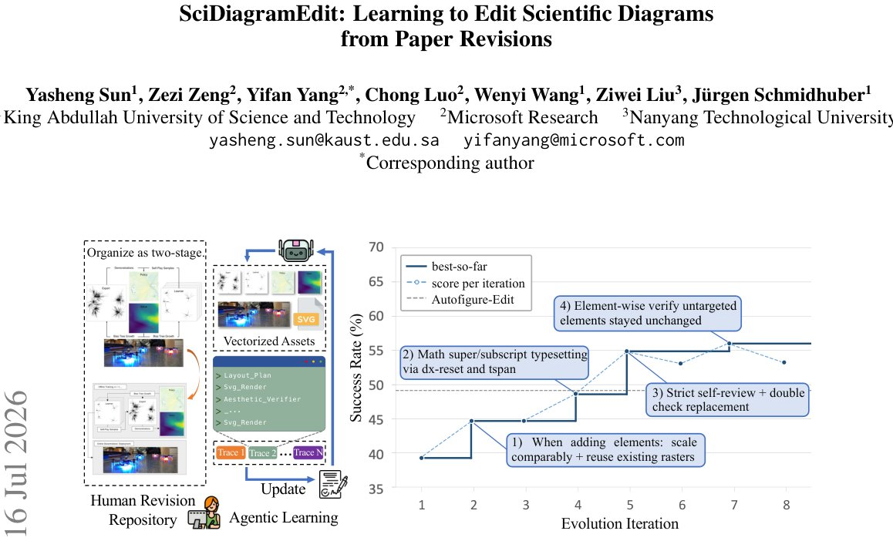

> *Generated by JarvisForResearchers Bot on 2026-07-20*

!!! tip "Why we featured this paper"
    Brand new preprint (2026) — accepted

## TL;DR
SciDiagramEdit introduces a skill-evolution framework to automate instruction-driven editing of scientific diagrams. It employs an agentic editor, a vision-language model judge, and a demonstration-aware coach to learn compositional editing skills directly from real author revisions, demonstrating substantial improvement over single-pass baselines.

## The Problem
Automating instruction-driven editing of scientific figures presents significant technical hurdles. A scientific figure is not a simple image; it is a dense infographic composed of heterogeneous visual elements governed by a strict visual grammar. Existing tooling falls short because they either attempt to generate the entire figure from scratch based on text prompts, or they operate purely at the raster level. Raster-level operations lack the necessary compositional handles required for targeted, local modifications—the very nature of an edit.

## Key Contributions
We introduce SCIDIAGRAMEDIT, a novel editing benchmark comprising 364 before/after figure pairs extracted from real arXiv paper revisions across 23 distinct subjects. This dataset is annotated with 2,628 atomic editing claims. Furthermore, we developed a self-improving scientific figure-editing agent that learns from these paper revisions via a skill evolution mechanism. This process distills execution traces and the authors' demonstrations into a portable skill specification. Finally, we empirically demonstrate that this agent learns meaningful editing skills from the revision data and achieves a substantial improvement in edit quality compared to strong single-pass baselines.

## How It Works


*Figure 1: Overview of SciDiagramEdit. Left: the Human Revision Repository, naturally occurring before/after
figure pairs mined from arXiv paper revisions, where each pair encodes an edit the original authors performed during
manuscript refinement. Middle: Agentic Learning via Skill Evolution — an SV*

SciDiagramEdit operates via an iterative refinement loop centered around an agentic system, the Editor E. Editor E manipulates the figure's editable vector source using a learned skill specification $S$, producing an execution trace $\tau$ and the resulting figure $F_{out}$. A Judge J, implemented as a vision-language model, evaluates $F_{out}$ by calculating a scalar score $r \in [0, 1]$. This score is a composite of semantic faithfulness ($r_{sem}$), derived from a per-sample checklist $Q$, and aesthetic preference ($r_{aes}$), derived from pairwise comparison against the author's reference revision $F_{ref}$. The Coach C consumes $\tau$, the judge's verdict $r$, and $F_{ref}$ to generate a patch $P$, which subsequently updates the skill specification $S$. This closed loop allows the agent to iteratively refine $S$ and learn compositional editing skills directly from observed author revisions.

### Editor E
Editor E is realized as an agentic system capable of code generation. It possesses file-system and Python tool access, enabling it to interpret the skill specification $S$ and execute precise modifications on the SVG figure source code.

### Skill Specification S
$S$ is the core learnable artifact driving Editor E's behavior. It is formally defined as a finite map from relative paths to file contents: $S = \{(p_i, c_i)\}_{i=1}^{|S|}$.

### Judge J
Judge J is a vision-language model responsible for assigning a comprehensive scalar score $r \in [0, 1]$. This score is a function of two components: $r_{sem}$, which measures semantic faithfulness against the required changes defined in $Q$, and $r_{aes}$, which measures aesthetic preference by comparing $F_{out}$ against the ground truth $F_{ref}$.

### Coach C
Coach C functions as a coding-agent subprocess. Its role is to analyze the history of execution traces ($\tau$), the associated Judge verdicts ($r$), and the target revision ($F_{ref}$). Based on this analysis, it emits a patch $P$ designed to upgrade or correct the skill specification $S$.

### Aesthetic_Verifier
This component is integrated into the training loop and is instrumental in calculating the aesthetic preference score ($r_{aes}$) used by Judge J, likely involving geometric or visual comparison routines.

### Svg_Render
Svg_Render is a utility component within the training pipeline responsible for converting the editable vector source (the SVG) into a renderable format for visual inspection and comparison by the Judge J.

### Layout_Plan
This component is utilized during the training loop, suggesting its involvement in geometric validation or pre-computation steps necessary for ensuring the structural integrity of the edits before or during rendering.

## Results
| Metric | Value | Baseline | Source |
| :--- | :--- | :--- | :--- |
| Success Rate (%) | best-so-far | N/A | Figure 1 |

## Why This Matters
The findings underscore that for instruction-driven editing tasks, operating directly on the editable vector source is fundamentally superior to raster-level re-rendering because it provides the necessary compositional control. Furthermore, the skill evolution paradigm, which leverages the contrast between agent execution traces and author-drawn targets, proves to be an effective method for acquiring complex, long-tail editing behaviors. Finally, the composite scoring mechanism, $r = r_{aes} \cdot r_{sem}$, which gates verification accuracy on aesthetic preference, ensures that the learned edits are not only semantically correct but also visually polished.

## Limitations & Open Questions
One observed limitation is the rarity of certain operations; for instance, connection rewiring constitutes only 4.2% of the atomic editing claims. Additionally, the design of Coach C incorporates a feedback-history file $H$ specifically to prevent the agent from re-litigating editing ideas that have already been rejected in previous iterations.

---

## Citation

**Paper:** [2607.15272](https://arxiv.org/abs/2607.15272)

```bibtex
@article{260715272,
  title   = {SciDiagramEdit: Learning to Edit Scientific Diagrams from Paper Revisions},
  author  = {Yasheng Sun and Zezi Zeng and Yifan Yang and Chong Luo and Wenyi Wang and Ziwei Liu et al.},
  journal = {arXiv preprint arXiv:2607.15272},
  year    = {2026},
  url     = {https://arxiv.org/abs/2607.15272}
}
```
