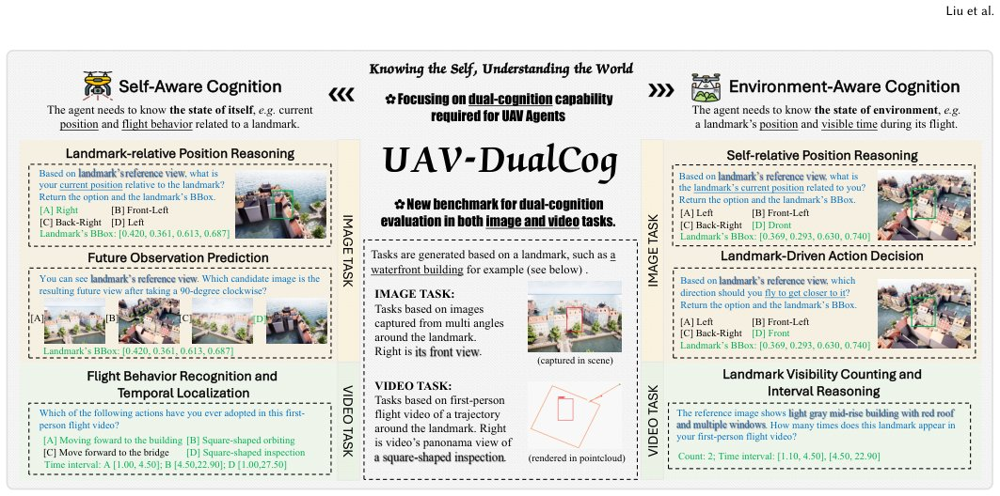

> *Generated by JarvisForResearchers Bot on 2026-07-21*

!!! tip "Why we featured this paper"
    Brand new preprint (2026) — accepted

## TL;DR
UAV-DualCog is a novel benchmark designed to jointly evaluate the dual-cognition capabilities—self-state and environment-state reasoning—of Multimodal Large Language Models (MLLMs) in aerial multiview spatio-temporal contexts. It moves beyond traditional scene understanding by requiring models to reason about both the UAV's own state and the external environment simultaneously, utilizing a highly automated pipeline to generate complex image and video tasks.

## The Problem
Current MLLMs' capabilities in UAV scenarios are insufficiently explored. Existing UAV-oriented benchmarks typically focus narrowly on scene understanding, event recognition, or navigation completion. This narrow focus fails to jointly assess the dual-cognition capability required for effective UAV agents: the ability to reason about both the UAV's own state (self-state) and the external environment (environment-state) within complex, multiview spatio-temporal contexts.

The gaps in prior work are threefold. First, existing benchmarks are largely built on static images or short videos in passive observation settings, where visual inputs are not conditioned on an agent's motion, viewpoint, or interaction with the environment. Second, most UAV-oriented benchmarks emphasize either external environment exploration or task completion, rather than jointly evaluating self-state and environment-state cognition in a unified aerial multiview spatio-temporal setting. Third, existing benchmarks often neglect the observer's embodied state (UAV's own state), focusing primarily on environment-centered understanding.

## Key Contributions
We introduce UAV-DualCog, a benchmark for UAV multiview spatio-temporal reasoning that formulates self-state cognition and environment-state cognition as top-level dimensions, with image and video tasks built by a scalable automated pipeline. We provide a systematic evaluation of diverse lightweight MLLMs, revealing persistent challenges in dual-cognition reasoning, spatial-temporal grounding, and cross-modal consistency. Furthermore, we provide diagnostic validations and a lightweight optimization probe, demonstrating that UAV-DualCog can serve not only as an evaluation benchmark but also as a structured supervision source for UAV-oriented MLLMs.

## How It Works


*Figure 1: Overview of UAV-DualCog, a benchmark for aerial multiview spatio-temporal reasoning. It explicitly formulates
self-aware cognition and environment-aware cognition as two top-level evaluation dimensions. By developing an automatic
construction pipeline, it utilize both image and video modal*

UAV-DualCog is constructed via a four-stage, highly automated pipeline. This pipeline begins with scene-level semantic point cloud construction from AerialVLN scenes. Candidate landmarks are then aggregated and annotated. Next, behavior-driven video tasks are generated using a hierarchical flight behavior framework, and image QA samples are constructed from controlled viewpoint sampling. The benchmark evaluates dual cognition, defined as $C(o) = \{c_s, c_e\}$, where $c_s$ is self-state cognition (e.g., relative position, motion) and $c_e$ is environment-state cognition (e.g., target direction, visibility). The evaluation utilizes both image tasks (four types) and video tasks (two types) to require structured outputs, such as normalized bounding boxes or temporal intervals, moving beyond discrete answer prediction.

### Scene-level semantic point cloud construction
This stage involves sampling coverage-aware UAV poses within the AerialVLN scenes. LiDAR, RGB, segmentation, and pose data are fused to construct scene-level semantic point clouds, which are annotated at both the class- and instance-level.

### Landmark asset construction and semantic annotation
Candidate landmarks are aggregated by instance. These landmarks are then associated with multi-view observations and annotated with detailed geometry and semantic attributes.

### Behavior-driven video task generation
Executable UAV missions and trajectories are generated under a hierarchical flight behavior framework. These trajectories are validated against geometric and collision constraints before being recorded as annotated first-person videos.

### Image task generation
Image QA samples are constructed from the pre-built landmark assets. This process involves controlled viewpoint sampling, rigorous visibility checking, and the application of structured annotation protocols.

## Results
The evaluation across various MLLMs highlights significant performance disparities across the dual-cognition dimensions.

| Metric | Value | Baseline | Source |
| :--- | :--- | :--- | :--- |
| Rel. Position Acc (Proprietary Models) | 37.7% | N/A | Table 2 |
| Future Obs. mIoU@50 (Proprietary Models) | 14.2% | N/A | Table 2 |
| Rel. Position Acc (Gemini 3 Flash) | 47.6% | N/A | Table 2 |
| Action Dec. Acc (GPT 5.5) | 53.4% | N/A | Table 2 |

## Why This Matters
The introduction of UAV-DualCog provides a necessary shift in how we evaluate embodied AI agents operating in complex aerial environments. The practitioner takeaways are clear: when evaluating MLLMs for embodied agents, the evaluation must explicitly test both self-state awareness (the agent's own state) and environment-state awareness (the external scene state). Furthermore, for robust UAV reasoning, models must be required to provide structured outputs, such as bounding boxes or temporal intervals, rather than relying solely on discrete answers. Finally, UAV-DualCog demonstrates utility beyond static evaluation; it can serve as a structured supervision source for training MLLMs specifically for UAV applications.

## Limitations & Open Questions
Two primary limitations are noted. First, reducing the sim-to-real gap remains an active area of future work, although the construction logic is extensible to real UAV videos provided reliable metadata can be secured. Second, current MLLMs remain substantially distant from reliable performance in UAV dual cognition. Persistent bottlenecks are observed in self-state reasoning, accurate viewpoint transformation, precise spatial grounding, and temporal interval localization.

---

## Citation

**Paper:** [2607.16193](https://arxiv.org/abs/2607.16193)

```bibtex
@article{260716193,
  title   = {Knowing the Self, Understanding the World: A Dual-Cognition Benchmark for UAV Spatio-temporal Reasoning with MLLMs},
  author  = {Like Liu and Zhengzheng Xu and Haitao He and Hongzhe Li and Shuchang Zhang and Dian Shao},
  journal = {arXiv preprint arXiv:2607.16193},
  year    = {2026},
  url     = {https://arxiv.org/abs/2607.16193}
}
```
