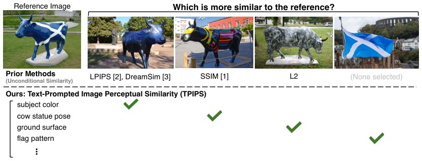

> *Generated by JarvisForResearchers Bot on 2026-07-22*

!!! tip "Why we featured this paper"
    Brand new preprint (2026) — accepted

## TL;DR
We introduce Text-Prompted Image Perceptual Similarity (TPIPS), a metric designed to capture context-dependent, multi-faceted visual similarity. TPIPS is learned by fine-tuning a Vision-Language Model (VLM) on a large-scale dataset of one million human similarity judgments across 25K image triplets, where judgments are conditioned on free-form text prompts. We explore three fusion strategies—Late, Mid, and Early—to define the text-conditioned pairwise similarity function $f_\theta(x_i, x_j | c)$.

## The Problem
Existing perceptual similarity metrics suffer from a fundamental limitation: they collapse nuanced, context-dependent human visual similarity judgments into a single, monolithic scalar value. This scalar approach fails to account for *why* two images are deemed similar or dissimilar. For instance, human perception often distinguishes similarity based on specific aspects—be it shape, color, texture, or composition. Current methods lack an intrinsic mechanism to condition their similarity assessment on these specific visual aspects, leading to a loss of critical semantic information during evaluation.

## Key Contributions
Our work makes three primary contributions:
1. We introduce a large-scale dataset comprising one million human similarity judgments derived from 25K image triplets, where these judgments are explicitly annotated across multiple, free-form semantic aspects.
2. We develop the Text-Prompted Image Perceptual Similarity (TPIPS) metric by fine-tuning a VLM using this novel, aspect-conditioned dataset.
3. We demonstrate that TPIPS achieves superior alignment with human perception and exhibits reliable generalization beyond the training distribution, thereby enabling novel capabilities in text-guided retrieval and compositional search.

## How It Works


*Figure 1: The Many Senses of Similarity. Given a reference image (top left), the four candidate
images (top right) are similar to the reference in different ways, such as subject color, pose, ground
surface, or texture. But existing visual similarity measures (L2, SSIM [1], LPIPS [2], Dreamsim [3])
*

TPIPS is formulated as a learning objective where a VLM is trained to predict the odd-one-out image from a triplet, conditioned on an input text prompt $c$. The training utilizes a cross-entropy loss derived directly from the human similarity judgments $y$. The central technical challenge is defining the text-conditioned pairwise similarity function, $f_\theta(x_i, x_j | c)$. We investigate three distinct architectural paradigms for integrating the image features and the conditioning prompt $c$: Late fusion, Mid-fusion, and Early fusion. All proposed architectures are trained end-to-end to optimize the prediction task.

### Late fusion (Embedding)
In this configuration, the VLM is repurposed to function as a text-guided embedding generator. The similarity $f_\theta(x_1, x_2 | c)$ is computed as the cosine similarity between two embeddings, $z_1$ and $z_2$, which are generated independently for each image conditioned on the prompt: $z = b_g^\theta(x, c)$.

### Mid-fusion (Activation Difference)
This approach operates by comparing the internal representations of the VLM. Specifically, it compares the activations $\phi_\ell(x, c)$ extracted from $L$ distinct transformer layers. The similarity is quantified using a negative weighted $\ell_2$ distance between these per-layer features. Crucially, the weighting factors $w_\ell(c)$ applied to these distances are themselves conditioned on the input text prompt $c$.

### Early fusion
Early fusion integrates the input modalities at the earliest possible stage. The images $x_1, x_2$ and the text prompt $c$ are concatenated and packed into a single, unified input sequence. This structure permits every image patch to engage in direct attention interaction with every other image patch and the prompt tokens across all transformer layers. The final similarity $f_\theta(x_1, x_2 | c)$ is derived from the attention outputs corresponding to designated register tokens, calculated as the cosine similarity: $f_\theta(x_1, x_2 | c) = \frac{h_1^\top h_2}{\|h_1\|\|h_2\|}$.

## Results
The empirical evaluation demonstrates the efficacy of the TPIPS framework.

| Metric | Value | Baseline | Source |
| :--- | :--- | :--- | :--- |
| Performance Gap Reduction | Narrows the performance gap considerably | Strongest current VLM systems | Section 4.2 |
| Generalization | Outperforms baselines in this setting too | Baselines | Section 1 |

## Why This Matters
TPIPS moves the field beyond monolithic similarity scoring. By grounding the metric in fine-grained, aspect-conditioned human judgments, it provides a mechanism to evaluate visual perception that respects semantic nuance. Practically, this unlocks capabilities in text-guided retrieval and compositional search, allowing users to query for similarity along a specific visual axis (e.g., "Find images similar in *texture* but different in *color*").

## Limitations & Open Questions
We acknowledge two primary limitations. First, the aspect list generated during the dataset construction phase is intentionally over-complete, and there is no guarantee that this list perfectly maps onto how humans articulate differences in a real-world scenario. Second, while the model's performance was assessed on a synthetic training distribution, we did test generalization to an out-of-distribution 2AFC set, which provides initial evidence of robustness. Future work should focus on refining the aspect generation process to better align with human linguistic structures.

---

## Citation

**Paper:** [2607.18237](https://arxiv.org/abs/2607.18237)

```bibtex
@article{260718237,
  title   = {The Many Senses of Visual Similarity: A Text-Prompted Image Perceptual Metric},
  author  = {Sheng-Yu Wang and Yotam Nitzan and Aaron Hertzmann and Jun-Yan Zhu and Eli Shechtman and Alexei A. Efros et al.},
  journal = {arXiv preprint arXiv:2607.18237},
  year    = {2026},
  url     = {https://arxiv.org/abs/2607.18237}
}
```
