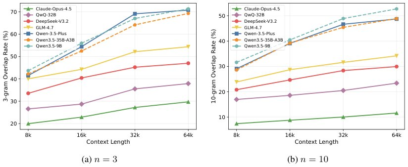

> *Generated by JarvisForResearchers Bot on 2026-07-23*

!!! tip "Why we featured this paper"
    Brand new preprint (2026) — accepted

## TL;DR
GEAR (Grounding Evidence-Aware Reward) is a reward shaping method that mitigates repetitive copying in long-context LLM reasoning by augmenting the accuracy signal with a grounding reward for key evidence overlap and a distractor penalty for irrelevant context overlap.

## The Problem
Large language models generating step-by-step reasoning traces exhibit repetitive copying when reasoning over long contexts. In these scenarios, the models frequently copy verbatim text from the input document into their reasoning traces rather than synthesizing or productively solving the underlying problem. This behavior degrades the quality and efficiency of the reasoning process, particularly when the context window is extensive.

## Key Contributions
We make three primary contributions. First, we identify repetitive copying as a pervasive failure mode in long-context LLM reasoning, tracing its root cause to insufficient evidence grounding—the model's inability to distinguish between salient evidence and extraneous information. Second, we propose GEAR, a reward shaping method that explicitly combines a grounding reward ($\alpha \cdot \text{Overlap}_n(y|x_{\text{key}})$) and a distractor penalty ($\beta \cdot \text{Overlap}_n(y|x_{\text{dist}})$). Third, we developed an automated three-stage pipeline to construct evidence-annotated QA pairs from arbitrary long documents, enabling the scaling of GEAR to natural-language datasets where manual annotation is infeasible.

## How It Works


*Figure 1: n-gram overlap rate on GSM-Infinite as a function of context length across seven models.
All models copy more as context grows, and the high 10-gram overlap confirms that copied spans are
long contiguous passages.*

GEAR addresses the issue of insufficient grounding by modifying the standard accuracy reward ($R_{\text{acc}}$). The modified reward function is defined as:
$$R(x, y) = R_{\text{acc}} + \alpha \cdot \text{Overlap}_n(y|x_{\text{key}}) - \beta \cdot \text{Overlap}_n(y|x_{\text{dist}})$$
This formulation introduces two corrective terms. The grounding reward encourages the model to selectively engage with task-relevant evidence ($x_{\text{key}}$) by measuring the $n$-gram overlap between the generated reasoning trace ($y$) and these annotated support spans. Conversely, the distractor penalty actively discourages indiscriminate copying by penalizing the overlap between $y$ and irrelevant context ($x_{\text{dist}}$).

### GEAR (Grounding Evidence-Aware Reward)
GEAR functions as a reward shaping mechanism applied during Reinforcement Learning from Human Feedback (RLHF) or similar fine-tuning regimes. It augments the intrinsic accuracy signal with explicit signals regarding the *quality* and *relevance* of the evidence utilized in the generated trace.

### Grounding Reward ($R_{\text{ground}}$)
This component is quantified by $\alpha \cdot \text{Overlap}_n(y|x_{\text{key}})$. It operates by calculating the $n$-gram overlap between the model's output trace ($y$) and the pre-identified, task-relevant evidence spans ($x_{\text{key}}$). A higher overlap, weighted by the coefficient $\alpha$, yields a positive reward, incentivizing the model to incorporate relevant facts from the source material into its reasoning steps.

### Distractor Penalty ($R_{\text{dist}}$)
This component is quantified by $-\beta \cdot \text{Overlap}_n(y|x_{\text{dist}})$. It specifically targets the undesirable behavior of copying irrelevant text. By calculating the $n$-gram overlap between $y$ and context segments deemed irrelevant ($x_{\text{dist}}$), and applying a negative weight $-\beta$, the system penalizes the model for generating text that is merely copied from non-essential parts of the input document.

### Automated Data Construction Pipeline
To make GEAR applicable to large, unannotated corpora, we employ a three-stage pipeline. This process begins with Document analysis and filtering, where the raw long document is processed to identify potential evidence regions. This is followed by Evidence-constrained QA generation, where questions are synthesized such that their ground truth answers are constrained to reside within the identified evidence regions. Finally, Answer verification confirms the generated QA pairs, resulting in a dataset where support annotations ($x_{\text{key}}$ and $x_{\text{dist}}$) are constructed by design.

## Results
The implementation of GEAR demonstrated a measurable improvement over baseline methods.

| Metric | Value | Baseline | Source |
| :--- | :--- | :--- | :--- |
| Average points improvement over standard RL with accuracy-based rewards | +4.6 | Standard RL with accuracy-based rewards | Abstract/Section 4.3 |

## Why This Matters
The ability of LLMs to reason over massive contexts is a critical capability for real-world deployment in domains like legal review, scientific literature analysis, and complex technical troubleshooting. Repetitive copying is not merely a stylistic flaw; it indicates a failure in the model's internal grounding mechanism, suggesting it is pattern-matching input text rather than performing abstract reasoning. GEAR provides a principled, quantifiable mechanism to guide the model toward utilizing context selectively, thereby improving the fidelity and robustness of its reasoning traces.

## Limitations & Open Questions
The efficacy of the GEAR framework is contingent upon the proper calibration of the hyper-parameters $\alpha$ and $\beta$. These non-negative coefficients require careful tuning relative to the base accuracy reward to ensure the shaping signals do not dominate or destabilize the RL training process. Furthermore, the reliance on the Automated Data Construction Pipeline introduces a dependency: the pipeline's success is bounded by the language model's inherent ability to accurately perform document analysis and successfully constrain question generation to the designated evidence regions. Future work must investigate more robust methods for evidence boundary detection that are less reliant on generative constraints.

---

## Citation

**Paper:** [2607.19345](https://arxiv.org/abs/2607.19345)

```bibtex
@article{260719345,
  title   = {Copy Less, Ground More: Overcoming Repetitive Copying in Long-Context Reasoning via Evidence-Aware Reinforcement Learning},
  author  = {Lizhe Fang and Weizhou Shen and Tianyi Tang and Yisen Wang},
  journal = {arXiv preprint arXiv:2607.19345},
  year    = {2026},
  url     = {https://arxiv.org/abs/2607.19345}
}
```
