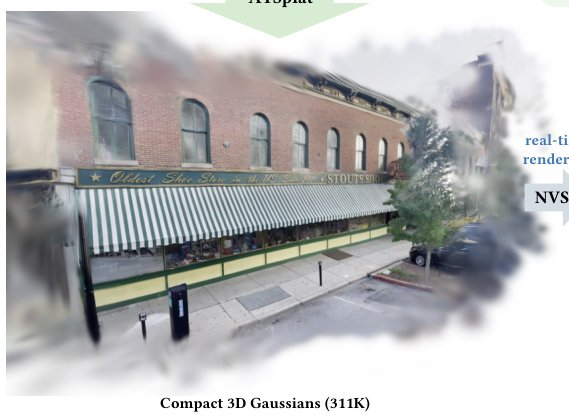

> *Generated by JarvisForResearchers Bot on 2026-07-24*

!!! tip "Why we featured this paper"
    Brand new preprint (2026) — accepted

## TL;DR
ATSplat introduces a feed-forward 3D Gaussian Splatting framework that overcomes the limitations of pixel-aligned formulations by utilizing sparse 3D anchor tokens. It employs an Adaptive Token Expansion (ATE) module to dynamically allocate representational capacity to complex regions, achieving state-of-the-art quality while drastically reducing the required number of Gaussians.

## The Problem
Existing feed-forward 3D Gaussian Splatting (3DGS) methods are fundamentally constrained by their pixel-aligned formulations. This dependency dictates that the number and spatial placement of 3D primitives must correlate directly with the input image resolution and the specific viewpoints provided. Consequently, these methods often generate overly dense and redundant Gaussian sets, as the primitive distribution is dictated by the image grid rather than the intrinsic geometric complexity of the scene. Furthermore, a key challenge in feed-forward decoding is the inability to directly access rendering errors during the forward pass, which complicates the identification of regions that are currently under-reconstructed. Previous attempts to address this either mandated dense, pixel-aligned predictions or relied on uniform spatial downsampling, neither of which adequately accounts for local scene complexity.

## Key Contributions
We propose ATSplat, a novel feed-forward 3DGS framework centered on adaptive 3D anchor tokens, which successfully restores scene-adaptive capacity allocation within a feed-forward paradigm. We introduce the Adaptive Token Expansion (ATE) module, which intelligently identifies and progressively expands tokens in geometrically challenging areas without requiring direct access to rendering errors. Critically, ATSplat achieves superior rendering quality while utilizing over $5.7\times$ fewer Gaussians compared to prior dense, pixel-aligned methods.

## How It Works


*Fig. 1. ATSplat reconstructs compact 3D Gaussians from multi-view captures in a single forward pass. Unlike dense pixel-aligned feed-forward methods that
place Gaussians according to input image grids, ATSplat starts from sparse 3D anchor tokens and adaptively expands tokens associated with challeng*

ATSplat operates in a single forward pass to reconstruct a scene from a set of multi-view images. The process begins by extracting coarse patch features and corresponding patch-level depths using a multi-view encoder. These initial features are used to establish a sparse scaffold of 3D anchor tokens. These anchors are subsequently refined by an Image-to-3D decoder, which integrates the Adaptive Token Expansion (ATE) module to selectively augment the representation in areas requiring higher fidelity. Finally, a Gaussian head maps these refined anchor features into local 3D Gaussians, whose centers are offset from the anchor positions, thereby decoupling primitive placement from the fixed input pixel grid. The ATE module guides this adaptive expansion by estimating a per-anchor uncertainty score, which is supervised using 2D reconstruction errors.

### Multi-view Encoder
The Multi-view Encoder is responsible for extracting rich, cross-view patch features from the input image set. It leverages a frozen DINO backbone for feature extraction. Crucially, camera geometry is injected into the process via Plücker raymap embeddings. The resulting features are then flattened across all input views to form a unified set of tokens.

### Sparse 3D Anchor Tokens Initialization
This stage establishes the initial, sparse geometric scaffold. For each encoded patch, a patch-level depth ($\hat{d}_i$) is predicted. This depth is then used to unproject the 2D patch location ($x_i$) along its corresponding ray ($r_{v_i}$) originating from the camera center ($o_{v_i}$), yielding the initial 3D coordinate $p_i = o_{v_i} + \hat{d}_i r_{v_i}(x_i)$. This process generates the initial sparse set of 3D anchor tokens.

### Image-to-3D Decoder
The Image-to-3D Decoder refines the initial anchor tokens. This refinement is achieved through a stack of $L$ blocks that facilitate cross-attention between the anchor tokens and fine-grained image features. These fine-grained features are extracted at twice the resolution of the initial coarse patch features, allowing for high-frequency detail incorporation during the refinement process.

### Adaptive Token Expansion (ATE) Module
The ATE Module is the mechanism for adaptive capacity allocation. It employs a lightweight MLP to predict a per-anchor uncertainty score ($u_i = g_\phi(f_i)$) based on the current anchor feature $f_i$. Based on this score, the top fraction $\rho_l$ of anchors are selected for expansion. These selected anchors are then expanded into $M$ child tokens via a linear projection: $[\Delta f_{i,1}, \dots, \Delta f_{i,M}] = W f_i$. This mechanism allows the model to concentrate representational power where the uncertainty is highest.

### Gaussian Head
The Gaussian Head is a lightweight, two-layer MLP that translates the refined anchor feature ($\hat{f}_i$) into the parameters defining a set of local 3D Gaussians. For each anchor, it outputs $K$ sets of Gaussian attributes: $\Delta\mu_{i,k}$ (center offset), $q_{i,k}$ (covariance), $s_{i,k}$ (scale), $\alpha_{i,k}$ (opacity), and $SH_{i,k}$ (spherical harmonics coefficients). The final 3D center of the $k$-th Gaussian is determined as $\mu_{i,k} = p_i + \Delta\mu_{i,k}$, ensuring the primitive placement is relative to the anchor, not the input grid.

## Results
| Metric | Value | Baseline | Source |
| :--- | :--- | :--- | :--- |
| Reduction in number of Gaussians | more than $5.7\times$ | dense feed-forward 3DGS methods | Experiments on RealEstate10K and DL3DV |
| Reconstruction time | less than a second | N/A | From 12 input images at $512 \times 960$ resolution |
| Rendering FPS | 1136 FPS | N/A | For $512 \times 960$ resolution with only 311K Gaussians |

## Why This Matters
ATSplat provides a viable pathway to achieving high-fidelity 3D scene reconstruction using feed-forward neural rendering techniques, a significant step toward real-time, generative 3D content creation. By decoupling primitive placement from the input image grid via sparse anchor tokens, we move away from the inherent inefficiencies of pixel-aligned methods. The introduction of the ATE module demonstrates that scene-adaptive capacity allocation can be effectively learned and implemented in a feed-forward setting, leading to highly compact representations without sacrificing visual quality.

## Limitations & Open Questions
A primary limitation is that the uncertainty score used to guide token expansion is an approximation of the true rendering error, as it is supervised solely via 2D reconstruction errors. Furthermore, the reliance on a single forward pass necessitates approximating the error signals during the decoding process, which inherently limits the direct feedback loop available in iterative optimization methods. Future work should investigate methods to incorporate more direct, differentiable error signals into the token expansion criterion.

---

## Citation

**Paper:** [2607.20417](https://arxiv.org/abs/2607.20417)

```bibtex
@article{260720417,
  title   = {ATSplat: Compact Feed-forward 3D Gaussian Splatting with Adaptive Token Expansion},
  author  = {Cho In and Jeonghwan Cho and Mijin Yoo and Gim Hee Lee and Seon Joo Kim},
  journal = {arXiv preprint arXiv:2607.20417},
  year    = {2026},
  url     = {https://arxiv.org/abs/2607.20417}
}
```
