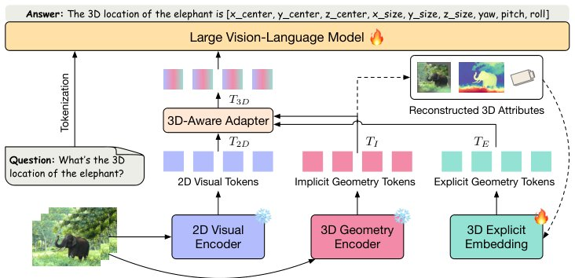

> *Generated by JarvisForResearchers Bot on 2026-07-25*

!!! tip "Why we featured this paper"
    Brand new preprint (2026) — accepted

## TL;DR
VLM-IE3D unifies the integration of Implicit Geometry Tokens (IGTs) and Explicit Geometry Tokens (EGTs) derived solely from RGB video streams to imbue Vision-Language Models (VLMs) with robust, fine-grained 3D spatial awareness, circumventing the need for auxiliary 3D sensor data.

## The Problem
Most contemporary Vision-Language Models (VLMs) are fundamentally trained on 2D visual data. When tasked with complex 3D reasoning—such as detailed spatial localization or geometric manipulation—these models encounter significant limitations. The implicit 3D representations often leveraged in related work tend to capture only coarse, global spatial layouts. Furthermore, the highly compressed and latent nature of these implicit representations hinders a language model's ability to interpret precise, quantitative geometric properties. Existing RGB-only VLM architectures fail to adequately exploit structured, interpretable explicit 3D representations, which are necessary for achieving high fidelity in spatial understanding.

## Key Contributions
We present VLM-IE3D, a unified framework designed to inject strong 3D inductive biases into VLMs using only RGB video sequences. Our primary contributions include:

1.  The introduction of two complementary geometry-aware representations: Implicit Geometry Tokens (IGTs), which encode high-level 3D priors, and Explicit Geometry Tokens (EGTs), which provide detailed 3D structural information.
2.  The design of a specialized 3D-aware adapter mechanism engineered to effectively fuse these disparate geometric representations with standard 2D visual cues.

## How It Works


*Fig. 2: Overview of the VLM-IE3D framework. VLM-IE3D directly processes RGB
frames without explicit 3D inputs, using three streams: (1) a 2D visual encoder that
extracts 2D visual tokens; (2) a 3D geometry encoder that generates Implicit Geometry
Tokens (IGTs) for high-level 3D information; (3) a 3D*

VLM-IE3D operates by processing an input RGB video sequence $I_i$ alongside a natural language query $Q$ through three parallel processing streams. The process begins with the extraction of standard 2D visual tokens ($T_{2D}$) from the video frames. Concurrently, a dedicated 3D geometry encoder (leveraging AnySplat [19]) generates Implicit Geometry Tokens ($T_I$), which encapsulate global 3D priors. In parallel, reconstructed 3D attributes (such as depth maps) are processed by a 3D explicit embedding module to yield Explicit Geometry Tokens ($T_E$). The core innovation lies in the 3D-aware adapter, which fuses $T_I$ and $T_E$ using an implicit-explicit attention (IEA) module to produce a unified 3D representation ($T_{3D}$). This $T_{3D}$ is then fused with a compressed version of $T_{2D}$ via element-wise addition, resulting in the final 3D-aware visual tokens ($T_{3D}$), which are subsequently fed into the VLM backbone.

### 2D visual encoder
This component is responsible for extracting the foundational 2D visual tokens, $T_{2D} \in \mathbb{R}^{f \times n \times c}$, directly from the input RGB video sequence $I_i$.

### 3D geometry encoder
This module utilizes AnySplat [19] to generate the Implicit Geometry Tokens ($T_I \in \mathbb{R}^{f \times n \times c}$). This process simultaneously yields the necessary 3D attributes required for the explicit encoding stream.

### 3D explicit embedding module
This module takes the reconstructed explicit 3D attributes (e.g., depth maps) and transforms them into Explicit Geometry Tokens ($T_E \in \mathbb{R}^{f \times n \times c}$). This transformation involves a one-layer patch embedding followed by a two-layer MLP.

### 3D-aware adapter
This component orchestrates the integration of the three modalities. It first employs an implicit-explicit attention (IEA) module, implemented as Multi-Head Cross-Attention, to fuse $T_I$ and $T_E$ into $T_{3D}$. Subsequently, $T_{3D}$ is fused with the compressed $T_{2D}$ via element-wise addition to yield the final, unified 3D-aware visual tokens.

## Results
The performance gains demonstrate the efficacy of this unified geometric injection strategy.

| Metric | Value | Baseline | Source |
| :--- | :--- | :--- | :--- |
| C@0.5$\uparrow$ (Scan2Cap) | 80.4 | Qwen2.5-VL-3B [2] | Table 1 |
| M@0.5$\uparrow$ (Scan2Cap) | 28.8 | Qwen2.5-VL-3B [2] | Table 1 |

## Why This Matters
The practitioner takeaway is clear: to move beyond coarse spatial reasoning in RGB-only VLM pipelines, augmenting implicit scene priors with structured, explicit geometric tokens (EGTs) is a highly effective strategy. The design of the implicit-explicit attention (IEA) module is critical, as it successfully bridges the semantic gap between the coarse global understanding provided by IGTs and the fine-grained local detail offered by EGTs. Crucially, VLM-IE3D achieves this strong 3D inductive bias injection without incurring the computational overhead or dependency on specialized 3D sensing hardware.

## Limitations & Open Questions
We acknowledge two primary limitations. First, the performance of the framework is contingent upon the 3D geometry encoder [19] having been pre-trained on a sufficiently diverse and comprehensive set of 3D geometric tasks. Second, the specific design choice within the 3D-aware adapter—the spatial merging strategy involving the concatenation of spatially adjacent $2 \times 2$ features—represents a fixed architectural decision that warrants further investigation regarding its optimality.

---

## Citation

**Paper:** [2607.21595](https://arxiv.org/abs/2607.21595)

```bibtex
@article{260721595,
  title   = {3D-Aware VLMs with Implicit and Explicit Geometries},
  author  = {Wenhao Li and Xueying Jiang and Quanhao Qian and Deli Zhao and Ran Xu and Shijian Lu et al.},
  journal = {arXiv preprint arXiv:2607.21595},
  year    = {2026},
  url     = {https://arxiv.org/abs/2607.21595}
}
```
