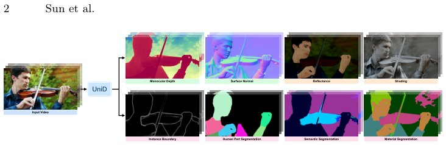

> *Generated by JarvisForResearchers Bot on 2026-07-26*

!!! tip "Why we featured this paper"
    Brand new preprint (2026) — accepted

## TL;DR
UniD introduces a unified video model capable of jointly predicting eight dense scene properties from disparate, domain-specific datasets. It achieves this by distilling task-specific knowledge from specialized diffusion models into a shared backbone via lightweight task projectors, circumventing the need for co-annotated data or expensive pseudo-labeling.

## The Problem
Scene understanding necessitates the simultaneous estimation of geometric, appearance, and semantic attributes. However, the available ground-truth annotations are typically fragmented across numerous, incompatible, domain-specific datasets. This fragmentation presents a significant hurdle for developing truly unified models, as standard training paradigms often require either perfectly co-annotated data across all tasks or rely on computationally intensive pseudo-labeling pipelines.

## Key Contributions
We introduce UniD, a unified video model designed to jointly predict eight dense scene properties sourced from disjoint, domain-specific datasets. Our primary technical contribution is a simple distillation mechanism where task-specific experts supervise a unified backbone through lightweight task projectors, effectively eliminating the dependency on annotation overlap or pseudo-labeling. Furthermore, we leverage the robust visual priors embedded within a pretrained diffusion model to effectively bridge the domain gaps inherent in training from disjoint data sources.

## How It Works


*Fig. 1: Unified Video Dense Predictions by UniD.*

The UniD framework operates in two phases. Initially, task-specific specialists ($F^k_\theta, P_k$) are trained independently on their respective disjoint datasets $D_k$ using a single-step diffusion framework, minimizing task-specific objectives $L_k$. These specialists learn to map input latent codes $z_i$ to task-specific latent representations $l^k_i$. Subsequently, a unified backbone $G_\phi$ is trained alongside $K$ lightweight task-specific latent projectors $\{\Psi^k\}_{k=1}^K$. The objective for this second phase is a latent reconstruction loss $L_{rec}$, which forces $G_\phi$ to reconstruct the target latents $\{l^k_i\}$ via the projectors. Temporal consistency across frames is enforced through an extended temporal gradient matching loss $L_{TGM}$, which stabilizes the predictions during simultaneous, temporally coherent inference.

### Pretrained Latent Diffusion Model (LDM) Backbone
This component is instantiated using Stable Diffusion v2 [60]. It comprises a Variational Autoencoder (VAE) encoder $E$ and decoder $D$, alongside a U-Net backbone $F_\theta$. This structure provides the foundational capability for initial latent code generation, leveraging extensive pretraining for strong visual representation learning.

### Task Specialist ($F^k_\theta, P_k$)
For each task $k$, a dedicated specialist is maintained. This specialist consists of a finetuned U-Net backbone $F^k_\theta$ and a task-specific pixel projector $P_k$, which is implemented as a single $3 \times 3$ convolution. These components are responsible for learning the specific mapping required for task $k$ within its domain $D_k$.

### Unified Backbone ($G_\phi$)
$G_\phi$ serves as the shared core of the model, initialized from the pretrained U-Net. It processes the input latent codes $z_i$ and incorporates Extended Self-Attention (ESA) mechanisms to integrate temporal context across frames.

### Task-Specific Latent Projector ($\Psi^k$)
This component acts as the interface between the unified representation and the task-specific latent space. It is implemented as a DPT head that fuses three intermediate feature representations from $G_\phi$ with the final output feature. This fusion occurs at a fixed dimension of 256, projecting the unified representation into the required task-specific latent space.

### Extended Self-Attention (ESA)
ESA is an augmentation applied to every self-attention layer within the U-Net backbone $F_\theta$. It enhances the standard attention mechanism by incorporating feature vectors derived from $M$ historical frames stored within a dedicated memory bank, thereby explicitly modeling temporal dependencies.

## Results
| Metric | Value | Baseline | Source |
| :--- | :--- | :--- | :--- |
| Depth | Competitive performance | Per-task specialists and multi-task baselines | Table 1 |
| Temporal Consistency | Superior | Existing unified models and a multi-task baseline utilizing a frozen DINOv3-H backbone | Section 4.1 |

## Why This Matters
UniD provides a practical pathway to achieve unified dense prediction across a spectrum of diverse tasks—encompassing geometry, semantics, and intrinsics—without the prohibitive requirement of co-annotated data. Furthermore, the modular design of the architecture ensures extensibility; introducing a new task $K+1$ necessitates only the training of a new specialist $(F^{K+1}_\theta, P_{K+1})$ and a corresponding latent projector $\Psi^{K+1}$. The reliance on pretrained diffusion models ensures that strong, general visual priors are available to mitigate the domain shift introduced by training on disjoint datasets.

## Limitations & Open Questions
A noted limitation is the temporal gradient matching loss $L_{TGM}$, which employs a mask $\mathbb{1}[|l_{i+1} - l_i|_2 < \varepsilon ]$. This masking mechanism inherently suppresses the learning signal in regions exhibiting rapid changes, where temporal regularization is less reliable. Additionally, if the reconstruction loss $L_{rec}$ is restricted solely to per-frame reconstruction objectives, the unified backbone $G_\phi$ may not receive sufficient global temporal regularization.

---

## Citation

**Paper:** [2607.21592](https://arxiv.org/abs/2607.21592)

```bibtex
@article{260721592,
  title   = {Unified Video Dense Prediction from Disjoint Data},
  author  = {Yihong Sun and Seoung Wug Oh and Jiahui Huang and Bharath Hariharan and Joon-Young Lee},
  journal = {arXiv preprint arXiv:2607.21592},
  year    = {2026},
  url     = {https://arxiv.org/abs/2607.21592}
}
```
