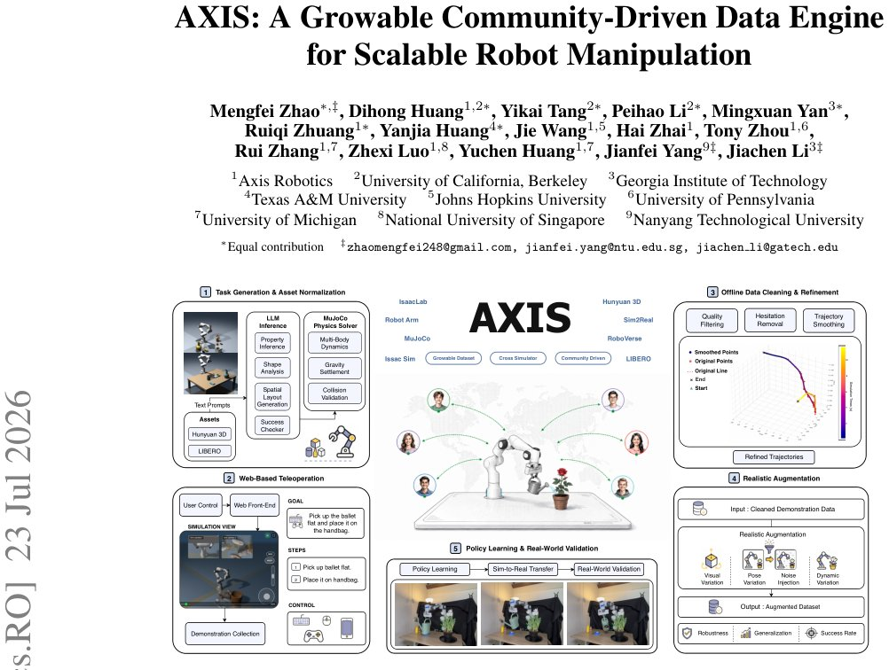

> *Generated by JarvisForResearchers Bot on 2026-07-27*

!!! tip "Why we featured this paper"
    Brand new preprint (2026) — accepted

## TL;DR
AXIS is a framework designed to overcome the scalability bottlenecks in robot manipulation data collection. It integrates automated task generation, community-driven data acquisition via browser-based teleoperation, and a multi-stage data refinement pipeline (including IsaacSim augmentation) to produce large, high-quality, and continuously growing datasets suitable for training Vision-Language-Action (VLA) policies.

## The Problem
The efficacy of modern robot manipulation policies is fundamentally constrained by the quality and quantity of training data. Current methodologies suffer from inherent scaling limitations. Specifically, existing manipulation datasets are typically static, resulting from one-time collection efforts. Furthermore, the data collection process is often centralized and closed, relying heavily on expert operators or dedicated, specialized teams. Finally, accessibility is restricted because many teleoperation systems mandate specialized hardware or complex local simulator installations. This combination results in datasets that grow significantly slower than the capability ceiling of the models being trained.

## Key Contributions
We present AXIS, a web-based, community-driven infrastructure engineered for scalable manipulation data collection. This infrastructure leverages browser-based MuJoCo-WASM teleoperation alongside automated task generation capabilities. We have constructed a growable manipulation dataset containing 207 tasks and over 50K trajectories. This dataset is supported by a unified data processing pipeline that standardizes trajectories, validates success, filters quality, performs temporal smoothing, resamples data, and applies realistic augmentation using IsaacSim. Furthermore, we introduce a systematic evaluation protocol that allows for controlled studies of policy learning and dataset scaling by utilizing versioned task snapshots (AXIS-25%, AXIS-50%, AXIS-100%) against a fixed evaluation suite.

## How It Works


*Figure 1: AXIS: A growable community-driven data engine unifying task generation, web teleoper-
ation, data refinement, realistic augmentation, and policy learning with real-world validation.*

AXIS is architected as a three-layer system. The infrastructure layer manages the interface between high-level instructions and physical demonstration capture. The dataset layer is responsible for transforming raw, noisy demonstrations into clean, high-fidelity training samples. The model layer facilitates the training and rigorous evaluation of VLA policies using these structured, progressively scaled datasets.

### Web-Based Teleoperation
This component provides the interface for data collection. It enables external users to contribute demonstrations through a shared web interface. The underlying simulation environment is powered by MuJoCo-WASM, allowing demonstrations to be captured using commodity input devices without requiring specialized local installations.

### Task Generation & Asset Normalization
This module addresses the need for diverse task coverage. It generates novel tasks based on high-level Text Prompts. This generation process is augmented by LLM Inference to structure the task, and it incorporates detailed analysis of object properties, including Shape Analysis and Spatial Layout Generation, to ensure the generated tasks are physically valid and well-defined.

### Dataset Layer Pipeline
This pipeline is the core transformation engine for raw data. It systematically processes demonstrations through several stages: automated success validation to confirm task completion; quality filtering to discard low-fidelity samples; static-segment removal to eliminate redundant motion; trajectory smoothing to reduce high-frequency noise; and resampling to standardize trajectory length.

### Realistic Augmentation
Once data is cleaned, it is replayed within the IsaacSim environment. This allows for the application of controlled, high-fidelity augmentation. Specifically, we introduce physical randomization, varying parameters such as object poses and friction coefficients, alongside rendering randomization, which manipulates camera viewpoints and lighting conditions.

### Task Snapshots
To enable controlled scaling studies, the collected and processed demonstrations are organized into versioned snapshots. These snapshots represent progressively larger subsets of the total data, specifically AXIS-25%, AXIS-50%, and AXIS-100%, allowing researchers to isolate the impact of dataset size on policy performance.

## Results
| Metric | Value | Baseline | Source |
| :--- | :--- | :--- | :--- |
| Overall LIBERO-Plus success rate improvement (Continual pretraining on AXIS-100%) | 5.8% | $\pi0.5$ | Abstract |
| Outperformance vs. RoboCasa365 (volume-matched) | 37.3% | RoboCasa365 | Abstract |
| Success Rate (AXIS-25%) | 84.7% | N/A | Abstract |
| Success Rate (AXIS-50%) | 85.7% | N/A | Abstract |
| Success Rate (AXIS-100%) | 88.8% | N/A | Abstract |
| Mean Acceleration Reduction (Smoothed vs. Raw) | 63.9% | Raw Teleoperation | Table 1 |
| Mean Jerk Reduction (Smoothed vs. Raw) | 80.8% | Raw Teleoperation | Table 1 |

## Why This Matters
AXIS provides a tangible pathway toward decoupling the rate of model improvement from the rate of specialized data collection. By democratizing data acquisition through web-based interfaces and automating the laborious process of data cleaning and augmentation, it shifts the bottleneck from infrastructure and expertise to the rate of community contribution. The systematic snapshotting allows for rigorous, controlled ablation studies on dataset scaling, which is critical for understanding the true data efficiency of VLA architectures.

## Limitations & Open Questions
The current description does not provide exhaustive detail on the specific hardware configuration utilized, beyond noting the use of a Franka Research 3 robot arm equipped with a parallel-jaw gripper. Furthermore, the operational complexity of the complete pipeline necessitates substantial backend infrastructure to maintain the required fidelity for high-fidelity simulation and augmentation steps. Future work should focus on modularizing the backend to allow for easier deployment and scaling of the augmentation services.

---

## Citation

**Paper:** [2607.21588](https://arxiv.org/abs/2607.21588)

```bibtex
@article{260721588,
  title   = {AXIS: A Growable Community-Driven Data Engine for Scalable Robot Manipulation},
  author  = {Mengfei Zhao and Dihong Huang and Yikai Tang and Peihao Li and Mingxuan Yan and Ruiqi Zhuang et al.},
  journal = {arXiv preprint arXiv:2607.21588},
  year    = {2026},
  url     = {https://arxiv.org/abs/2607.21588}
}
```
