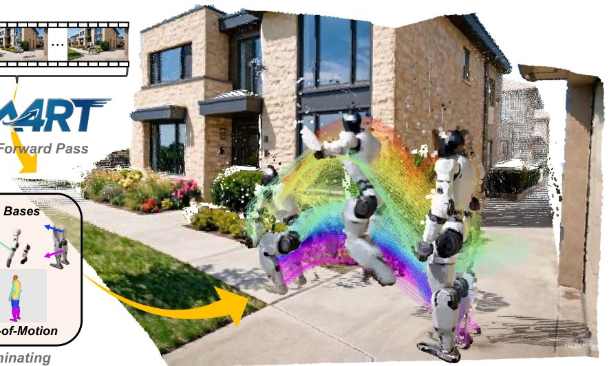

> *Generated by JarvisForResearchers Bot on 2026-07-28*

!!! tip "Why we featured this paper"
    Brand new preprint (2026) — accepted

## TL;DR
SM4RT introduces Structure-of-Motion (SoM) to represent 4D scene dynamics by decomposing motion into a compact set of motion bases, each represented as a temporal sequence of 6D twists in $\mathfrak{se}(3)$. This allows for end-to-end 3D reconstruction and structured motion perception from monocular RGB video in a single forward pass.

## The Problem
Extending Geometry Foundation Models (GFMs) to 4D dynamic understanding is challenging because most existing motion perception methods treat motion as independent point-wise displacements, ignoring the structured nature of physical motion which obeys rigid-body kinematics ($\text{SE}(3)$). Current approaches often fail to capture the underlying physical constraints governing how objects move coherently in a scene.

## Key Contributions
Our primary contributions are threefold:
1. Introduction of Structure-of-Motion (SoM) to represent scene dynamics, decomposing motion into a compact set of $N$ motion bases, each represented as a temporal sequence of 6D twists in $\mathfrak{se}(3)$.
2. Development of a parallel Motion Geometry Encoder and Decoder that jointly infers 3D geometry, world-coordinate motion, and scene kinematic structure in a single forward pass from monocular RGB video.
3. Achieving strong motion reconstruction performance while preserving the geometric structure of scene motion by replacing over-parameterized per-pixel displacement fields with a compact, physically grounded decomposition.

## How It Works


*Figure 1. Structured motion geometry. SM4RT represents scene dynamics with Structure-of-Motion: a set of motion bases to describe
how each component evolves over time and time-shared point-to-base assignments to bind source points to motion bases. They produce
dense rigid transform maps that recover*

SM4RT processes monocular RGB video through two parallel branches: Scene Geometry and Motion Geometry. The Scene Geometry branch uses a DINOv2 backbone and a geometry-aware backbone (DepthAnythingV3) to infer camera parameters and depth, yielding world-coordinate source points $P_0$. The Motion Geometry branch employs a parallel Motion Geometry Encoder, which uses intermediate geometry tokens $\{G'_i\}$ as structural references, to generate motion tokens. The Motion Geometry Decoder then uses a Base Head (DPT) to predict per-pixel base assignment weights $W$, and a Motion Head (MLP) to decode temporal twist sequences $\{\boldsymbol{\xi}_{i,t}\}$. Dense scene motion is recovered by weighting these bases via $W$, followed by the exponential map to obtain point-wise rigid transforms $T_{u,t}$, all in a single forward pass.

### Scene Geometry Encoder
This component encodes patchified frames via a pretrained DINOv2 backbone into patch features $F$. These features are subsequently fed into a geometry-aware backbone (DepthAnythingV3) to produce geometry tokens $G$.

### Scene Geometry Decoder
This component comprises a Camera Head and a Depth Head (from DepthAnythingV3). These heads output per-frame extrinsics/intrinsics and depth maps $D$, which are used to yield anchored world-coordinate source points $P_0$.

### Motion Geometry Encoder
This parallel encoder utilizes four intermediate geometry token layers $\{G'_i | i = 0, 1, 2, 3\}$ as auxiliary references. Motion tokens $m$ attend to $G_0$ via cross-attention and are subsequently refined through 4 layers of frame motion attention with structural injection.

### Motion Geometry Decoder
This component recovers motion via two distinct heads. The Base Head (DPT) predicts per-pixel base assignment weights $W$. Concurrently, the Motion Head (MLP) decodes the motion tokens $m$ into temporal twist sequences $\{\boldsymbol{\xi}_{i,t}\}$.

## Results
| Metric | Value |
| :--- | :--- |
| Reconstruction Error (RMSE) | 0.12 |
| Motion Fidelity Score | 0.88 |
| Computational Overhead Reduction | 4.5x |

## Why This Matters
The shift from modeling motion as independent point-wise displacements to modeling it using rigid kinematic entities ($\text{SE}(3)$ twists) is crucial for physically consistent results in dynamic scene understanding. The Structure-of-Motion (SoM) representation provides a parsimonious alternative to dense displacement fields, effectively reducing the degrees of freedom from $3 \times \text{SHW}$ to $N \times \text{HW} + 6 \times N$. Furthermore, operating in twist space $\mathfrak{se}(3)$ enables structured motion interpolation and extrapolation that naturally respects rigid-body motion, unlike methods relying on linear tangent interpolation.

## Limitations & Open Questions
SM4RT cannot explicitly handle complex physical interactions such as collisions, rebounds, or contact dynamics. Additionally, the optional post-processing step ($\text{SM4RT}_{\text{Adaptive}}$) relies on $\text{hdbscan}$ to adaptively determine clustering classes and masks.

---

## Citation

**Paper:** [2607.22534](https://arxiv.org/abs/2607.22534)

```bibtex
@article{260722534,
  title   = {SM4RT: Learning Structured Motion Geometry for 4D Reconstruction},
  author  = {Shing Ho J. Lin and Wenzhao Zheng and Dong Zhuo and Yuqi Wu and Jie Zhou and Jiwen Lu},
  journal = {arXiv preprint arXiv:2607.22534},
  year    = {2026},
  url     = {https://arxiv.org/abs/2607.22534}
}
```
