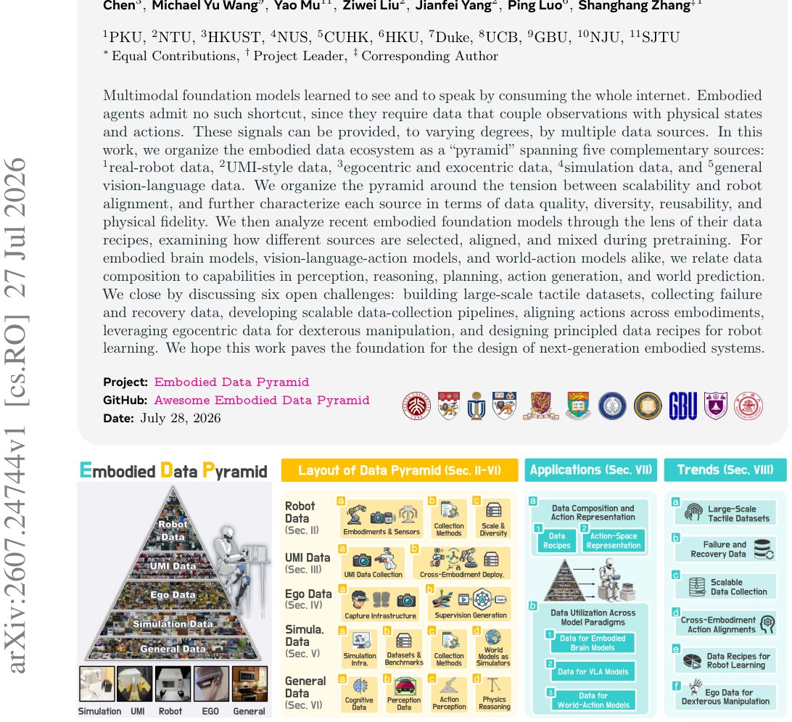

> *Generated by JarvisForResearchers Bot on 2026-07-29*

!!! tip "Why we featured this paper"
    Brand new preprint (2026) — accepted

## TL;DR
This work formalizes the embodied data ecosystem into a five-layer 'Data Pyramid.' This structure organizes complementary data sources—Real-Robot, UMI-Style, Egocentric/Exocentric, Simulation, and General—based on the inherent tension between data scalability and robot alignment. Each source is characterized across Quality, Diversity, Reusability, and Physical Fidelity, providing a systematic lens to analyze how embodied foundation models integrate heterogeneous data for perception, reasoning, and action generation.

## The Problem
Extending multimodal foundation models to function as competent embodied agents necessitates data that robustly couples high-dimensional observations with precise physical states and executable actions. However, the current landscape lacks a systematic framework for understanding the roles, inherent trade-offs, relationships, and optimal integration strategies among the various complementary data sources available.

The existing literature presents several gaps. First, prior hierarchical or pyramid-like views of training data are often tailored to the specific training recipe of a single model, offering limited comparative analysis across critical dimensions such as collection scalability, embodiment dependence, physical fidelity, transferability, and downstream utility. Second, existing surveys tend to be siloed, focusing narrowly on model architectures or specific subproblems (e.g., Vision-Language-Action models, World-Action models, or world modeling). Consequently, the embodied data ecosystem has not been systematically organized at the category level, nor has the utilization of heterogeneous data by embodied foundation models been comprehensively analyzed from a rigorous, data-centric perspective.

## Key Contributions
We make three primary contributions to this domain:
1. We organize the embodied data ecosystem into a 'Data Pyramid' comprising five complementary sources: real-robot data, UMI-style data, egocentric and exocentric data, simulation data, and general data.
2. We characterize each of these data sources using four complementary dimensions—Quality, Diversity, Reusability, and Physical Fidelity—in conjunction with the overarching metrics of Scalability and Robot Alignment.
3. We analyze recent embodied foundation models through the lens of their data recipes, establishing a direct relationship between the composition of their utilized data and their resulting capabilities across perception, reasoning, planning, action generation, and world prediction.

## How It Works


*Figure 1 Overview of Organization and Scope. This work is organized into three parts. We first introduce the embodied
data pyramid, which categorizes data sources into real-robot, UMI-style, egocentric-exocentric, simulation, and general
data according to their scalability and robot alignment, and r*

The core methodology involves constructing the Embodied Data Pyramid. This pyramid categorizes five distinct data sources—Real-Robot, UMI-Style, Egocentric/Exocentric, Simulation, and General—by mapping them onto the tension between Scalability and Robot Alignment. These categories are then further characterized by their inherent levels of Quality, Diversity, Reusability, and Physical Fidelity. The pyramid is structurally ordered from its apex, representing the strongest physical grounding, down to its base, which represents the greatest accessibility and scalability. Following this categorization, the paper examines how contemporary embodied foundation models leverage these heterogeneous sources, specifically analyzing their data composition and the accommodation strategies employed, such as action-space alignment and geometric alignment.

### Real-Robot Data
This data consists of trajectories that are either teleoperated or scripted directly onto the target robot. It captures a complete, closed-loop sequence, recording observations, internal states, executed actions, and resulting outcomes within the physical environment.

### UMI-Style Data
This category encompasses demonstrations captured using handheld grippers. Crucially, this data records end-effector motion trajectories without requiring the full complexity of a robot integrated into the control loop.

### Egocentric / Exocentric Data
This data includes first-person (egocentric) and third-person (exocentric) recordings of human agents performing tasks. These sources provide access to real-world physics, dexterous manipulation examples, and high levels of everyday behavioral variety.

### Simulation Data
This data is generated through interaction within physics engines. It is valuable because it returns executable actions alongside privileged, ground-truth labels, such as precise contact points, object poses, and binary success signals.

### General Data
This category comprises web-scale corpora, including images, videos, natural language text, and vision-language pairs. These sources primarily inject semantics, spatial structure, and commonsense knowledge into the model.

## Results
The analysis of recent model training practices reveals a clear trend in data composition.

| Metric | Value | Baseline | Source |
| :--- | :--- | :--- | :--- |
| Data Utilization Across Model Paradigms | Transition from early training recipes dominated by real-robot trajectories toward increasingly heterogeneous mixtures of real-robot, simulation, general, egocentric, and, less frequently, UMI-style data. | N/A | Figure 3 |

## Why This Matters
This systematic organization moves the discussion beyond mere data aggregation toward a principled understanding of data utility in embodied AI. By characterizing data sources across six dimensions (Scalability, Robot Alignment, Quality, Diversity, Reusability, and Physical Fidelity), practitioners gain a diagnostic tool for pipeline design. The findings indicate that the evolution of embodied foundation models is characterized by a move away from reliance on singular, high-fidelity sources toward complex, heterogeneous mixtures, suggesting that the optimal data recipe is context-dependent and requires careful balancing of fidelity against scale.

## Limitations & Open Questions
The current framework highlights several open challenges that require focused research. These include the necessity of building large-scale tactile datasets, developing robust methods for collecting failure and recovery data, engineering scalable data-collection pipelines, establishing principled methods for aligning actions across different embodiments, effectively leveraging egocentric data for fine-grained dexterous manipulation, and ultimately, designing principled data recipes for general robot learning. Furthermore, it must be noted that the ordering of the pyramid represents an overall synthesis of the six dimensions; it does not imply a strictly monotonic progression along every individual property for any given data source.

---

## Citation

**Paper:** [2607.24744](https://arxiv.org/abs/2607.24744)

```bibtex
@article{260724744,
  title   = {Data Pyramid for Embodied Manipulation},
  author  = {Yifan Ye and Yankai Fu and Yaoxu Lv and Bohan Hou and Jun Cen and Lingdong Kong et al.},
  journal = {arXiv preprint arXiv:2607.24744},
  year    = {2026},
  url     = {https://arxiv.org/abs/2607.24744}
}
```
