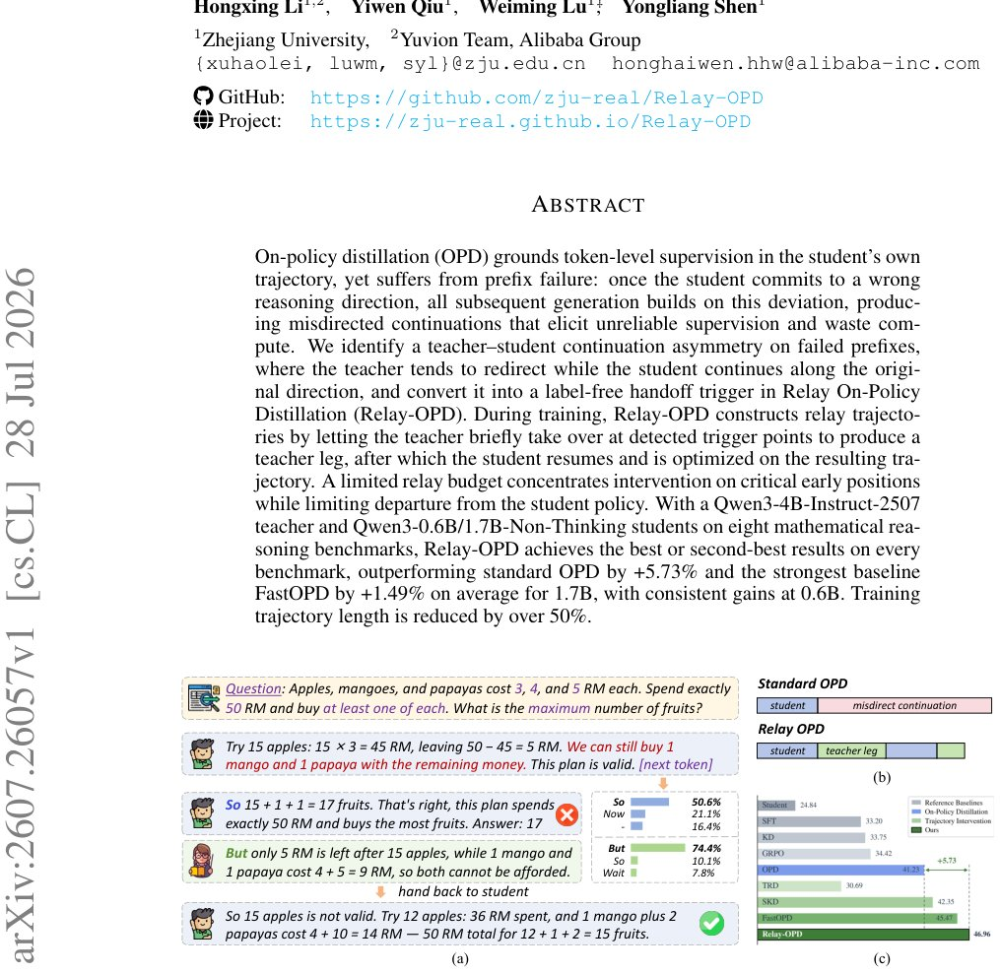

> *Generated by JarvisForResearchers Bot on 2026-07-30*

!!! tip "Why we featured this paper"
    Brand new preprint (2026) — accepted

## TL;DR
Relay On-Policy Distillation (Relay-OPD) mitigates prefix failure in On-Policy Distillation (OPD) by introducing a label-free handoff trigger. This trigger allows the teacher model to briefly correct the student's trajectory via a budgeted relay rollout before control returns to the student, leading to significant performance gains while reducing training compute.

## The Problem
On-policy distillation (OPD) is susceptible to prefix failure. If the student model commits to an incorrect reasoning path early in the generation process, all subsequent tokens are conditioned on this erroneous prefix. This leads to the generation of misdirected continuations, which in turn yields unreliable supervision signals for the student, ultimately wasting computational resources.

The existing approaches to address this failure mode exhibit limitations:
*   Fixed-length truncation methods (e.g., ESR, FastOPD) impose a rigid cutoff point, irrespective of the actual point of reasoning failure.
*   Offline rewriting techniques (e.g., TRD) only correct trajectories after they have been fully generated, often resulting in noticeable artifacts in the repaired output.
*   Token-level mixing methods (e.g., SKD) switch between teacher and student based on generic distributional disagreement, lacking the specificity of an explicit signal indicating a failure in the reasoning direction.

## Key Contributions
We make three primary contributions:
1.  We identify a continuation asymmetry between the teacher and student models specifically on failed reasoning prefixes, demonstrating that correcting this failure requires only early and localized teacher intervention, with teacher tokens constituting as little as 0.35% of the total generation.
2.  We propose Relay-OPD, which formalizes this asymmetry into a label-free handoff trigger and implements a budgeted relay rollout. This unifies the student and teacher generation processes within a single speculative-decoding engine.
3.  Empirically, across eight math reasoning benchmarks, Relay-OPD surpasses standard OPD by +5.73% and FastOPD by +1.49% when using a 1.7B student model, concurrently achieving a reduction in average training trajectory length exceeding 50%.

## How It Works


*Figure 1: (a) A Relay-OPD case: at the detected handoff trigger, the teacher prefers the reflection
token (But, 74.4%) while the student would continue along the current direction (So, 50.6%); a
brief teacher leg corrects the reasoning and the student resumes to the correct answer. (b) Difference
be*

Relay-OPD operates by monitoring the student's trajectory for a specific handoff trigger. This trigger signals a state where the teacher model indicates a desire to redirect the reasoning, while the student model is still proceeding along its initial, potentially flawed, path.

When the condition $\phi(h) = 1$ is met, the teacher initiates a short "Teacher Leg" of length $L$ paragraphs, guided by the teacher's policy $a_T(h)$. This intervention is constrained by a predefined relay budget $(M, L)$ to ensure correction is concentrated early. Upon completion of the teacher leg, control transfers back to the student for a "Student Leg," where generation resumes autoregressively according to the student's policy $\pi_{\bar{\theta}}$. The student is then trained on this corrected, relay-augmented trajectory using the advantage $A_{Relay}^t = \log \pi_T(z_t | h_z^t) - \log \pi_{\bar{\theta}}(z_t | h_z^t)$, optimized via the objective $L_{Relay}$. The entire state management—switching between student and teacher control—is managed within a single speculative decoding engine.

### Handoff Trigger
The handoff trigger is defined by the criterion $\phi(h) = 1[a_T(h) \in R] \cdot 1[KS(h) \cap R = \emptyset]$. This fires when the teacher's most probable next token, $a_T(h)$, belongs to the set of reflection tokens $R$, but the student's top-K support set, $KS(h)$, contains no token from $R$. This precisely captures the moment the teacher suggests a correction that the student has not yet considered.

### Relay Budget $(M, L)$
The relay budget $(M, L)$ dictates the operational constraints of the intervention. $M$ specifies the maximum number of times the teacher can take over control, and $L$ defines the fixed number of additional paragraphs generated during each teacher leg following the reflection token. This budget ensures the correction mechanism remains localized and computationally bounded.

### Teacher Leg
The Teacher Leg is the corrective phase. It commences when the handoff trigger fires, beginning with the teacher's suggested token $a_T(h)$. The teacher then generates subsequent tokens for $L$ paragraphs, actively steering the reasoning process back toward a correct path, effectively overriding the student's current trajectory.

### Student Leg
The Student Leg is the resumption phase. Once the teacher leg concludes, control reverts to the student. The student continues generation autoregressively, conditioned on the state established by the teacher leg, allowing it to build upon the corrected prefix.

### Single Speculative Decoding Engine
The entire Relay-OPD mechanism is integrated into a single speculative decoding engine. This engine manages the state transitions $s_t \in \{S, T, \perp\}$, where $S$ denotes student control, $T$ denotes teacher control, and $\perp$ denotes an inactive state. This unification allows for seamless, state-switched execution of the relay mechanism without requiring separate inference pipelines.

## Results
| Metric | Value | Baseline | Source |
| :--- | :--- | :--- | :--- |
| Outperformance vs standard OPD | +5.73% | standard OPD | Section 4.1 |
| Outperformance vs FastOPD | +1.49% | FastOPD | Section 4.1 |
| Training trajectory length reduction | over 50% | N/A | Section 4.1 |
| Accuracy lift (intervention experiment) | 34.96% (from 27.73%) | Student Accuracy (27.73%) | Figure 2(a) |

## Why This Matters
The ability to correct reasoning errors locally and early during the distillation process fundamentally improves the efficiency and reliability of knowledge transfer from teacher to student models. By requiring only minimal teacher intervention (as low as 0.35% of tokens), Relay-OPD demonstrates that high-quality supervision can be achieved without the prohibitive computational cost of full trajectory rewriting or the instability associated with late-stage correction. This provides a more robust paradigm for fine-tuning large language models on complex, multi-step reasoning tasks.

## Limitations & Open Questions
The current formulation relies on the existence of a specific teacher-student continuation asymmetry, which is detectable without recourse to external ground-truth verifiers or complex reward models. Furthermore, the training objective employs a reverse-KL-style single-sample objective because the supervision signal derived from the relay trajectories differs intrinsically from the ideal supervision the teacher provides on its own, unperturbed trajectories. Future work should investigate the stability and generalization of this objective across different task modalities.

---

## Citation

**Paper:** [2607.26057](https://arxiv.org/abs/2607.26057)

```bibtex
@article{260726057,
  title   = {Pass the Baton: Trajectory-Relayed On-Policy Distillation},
  author  = {Haolei Xu and Xiaowen Xu and Haiwen Hong and Zixuan Ni and Hongxing Li and Yiwen Qiu et al.},
  journal = {arXiv preprint arXiv:2607.26057},
  year    = {2026},
  url     = {https://arxiv.org/abs/2607.26057}
}
```
