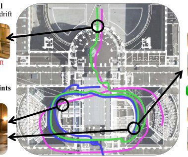

> *Generated by JarvisForResearchers Bot on 2026-07-31*

!!! tip "Why we featured this paper"
    Brand new preprint (2026) — accepted

## TL;DR
VidMap achieves robust metric reconstruction of arbitrary, long, uncalibrated videos by integrating the sequential constraints inherent in SLAM with the global optimization capabilities of offline Structure-from-Motion (SfM). This is accomplished by treating temporal ordering as a primary constraint, augmenting the global optimization framework with metric monocular depth priors, and employing provenance-aware loss functions to reliably distinguish sequential motion from loop closure observations.

## The Problem
Accurately recovering the camera's calibration and metric poses for any unconstrained video presents a fundamental challenge due to the inherent limitations of existing dominant paradigms. Simultaneous Localization and Mapping (SLAM) is fundamentally constrained by its causal, incremental nature; consequently, it exhibits high sensitivity to initialization errors, where early inaccuracies propagate and compound throughout the entire trajectory. Conversely, traditional Structure-from-Motion (SfM) methods, while capable of global optimization, typically disregard the sequential structure of video data, rendering them less robust to visual symmetries and extreme, non-monotonic motions. Furthermore, both classical SfM and SLAM often lack sufficient robustness when confronted with challenging visual conditions such as textureless environments, poor illumination, motion blur, or degenerate camera motion.

## Key Contributions
VidMap introduces three primary contributions to address these deficiencies:
1. A unified system architecture that successfully merges the strong sequential constraints characteristic of SLAM with the comprehensive global optimization framework of offline SfM.
2. The formal treatment of temporal ordering as a first-class constraint within the optimization process, which is crucial for reliable and geometrically sound loop closure detection.
3. The augmentation of the global optimization procedure with metric monocular depth priors. This augmentation is specifically designed to mitigate scale drift and provide necessary regularization when dealing with degenerate camera configurations in uncalibrated settings.

## How It Works


*Fig. 1: VidMap reconstructs long, unconstrained videos with complex mo-
tion and visual ambiguity. SLAM cannot recover from critical tracking failures and
drift because it is causal. SfM treats videos as unordered image sets and therefore
cannot leverage temporal cues to disambiguate visual symmetri*

The VidMap pipeline operates in a multi-stage fashion. Initially, it executes a video-aware extraction phase, which adapts core SLAM concepts—such as sequential tracking and keyframing—into an offline dense matching context. This allows for the chaining of dense correspondences across consecutive keyframes, yielding long tracks that are inherently more resilient to perceptual aliasing than sparse methods. Subsequently, the system proceeds to global mapping by extending the established GLOMAP framework. This extension incorporates monocular depth priors, allowing for per-image scale estimation within the Global Positioning (GP) step, thereby enabling metric-scale reconstruction. A critical innovation is the use of provenance-dependent robust losses. These losses allow the system to explicitly differentiate between edges derived from sequential motion and those originating from Loop Closure (LC) observations during the Rotation Averaging and GP phases, enabling the robust downweighting of erroneous LC observations induced by visual aliasing.

### Video-aware extraction
This component adapts the sequential tracking and keyframing methodologies from SLAM into an offline dense matching pipeline. Instead of relying solely on local feature matching, it leverages the temporal continuity of the video stream. Keyframes are selected based on observed changes in motion, and sparse tracks are propagated by chaining dense warp estimates across these selected keyframes.

### Dense Matcher
The Dense Matcher functions as a coarse-to-fine correspondence estimator. For any pair of frames $(a, b)$, it outputs a dense flow field $W_{a\to b}: \mathbb{R}^2 \to \mathbb{R}^2$. Crucially, it also provides per-pixel certainty $\epsilon_{a\to b} \in [0, 1]$ and a per-pixel localization covariance $\Sigma_{a\to b} \in \mathbb{R}^{2\times 2}$, providing necessary uncertainty quantification for subsequent optimization steps.

### Track Construction
This module is responsible for propagating the established tracks across the sequence of keyframes. To minimize drift, it utilizes direct flow estimates derived from a local window $W$ preceding the target keyframe $K_i$. A candidate correspondence is only accepted into the track if it exhibits sufficient agreement with the sequential prediction $\hat{\mathbf{x}}_i^{\mathrm{seq}}$ derived from the preceding frame's state.

### Loop Closure (LC)
Temporal distant views are identified using a retrieval mechanism, specifically MegaLoc. Once retrieved, these distant views are matched against the current trajectory using the Dense Matcher. The resulting correspondences are attached to the graph structure as distinct observations, explicitly labeled with the provenance identifier $l_{ik} = lc$.

### Global Mapping (GLOMAP extension)
This overarching component encompasses the entire global optimization process. It is structured around four sequential sub-steps: View Graph Construction, Rotation Averaging, Global Positioning (GP), and the final Bundle Adjustment.

#### Rotation Averaging
This step estimates the global orientations $\{R_i\}$ for all camera poses. The estimation minimizes the geodesic distance $\lVert \log(R_j^\top \tilde{R}_{ij}R_i) \rVert$ across all edges in the graph. A key aspect here is the differential loss function: Huber loss is employed for edges representing sequential motion, whereas Cauchy loss is utilized for edges identified as Loop Closure (LC) observations.

#### Global Positioning (GP)
GP performs a joint optimization over the camera centers $\{c_i\}$, the 3D world points $\{X_k\}$, and the per-image depth scale factors $\{s_i\}$. This optimization is regularized by incorporating metric monocular depth priors $\{m_{ik}\}$ and their associated uncertainties $\{\sigma_{ik}\}$, which is the mechanism that enables metric-scale reconstruction.

## Results
| Metric | Value | Baseline | Source |
| :--- | :--- | :--- | :--- |
| Robustness and Accuracy | significantly more robust and accurate | both state-of-the-art SLAM and SfM, classical or learned | Abstract |

## Why This Matters
The practitioner takeaways highlight the necessity of a hybrid approach for complex video reconstruction. For long, unconstrained video sequences, relying solely on the local consistency of SLAM or the global, but structure-agnostic, nature of SfM is insufficient. The provenance tracking mechanism is vital; it provides the necessary geometric discrimination to ensure that global optimization steps do not corrupt the trajectory by incorrectly weighting visually ambiguous loop closures. Furthermore, the injection of metric depth priors into the GP stage provides a powerful regularization tool, stabilizing the solution and ensuring metric accuracy even when the input video lacks intrinsic scale information.

## Limitations & Open Questions
The current implementation of VidMap has two primary limitations. First, the system's reliance on the Dense Matcher necessitates that this component be trained on sufficiently large and diverse datasets to guarantee the required level of robustness across varied visual inputs. Second, the overall process is inherently non-causal. It requires multiple passes over the entire dataset—including low-resolution matching, keyframe detection, high-resolution refinement, and track propagation—which contrasts with the real-time, causal nature of standard SLAM systems. Future work should investigate methods to introduce more causal elements or to accelerate the iterative global optimization process.

---

## Citation

**Paper:** [2607.27194](https://arxiv.org/abs/2607.27194)

```bibtex
@article{260727194,
  title   = {VidMap: Exploiting Temporal Structure for Video-Based Structure-from-Motion},
  author  = {Zador Pataki and Paul-Edouard Sarlin and Marc Pollefeys},
  journal = {arXiv preprint arXiv:2607.27194},
  year    = {2026},
  url     = {https://arxiv.org/abs/2607.27194}
}
```
