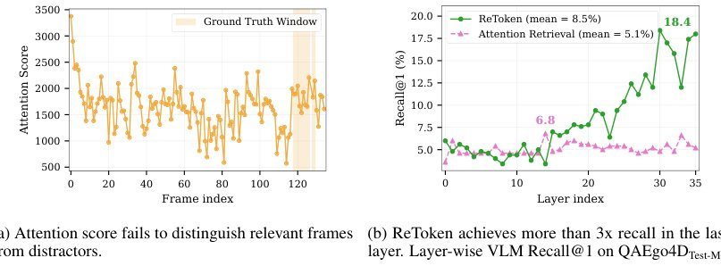

> *Generated by JarvisForResearchers Bot on 2026-08-01*

!!! tip "Why we featured this paper"
    Brand new preprint (2026) — accepted

## TL;DR
RETOKEN introduces a single learnable embedding trained as an explicit retrieval target to select a sparse set of query-relevant visual tokens from a pre-filled visual KV cache, improving performance in long visual context tasks for Vision-Language Models (VLMs).

## The Problem
Long visual contexts pose challenges for VLMs because performance degrades as the number of distractors grows, and processing all tokens simultaneously is computationally infeasible under GPU memory constraints. Standard attention mechanisms struggle to effectively prune irrelevant visual information in these extended sequences.

## Key Contributions
We made three primary contributions:
1. Identifying that retrieval scores computed in the value space, rather than the conventional query-key space, provide a substantially stronger signal for retrieving visual information.
2. Introducing RETOKEN, a lightweight learnable retrieval token that enables pretrained VLMs to identify relevant visual information more effectively.
3. Demonstrating that RETOKEN trained only on multi-image QA transfers zero-shot to long-video benchmarks.

## How It Works


*Figure 1: Attention-based retrieval mechanisms are not effective for retrieving relevant visual
information in VLMs. (a) shows attention scores from question tokens (as queries) to frame tokens
(as keys), across frames in one video; (b) shows whether the top-1 retrieved frame falls within the
ground*

RETOKEN operates by introducing a single learnable embedding, $X_r \in \mathbb{R}^{d_r}$, which is appended to the question tokens. This token is trained explicitly as a retrieval target. The mechanism leverages the final layer $L_N$ of the VLM. For each frame $f$, we compute its mean value vector, $\bar{\mathbf{v}}_f^{(N)}$, across all its visual tokens at $L_N$. The retrieval process then scores each frame based on the cosine similarity between the projected retrieval token embedding, $\mathbf{Z}_r = \mathbf{W}_r \mathbf{X}_r^{(N)}$, and $\bar{\mathbf{v}}_f^{(N)}$. The model is supervised using a class-balanced binary cross-entropy loss ($\mathcal{L}_{\text{ret}}$) against ground-truth relevance labels $y_f$. At inference, a two-pass retrieve-then-answer pipeline is employed: the first pass selects the top-$K$ relevant frames ($\mathcal{S}_{K}^{(N)}$) based on the scores, and the second pass generates the answer conditioned solely on the cached features of these selected frames.

### RETOKEN ($X_r$)
RETOKEN is defined as a single learnable embedding, $X_r \in \mathbb{R}^{d_r}$, which is injected into the input sequence alongside the question tokens. Its purpose is to serve as a dynamic, query-specific anchor for visual information retrieval, unlike static tokens used in prior work.

### Projection Matrix ($\mathbf{W}_r$)
The Projection Matrix ($\mathbf{W}_r$) is a single final-layer projection matrix. It maps the embedding $X_r$ into the retrieval space, yielding $\mathbf{Z}_r = \mathbf{W}_r \mathbf{X}_r^{(N)}$. This projection is crucial as it aligns the retrieval token into the feature space where the frame representations reside at the final layer.

### Frame Mean Value Vector ($\bar{\mathbf{v}}_f^{(N)}$)
The Frame Mean Value Vector ($\bar{\mathbf{v}}_f^{(N)}$) is computed by averaging the value vectors of all visual tokens associated with the $f$-th frame at the final layer $L_N$. This vector serves as a compact, representative embedding for the entire visual content of that frame.

### Retrieval Score ($s_f^{(N)}$)
The Retrieval Score ($s_f^{(N)}$) quantifies the relevance of frame $f$ to the query. It is calculated as the cosine similarity between the projected retrieval token embedding ($\mathbf{Z}_r$) and the frame's mean value vector ($\bar{\mathbf{v}}_f^{(N)}$): $s_f^{(N)} = \cos(\mathbf{Z}_r, \bar{\mathbf{v}}_f^{(N)})$.

### Retrieval Loss ($\mathcal{L}_{\text{ret}}$)
The model is trained using the Retrieval Loss ($\mathcal{L}_{\text{ret}}$). This is a class-balanced binary cross-entropy loss that directly compares the computed final-layer retrieval scores ($s_f^{(N)}$) against the provided ground-truth relevance labels ($y_f$).

## Results
| Metric | Value | Baseline | Source |
| :--- | :--- | :--- | :--- |
| Improvement on Visual Haystacks (Qwen3VL-8B) | 13.4 points | N/A | Abstract |
| Improvement on Visual Haystacks (InternVL3.5) | 12.4 points (>20% relative) | N/A | Abstract |
| Zero-shot gain on LVBench (Qwen3VL-8B) | 8.0-point gain | N/A | Abstract |
| Recall@1 (Qwen3VL, Target Phrase) | 78.0 | 65.7 (Sentence) | Table 1 |
| Recall@1 (InternVL3.5, Target Phrase) | 83.8 | 78.8 (Sentence) | Table 1 |
| Average Recall@1 (Attention Retrieval, QAEgo4DTest-MC) | 5.1% | N/A | Fig. 1b |

## Why This Matters
The findings demonstrate a significant advantage to value-space retrieval over traditional query-key attention mechanisms for long-context reasoning. The substantial performance gains across Visual Haystacks and LVBench, coupled with the high Recall@1 scores achieved by using target phrases, validate the efficacy of RETOKEN. Furthermore, the zero-shot transfer capability from multi-image QA to long-video benchmarks suggests that this mechanism provides a robust, generalizable pathway for scaling multimodal reasoning without requiring task-specific fine-tuning on massive video datasets. The parameter efficiency of RETOKEN also makes it practical for deployment on constrained hardware.

## Limitations & Open Questions
Two primary limitations were identified. First, there is an asymmetry in context access: the retrieval pass budget ($K_1 = 256$ frames per early layer) differs from the answer-stage budget ($K$). Second, the necessity of a two-pass retrieve-then-answer pipeline at test time is a consequence of training RETOKEN only at the final layer $L_N$. Future work should investigate methods to integrate this retrieval signal earlier in the VLM stack or develop a single-pass inference strategy.

---

## Citation

**Paper:** [2607.28627](https://arxiv.org/abs/2607.28627)

```bibtex
@article{260728627,
  title   = {ReToken: One Token to Improve Vision-Language Models for Visual Retrieval},
  author  = {Yao Xiao and Reuben Tan and Zhen Zhu and Yuqun Wu and Jianfeng Gao and Derek Hoiem},
  journal = {arXiv preprint arXiv:2607.28627},
  year    = {2026},
  url     = {https://arxiv.org/abs/2607.28627}
}
```
