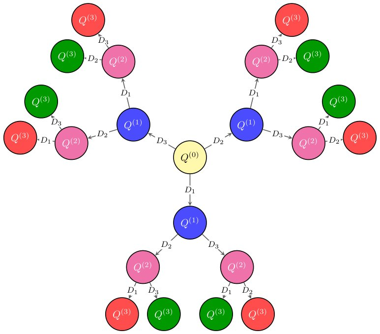

> *Generated by JarvisForResearchers Bot on 2026-08-02*

!!! tip "Why we featured this paper"
    Brand new preprint (2026) — accepted

## TL;DR
This work leverages Graph Neural Networks (GNNs)—specifically the Distance GNN (DGNN) and Adviser GNN (AGNN)—to automate the search for Seiberg duality transformations between supersymmetric quiver gauge theories. By integrating these learned policies into sophisticated pathfinding algorithms like bidirectional A*search, we demonstrate that hybrid, data-driven search strategies outperform purely deterministic approaches in navigating the combinatorial explosion inherent in these theoretical physics problems.

## The Problem
The fundamental challenge addressed is the efficient determination of whether two given supersymmetric quiver gauge theories are related by a sequence of Seiberg dualities, and if they are, identifying the optimal sequence of simple duality operations required to transform one into the other. The search space for these transformations grows combinatorially with each successive duality operation, making exhaustive search intractable for non-trivial theories.

The prior art has largely restricted its AI/ML applications to the specialized case of quivers possessing finite mutation type. The general case, where the sequence of dualities leads to rapidly increasing combinatorial complexity, remains largely unaddressed computationally. This research marks the initial application of this methodology to a problem in theoretical physics, aiming to elucidate the underlying physics, computational complexity, and inference mechanisms governing duality operations.

## Key Contributions
We present three primary contributions:
1. We demonstrate that for quivers of modest size (up to 10 nodes), specific network architectures combining transformers and multi-layer perceptrons exhibit superior performance compared to traditional deterministic algorithms.
2. We enhance the search strategy by augmenting the neural network outputs with established pathfinding algorithms, effectively creating a "Google Maps for quivers" that improves both efficiency and accuracy.
3. We develop and rigorously test several pathfinding heuristics, including the Distance GNN (DGNN) and Adviser GNN (AGNN) guided searches, alongside a physics-informed Lowest Common Ancestor (LCA) pathfinder.

## How It Works


*Figure 2: Seiberg Duality Tree for C3/Z3 inspired by [32, Figure 2]. Each node in the tree
is a gauge theory Q(n) with n being the number of non-trivial mutations Dj done from
Q(0). Generally, the action of Dj leads to different gauge theories. However, C3/Z3 has a
permutation symmetry such that eac*

The methodology centers on constructing a dataset by iteratively applying Seiberg dualities to canonical quiver presentations, focusing on theories with 13 or fewer nodes and up to 12 duality steps. Two core GNNs are trained on this dataset: the DGNN estimates the minimal mutation distance between two quivers, while the AGNN functions as a policy adviser, predicting the most probable vertex for the next duality operation. These learned models are then integrated into heuristic-driven pathfinders, such as bidirectional A*search and beam search. Specifically, the DGNN output serves as the admissible heuristic function, and the AGNN output informs the cost function, enabling a hybrid search guided by both learned and physics-informed policies.

### Distance GNN (DGNN)
The DGNN is engineered to perform a conceptual comparison between two input graphs (quivers). Its objective is to output an estimate of the distance or difference between these two structures, providing a metric for how far apart the two quivers are in the duality graph.

### Adviser GNN (AGNN)
The AGNN operates as a policy adviser within the search framework. Given an input quiver, it outputs a probability distribution over the possible nodes, guiding the pathfinder algorithm to select the most likely vertex to perform a duality operation at each step.

### Bidirectional A*search pathfinder
This pathfinder implements a search strategy where the DGNN's output is utilized as the heuristic function $h(n)$, estimating the remaining distance to the target. Concurrently, the AGNN's prediction informs the cost function $g(n)$, allowing the search to be guided by both learned distance estimates and policy advice.

### Beam search pathfinder
This variant of the search algorithm operates similarly to A*search but foregoes the explicit heuristic function derived from the DGNN. Instead, it maintains a reduced search frontier, pruning less promising paths based on a limited beam width, thereby controlling computational overhead.

### Lowest Common Ancestor (LCA) pathfinder
This pathfinder is inspired by heuristic approaches employed by human physicists. It operates by attempting to locate a common quiver structure between the two input theories that minimizes the ranks of the intermediate theories, effectively searching for a shared ancestor in the duality tree.

### Hybrid LCA pathfinder
This final pathfinder represents a synthesis of the preceding policies. It unifies the guidance mechanisms, incorporating the outputs from the trained neural networks (DGNN/AGNN) alongside the structural insights derived from the LCA policies, aiming for a maximally informed search trajectory.

## Results
The performance evaluation across various search strategies yielded distinct results concerning computational complexity.

| Metric | Value | Baseline | Source |
| :--- | :--- | :--- | :--- |
| Efficiency Ratio (ER) | Not quantified numerically in the abstract/summary provided | Breadth-First Search (BFS) | Table 2a |
| Success Rate | Not quantified numerically in the abstract/summary provided | Not specified | Table 2a |
| Complexity | $\le 11.5$ | N/A | Section 5 |

## Why This Matters
The findings underscore a critical trend: the integration of learned heuristics derived from GNNs with established, rigorous search algorithms (like A*search) yields substantial improvements in both the efficiency and the accuracy of tracing complex theoretical relationships. Furthermore, the complexity measure $C = D \log_{10} K$ provides a quantifiable metric for benchmarking the performance gains achieved by NN-guided pathfinders against traditional methods. The Hybrid LCA pathfinder specifically demonstrated superior overall performance when the constraint of achieving a 100% success rate was imposed.

## Limitations & Open Questions
Despite the advancements, limitations persist. The LCA pathfinder exhibits a tendency to become trapped in local minima when the true duality distance is not sufficiently large. Moreover, an interesting paradox was observed when comparing the Efficiency Ratios (ERs) of Out-of-Distribution (OOD) theories: while the average EERs of the LCA relative to BFS were superior, the Hybrid model outperformed the LCA when the ER was normalized against the LCA baseline. This suggests a nuanced trade-off between structural intuition and learned generalization that requires further investigation.

---

## Citation

**Paper:** [2607.28628](https://arxiv.org/abs/2607.28628)

```bibtex
@article{260728628,
  title   = {Learning to Trace Seiberg Dualities},
  author  = {Jonathan J. Heckman and Shani Meynet and Alessandro Mininno and Gary Shiu},
  journal = {arXiv preprint arXiv:2607.28628},
  year    = {2026},
  url     = {https://arxiv.org/abs/2607.28628}
}
```
