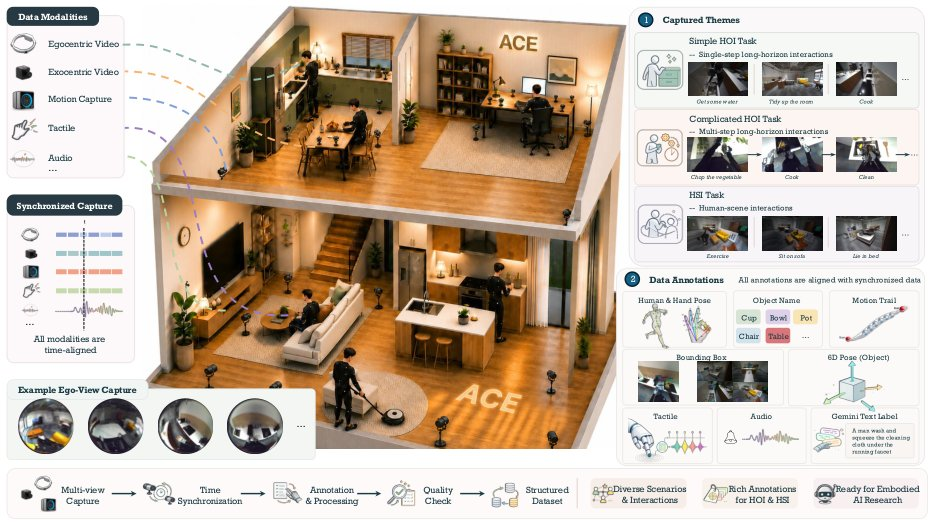

> *Generated by JarvisForResearchers Bot on 2026-08-03*

!!! tip "Why we featured this paper"
    Brand new preprint (2026) — accepted

## TL;DR
ACE introduces the Ambient Capture Engine (ACE), a paradigm for generating ACE-Data-0. This dataset captures human-object interactions in realistic home environments across table-scale and room-scale configurations, providing temporally synchronized, multi-modal data spanning 17M frames and 75,000 interaction episodes.

## The Problem
Embodied intelligence development is fundamentally constrained by data availability. Current datasets fail to capture the complete perception-action loop necessary for robust agents. Specifically, existing resources tend to fragment this loop, meaning they either lack synchronized ground truth across modalities (e.g., omitting audio or tactile sensing alongside visual and kinematic data), lack the necessary egocentric perspective, or are confined to artificial laboratory settings. Furthermore, the majority of existing Human-Object Interaction (HOI) clips are short-horizon, failing to model the sustained, goal-directed activities characteristic of real-world household use.

## Key Contributions
We present ACE, a "human-centric ambient capture as embodied data engine paradigm," implemented via table-scale and room-scale configurations. This engine yields ACE-Data-0, a large-scale, long-horizon home-scene HOI dataset containing 17M frames and 75,000 interaction episodes, richly annotated. Finally, we establish a three-level benchmark that systematically evaluates state-of-the-art methods across signal, component, and interaction levels, testing over 30 existing approaches.

## How It Works


*Figure 1
We introduce the Ambient Capture Engine (ACE), a capture system that transforms real home envi-
ronments into recording studios. ACE observes household activity at two complementary scales, i.e., table-scale
and room-scale. Via ACE, we capture and release ACE-Data-0 with synchronized multip*

The Ambient Capture Engine (ACE) functions by transforming uncontrolled, real home environments into precisely calibrated, temporally synchronized recording environments. This is achieved by operating concurrently at two complementary spatial scales: table-scale for high-fidelity, local manipulation analysis, and room-scale for capturing global, whole-body dynamics. ACE records a unified multisensory stream encompassing synchronized egocentric and multi-view exocentric video, optical tracking of full-body and articulated hand motion, precise 6-DoF trajectories for every object, multi-channel audio, and tactile feedback. ACE-Data-0 is the resulting corpus, documenting 150 hours of daily living interactions across 200 distinct task categories, performed by 50 participants. Annotations are comprehensive, including full-body/hand poses, 6-DoF poses, bounding boxes, motion trails, and Gemini Text Labels, all rigorously aligned to the synchronized sensor stream.

### Ambient Capture Engine (ACE)
ACE serves as the core data generation mechanism. It operationalizes the concept of a human-centric data engine, effectively converting unstructured domestic settings into structured, spatially calibrated recording studios. This engine is designed to enforce temporal and spatial synchronization across disparate sensor modalities.

### Table-scale configuration
This configuration is optimized for high-resolution, localized interaction analysis. It employs a dense arrangement of close-range cameras coupled with high-resolution tactile sensors. This setup is specifically engineered to resolve the fine-grained kinematic details inherent in hand-object manipulation tasks.

### Room-scale configuration
This setup addresses the global context of interaction. Sensors are deployed across the entirety of a furnished environment to capture large-scale phenomena, including whole-body motion, locomotion patterns, and interactions that are spatially distributed throughout the scene.

### ACE-Data-0
This is the empirical output of the ACE framework. It constitutes a massive, multi-modal dataset comprising 150 hours of recorded data, totaling 17M video frames. The dataset is structured around 75,000 interaction episodes categorized into 200 distinct task categories, featuring synchronized recordings and rich, ground-truth annotations.

## Results
| Metric | Value | Baseline | Source |
| :--- | :--- | :--- | :--- |
| Total Interaction Episodes | 75,000 | N/A | Abstract |
| Total Video Frames | 17M | N/A | Abstract |
| Task Categories | 200 | N/A | Abstract |

## Why This Matters
The ACE framework provides a necessary methodological advancement for embodied AI research. By providing synchronized, multi-modal grounding—encompassing perceptual input, kinematic state, and contact supervision—it furnishes coherent training signals that are currently unavailable. Furthermore, the dual-scale nature of ACE allows researchers to bridge the critical gap between analyzing fine-grained, local manipulation (via table-scale data) and achieving robust, global scene understanding (via room-scale data). The structured, three-level benchmark (signals $\rightarrow$ components $\rightarrow$ interactions) offers a systematic progression for rigorously assessing the capabilities of embodied agents.

## Limitations & Open Questions
A primary limitation observed during the evaluation of state-of-the-art methods is the manifestation of failure modes inherent to long-horizon, real-world data. These failures are attributable to the sheer diversity and complexity of the interactions, the interleaving nature of tasks, significant occlusion events, extreme viewpoints, and continuous movement across the scene. Additionally, the current paper does not provide quantitative performance metrics for the state-of-the-art methods across the established benchmark tracks.

---

## Citation

**Paper:** [2607.28625](https://arxiv.org/abs/2607.28625)

```bibtex
@article{260728625,
  title   = {ACE-Data-0: Human-Centric Ambient Capture as Embodied Data Engine},
  author  = {Yukang Cao and Haozhe Xie and Beichen Wen and Runmao Yao and Yinghao Liu and Yue Huang et al.},
  journal = {arXiv preprint arXiv:2607.28625},
  year    = {2026},
  url     = {https://arxiv.org/abs/2607.28625}
}
```
