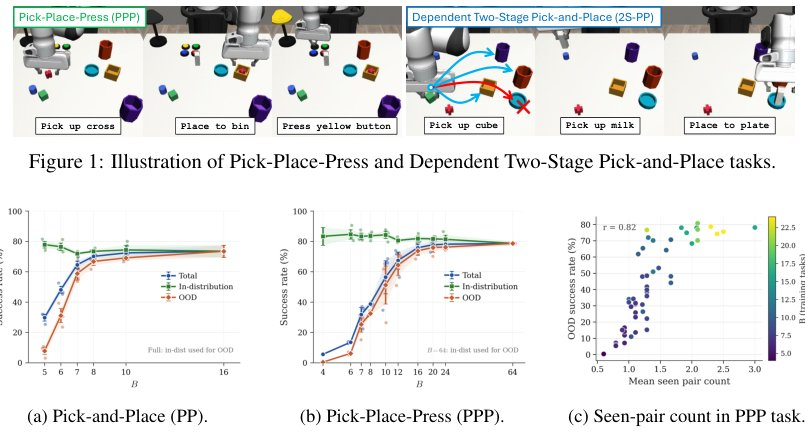

> *Generated by JarvisForResearchers Bot on 2026-08-04*

!!! tip "Why we featured this paper"
    Brand new preprint (2026) — accepted

## TL;DR
We decompose the generalization gap in sequential robot tasks into marginal, instruction-compositional, and context-action shifts. We demonstrate that achieving strong out-of-distribution (OOD) performance does not require exhaustive coverage of the instruction space; a structured subset covering action-relevant dependencies suffices. Furthermore, we show that sparse training failures are often attributable to instruction steering deficiencies rather than missing low-level skills.

## The Problem
Sequential robot manipulation necessitates policies capable of executing novel sequences formed by combining familiar subtasks. The core difficulty lies in the combinatorial explosion of possible instruction tuples, $l = (l_1, \dots, l_n) \in L_1 \times \dots \times L_n$. Collecting demonstrations for every possible tuple is computationally intractable. When datasets are sparsely covered, policies frequently fail when presented with out-of-distribution (OOD) recombinations of familiar components. Existing methods, such as hierarchical pipelines or end-to-end instruction-conditioned policies, exhibit performance degradation when the training and testing instruction distributions diverge significantly. The fundamental open question is determining the minimal necessary coverage of the instruction space required to guarantee robust compositional generalization.

## Key Contributions
We provide a formal decomposition of the generalization gap into three distinct sources: marginal instruction shift, instruction-compositional shift, and context-action shift. We establish that exhaustive enumeration of task tuples is an unnecessary requirement; specifically, a structured subset comprising only one quarter of the full task space can yield strong OOD performance provided it adequately covers action-relevant dependencies. Finally, empirical evidence indicates that when training data is sparse, performance degradation is frequently rooted in inadequate instruction steering (manifested as instruction-compositional shift) rather than a deficit in reusable low-level skills.

## How It Works


*Figure 2: Full tuple coverage is unnecessary. Higher seen pair count predicts stronger OOD success.*

The study formalizes a sequential robot task as an ordered $n$-tuple of discrete subtask indices, $l = (l_1, \dots, l_n)$. The generalization gap, $\Delta_q(\theta)$, is rigorously decomposed into three terms corresponding to the shifts in the input distributions: the marginal instruction shift ($\|q(l_i) - p(l_i)\|_1$), the instruction-compositional shift ($\mathbb{E}_{l_i \sim p(l_i)} [\|q(l_{-i} | l_i) - p(l_{-i} | l_i)\|_1]$), and the context-action shift ($\mathbb{E}_{l \sim p(l)} [\|q(z, a | l) - p(z, a | l)\|_1]$). This decomposition motivates the design of a stage-wise modular policy, $\pi_\theta(a | z, l) = \pi_{\theta, \sigma(z)}(a | z, l_{\sigma(z)})$, which aims to isolate the influence of the currently active subtask. Experiments are conducted across independent (PPP) and semantically dependent (2S-PP) task settings to validate the coverage requirements.

### Robot Policy
The policy is modeled as a conditional action distribution, $p(a | z, l_1, \dots, l_n)$. This represents the system's generative capability for selecting an action $a$ given the current context $z$ and the full sequence of instructions $l$.

### Stage Indicator $\sigma$
The Stage Indicator, $\sigma: Z \to \{1, \dots, n\}$, serves to map the current context $z$ to the specific subtask index $l_i$ that is currently active. This function is crucial for enabling the modular policy to focus its conditioning on the relevant part of the instruction sequence.

### Stage-wise Modular Policy
This architecture employs a hierarchical parameterization where the policy's conditioning is restricted. Specifically, $\pi_\theta(a | z, l) = \pi_{\theta, \sigma(z)}(a | z, l_{\sigma(z)})$. This structure enforces that the action selection at context $z$ depends only on the current context and the instruction corresponding to the active subtask, $l_{\sigma(z)}$, effectively isolating the task execution to the relevant stage.

## Results
The empirical evaluation demonstrates the efficacy of this structured approach.

| Metric | Value | Baseline | Source |
| :--- | :--- | :--- | :--- |
| OOD success (PPP task) | 54.7% | 0.4% | Figure 5 |
| OOD success (PPP task, orthogonal set) | 78.2% | Full-task training | Section 5.2 |

## Why This Matters
The findings provide a principled framework for understanding and mitigating generalization failure in complex robotic systems. The decomposition allows researchers to diagnose whether performance bottlenecks stem from insufficient exposure to specific instruction combinations (compositional shift) or from the policy failing to correctly interpret the current task phase (context-action shift). The demonstration that a small, structured subset of the instruction space can yield high OOD performance offers a significant practical guideline for data collection efficiency, moving away from the computationally prohibitive goal of exhaustive tuple coverage. Furthermore, the observation regarding instruction steering clarifies a common pitfall in sparse reinforcement learning for robotics.

## Limitations & Open Questions
A primary limitation of the current modular design is that the policy structure does not inherently prevent inactive instructions from influencing the context representations, meaning the influence of $l_{j}$ where $j \neq \sigma(z)$ is not entirely suppressed. Additionally, the stage-wise modular policy assumes that the optimal action $a$ depends solely on the active subtask instruction $l_i$. If the required action fundamentally depends on factors encoded in instructions outside the currently active stage, the modular policy formulation becomes inherently ambiguous and may fail to capture necessary cross-stage dependencies.

---

## Citation

**Paper:** [2607.29687](https://arxiv.org/abs/2607.29687)

```bibtex
@article{260729687,
  title   = {Diagnosing Compositional Generalization in Sequential Robot Tasks},
  author  = {Yixiao Wang and Cheng-En Wu and Lingfeng Sun and Pengcheng Wang and Xiang Ji and Boyuan Liang et al.},
  journal = {arXiv preprint arXiv:2607.29687},
  year    = {2026},
  url     = {https://arxiv.org/abs/2607.29687}
}
```
