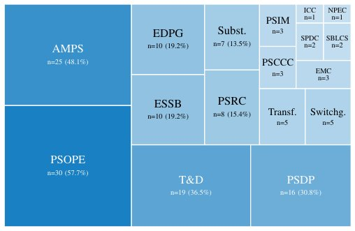

> *Generated by JarvisForResearchers Bot on 2026-08-05*

!!! tip "Why we featured this paper"
    Brand new preprint (2026) — accepted

## TL;DR
We introduce an open, executable module library designed to bridge Artificial Intelligence and Power Systems Education. This library maps core AI concepts onto representative, progressive power-system tasks, providing engineering-grounded AI (EGAI) workflows that are accessible and reusable for interdisciplinary learners.

## The Problem
Current AI educational materials often suffer from a lack of structural coherence when applied to engineering domains. Most existing academic work focuses on highly specialized applications or high-level theoretical contributions, rendering them inaccessible to newcomers. Furthermore, while some hands-on tutorials exist, they typically concentrate on a singular problem (e.g., optimal power flow) or a specific AI objective, failing to provide a generalizable workflow that spans the entire ML lifecycle—from data handling and model construction through training and evaluation. This gap leaves beginners without step-by-step, task-agnostic programs, often forcing reliance on opaque Large Language Models (LLMs) for basic implementation guidance. There is a demonstrable need for Engineering-Grounded AI (EGAI) where the AI workflow is explicitly anchored within established power-system domain rules.

## Key Contributions
We address these limitations through three primary contributions:
1. A targeted community survey, involving $N = 52$ valid responses, was conducted to empirically ground the design choices of the proposed educational materials.
2. We propose a design framework that organizes AI teaching modules along a progressive difficulty ladder and explicitly maps fundamental AI concepts onto representative power-system tasks.
3. We release six open, hands-on modules structured across three tiers: foundational DNN templates, a domain-coupled CNN power-flow surrogate, and frontier modules covering DNN-assisted optimization, DRL, and PINNs.

## How It Works


*Fig. 1.
Treemap of respondents’ research and work areas across the IEEE
PES technical committees (Q3, multiple selections).*

The core of the framework is the coupling of two knowledge maps: an AI Knowledge Map and a Power-System Knowledge Map. The AI Knowledge Map orders methods based on problem type (e.g., nonlinear regression, CNNs, constrained decision making, DRL, PINNs), while the Power-System Knowledge Map orders tasks by functional domain (e.g., forecasting, power-flow analysis, dispatch, control, dynamics). By pairing these maps, we anchor generic AI workflows within recognizable, functional power-system problems.

The resulting six modules are systematically structured across three tiers of increasing complexity, all adhering to a unified notebook skeleton that mandates the sequence: Settings $\rightarrow$ Data Generation $\rightarrow$ Model Construction $\rightarrow$ Training $\rightarrow$ Evaluation $\rightarrow$ Visualization.

### Tier 1 Modules
These modules serve as the entry point, focusing on foundational DNN templates. They are designed for basic function approximation and tasks such as load-curve fitting, exemplified by `DNN_sin.ipynb` and `DNN_template.ipynb`.

### Tier 2 Module
This tier introduces domain coupling. The `CNN_for_5_bus_system.ipynb` module implements a Convolutional Neural Network (CNN) to act as a surrogate model for the power-flow analysis of a standardized 5-bus system.

### Tier 3 Modules
These modules represent the frontier of the framework, integrating advanced AI paradigms with complex power system challenges. They include:
*   `DNN_Assisted_Opti.ipynb`: Demonstrating the use of DNNs to aid in optimization routines.
*   `DRL_BESS.ipynb`: Implementing Deep Reinforcement Learning (DRL) for Battery Energy Storage System (BESS) control.
*   `PINN_Frequency.ipynb`: Utilizing Physics-Informed Neural Networks (PINNs) to model the system's swing equation dynamics.

## Results
The initial reception of the framework indicates strong engagement within the target community.

| Metric | Value | Baseline | Source |
| :--- | :--- | :--- | :--- |
| Webinar Live Attendees (Part I) | more than 590 | N/A | Abstract |
| Repository Visits (within two weeks) | over 344 | N/A | Abstract |

## Why This Matters
This framework operationalizes the concept of Engineering-Grounded AI. By providing execution-ready, modular code, it directly addresses a major barrier reported by $92\%$ of survey respondents: the complexity of local setup. The progressive difficulty ladder ensures that learners can build competence incrementally, moving from basic function approximation in Tier 1 to advanced techniques like PINNs and DRL in Tier 3, all within a single, coherent pedagogical structure. Furthermore, the modular design promotes extensibility, allowing users to scale the examples from the default small systems to more complex topologies.

## Limitations & Open Questions
We must acknowledge certain limitations. Specifically, this paper does not provide detailed performance metrics or quantitative validation results for the advanced modules contained within Tier 3. Additionally, while the framework is demonstrated using specific, tractable examples—such as the 5-bus system or the linearized swing equation—its direct applicability to highly unique or large-scale power system topologies may necessitate significant adaptation by the end-user.

---

## Citation

**Paper:** [2608.02599](https://arxiv.org/abs/2608.02599)

```bibtex
@article{260802599,
  title   = {Bridging Artificial Intelligence and Power Systems Education Using a Hands-On Executable Framework},
  author  = {Junjie Yin and Buxin She and Xinyu Feng and Fangxing and Li},
  journal = {arXiv preprint arXiv:2608.02599},
  year    = {2026},
  url     = {https://arxiv.org/abs/2608.02599}
}
```
