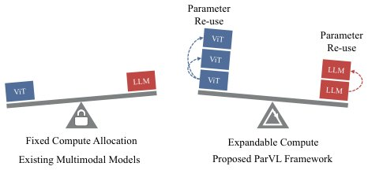

> *Generated by JarvisForResearchers Bot on 2026-08-06*

!!! tip "Why we featured this paper"
    Brand new preprint (2026) — accepted

## TL;DR
ParVL introduces a parallel scaling framework for MLLMs that expands computational capacity by reusing backbone parameters across multiple, independently scalable Vision Transformer ($P_v$) and Large Language Model ($P_l$) branches. This formulation treats computation expansion as a two-dimensional allocation problem, allowing for task-specific optimization of the $P_v:P_l$ ratio while maintaining modest parameter overhead.

## The Problem
Current scaling methodologies for Multimodal Large Language Models (MLLMs) generally force a binary choice: either increase the total number of model parameters or increase the sequential inference computation. Both approaches introduce significant overhead, either in memory footprint or latency. A critical limitation in existing MLLMs is the rigid, fixed allocation of computational resources between the Vision Transformer (ViT) and the Large Language Model (LLM) components. This design constraint prevents task-specific optimization, as the model's capacity distribution is determined at design time rather than being exposed as independently controllable scaling axes. Furthermore, the potential for shared-backbone parameter reuse across parallel modalities in MLLMs has remained largely underexplored. This leads to the fundamental scientific question: how can we effectively expand computational capacity via parameter reuse while simultaneously determining the optimal resource allocation between the vision and language modalities?

## Key Contributions
We introduce ParVL, a parallel-scaling framework for MLLMs. This framework models computation expansion as a two-dimensional vision–language allocation problem, implemented via parameter-shared, prefix-conditioned ViT and LLM branches, coupled with modality-specific token-wise aggregation. We conducted a systematic study across nine vision–language branch-count configurations, demonstrating that the preferred compute allocation is contingent upon the specific benchmark. Finally, we provide controlled comparisons across 1B, 2B, and 8B model scales, complete with latency and memory profiling, to characterize the accuracy–cost trade-offs inherent in parallel scaling.

## How It Works


*Figure 1: Fixed vs. expandable compute allocation in
MLLMs. (Left) Existing multimodal models suffer from
a fixed compute allocation between ViT (vision) and LLM
(language) components during the SFT phase, which is vi-
sualized as a locked seesaw. (Right) Our ParVL frame-
work enables expandable and*

ParVL scales the vision and language computation in parallel by deploying $P_v$ ViT branches and $P_l$ LLM branches, denoted by the configuration $P_v:P_l$. The core mechanism relies on weight sharing: all branches within a single component (either ViT or LLM) share the same backbone weights. Differentiation between branches is achieved by introducing branch-specific key and value prefixes at each attention layer.

### ViT branches
The ViT branches operate using shared backbone weights. Each branch is uniquely characterized by a set of learnable Key and Value (KV) prefixes. These prefixes are prepended to the standard key and value sequences within the attention mechanism. This allows multiple parallel streams to process input data while only storing the base weights once.

### LLM branches
Analogous to the ViT branches, the LLM branches also leverage shared backbone weights. Their distinctiveness across the parallel streams is maintained through the injection of unique, learnable KV prefixes at the prefix-conditioned attention layers within the LLM architecture.

### Prefix-Conditioned Attention
This mechanism is the enabler for parameter sharing across parallel streams. In the attention calculation, learnable prefixes, denoted as $K^{(k)}_P, V^{(k)}_P \in \mathbb{R}^{L_p \times d_h}$, are prepended to the standard key and value sequences. This allows the model to condition its attention computation based on the specific branch context without duplicating the entire weight matrix.

### Token-wise MLP aggregator ($g_m$)
After feature extraction from the parallel branches, the outputs must be aggregated. For the vision modality, the features from all $P_v$ branches are concatenated. This concatenated feature vector is then passed through a modality-specific two-layer SiLU MLP, denoted $g_m$. This MLP predicts branch logits, effectively summarizing the information across the parallel vision streams.

### Vision-Language Connector
The aggregated visual tokens, $b_{Z_v}$, are then mapped into the latent space of the LLM. This transformation is executed by the Vision-Language Connector, which projects the visual representation into the required hidden dimension of the LLM, yielding $H_v \in \mathbb{R}^{N \times D_\ell}$.

### LLM Branch Aggregation (Implicit)
For the language modality, the states from all $P_l$ branches are fused using a modality-specific two-layer SiLU MLP before they enter the final shared language-modeling head. This fusion step aggregates the specialized linguistic processing performed by each parallel LLM branch.

The entire ParVL system is trained end-to-end using full-parameter Supervised Fine-Tuning (SFT) under the standard objective $L_{SFT}$.

## Results
The systematic evaluation across different scales and configurations demonstrates the efficacy of the parallel scaling approach.

| Metric | Value | Baseline | Source |
| :--- | :--- | :--- | :--- |
| Overall average (1B) | 50.5 | 49.6 | Table 1 |
| Math (1B) | 28.0 | 26.0 | Table 2 |
| OCR (1B) | 75.9 | 75.6 | Table 2 |
| Overall average (2B) | 54.7 | 54.4 | Table 1 |
| Overall average (8B) | 63.0 | 62.5 | Table 1 |

## Why This Matters
ParVL provides a principled mechanism to decouple the scaling of vision and language capacities within an MLLM. By leveraging parameter reuse across parallel streams, we achieve computational expansion without the proportional increase in total parameters that plagues traditional scaling methods. The finding that the optimal $P_v:P_l$ ratio is task-dependent is a significant practical insight, moving the design choice from a static hyperparameter to a dynamically optimized configuration based on the target application. Furthermore, the modest parameter increase (at most 4% over single-branch baselines) suggests that this method offers a high efficiency gain in terms of computational throughput relative to memory cost.

## Limitations & Open Questions
The current empirical validation is constrained by the dataset size; the experiments were conducted using only a 1/20 subsample of the InternVL3.5 SFT collection. Consequently, it remains an open question whether broader supervision across the full dataset would yield further improvements in the smaller-scale General results.

---

## Citation

**Paper:** [2608.04010](https://arxiv.org/abs/2608.04010)

```bibtex
@article{260804010,
  title   = {ParVL: Parallel Scaling and Expandable Compute Allocation for Multimodal LLMs},
  author  = {Yang Yang and Qinyu Zhao and Mouxiang Chen and Xiaohui Li and Lixin Gu and Wenhai Wang et al.},
  journal = {arXiv preprint arXiv:2608.04010},
  year    = {2026},
  url     = {https://arxiv.org/abs/2608.04010}
}
```
