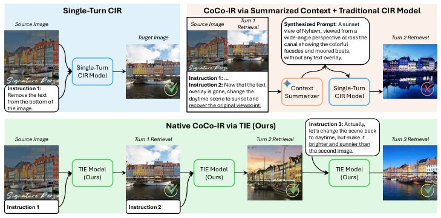

> *Generated by JarvisForResearchers Bot on 2026-08-07*

!!! tip "Why we featured this paper"
    Brand new preprint (2026) — accepted

## TL;DR
CoCo-IR formalizes multi-turn contextual composed image retrieval, addressing the limitations of single-turn systems. We introduce TIE, an LMM-based framework that generates context-aware, transformable image embeddings by utilizing a specialized $\langle EMB\rangle$token to aggregate the entire dialogue history into a compact, query-aware representation.

## The Problem
Current instruction-based image retrieval systems are fundamentally constrained to single-turn interactions. This limitation prevents them from modeling the iterative, exploratory, and inherently complex nature of real-world visual search tasks. In practical scenarios, users do not issue a single, monolithic query; rather, they engage in a dialogue, progressively refining their intent based on the visual evidence or results presented in previous turns.

The gaps in prior work are significant:
1. Classical CIR is restricted to isolated, single-turn queries.
2. Existing methods struggle to natively encode a sequence of interleaved images and instructions, even when employing powerful external models to summarize the interaction history.
3. Prior work, such as IRR or MAI, is often domain-specific (e.g., fashion) or only supports text-only refinements after the initial turn, failing to accommodate the interleaved image-text input structure central to CoCo-IR.

## Key Contributions
Our work makes three primary contributions:
1. We introduce CoCo-IR, a novel task definition for multi-turn contextual composed image retrieval.
2. We propose TIE, an LMM-based architecture designed to generate context-aware, transformable image embeddings that accurately capture the full dialogue history.
3. We developed a scalable data engine that leverages LMM-driven self-reflection and hard-negative verification to construct the first large-scale CoCo-IR dataset.

## How It Works


*Fig. 1: Comparison between conventional single-turn Composed Image Retrieval (CIR)
and our novel Contextual Composed Image Retrieval (CoCo-IR) task, achieved via our
proposed TIE framework. (Top Left) A standard single-turn CIR model successfully
processes a simple, isolated instruction. (Top Right)*

CoCo-IR is modeled as an interactive dialogue where the system must interpret each new instruction relative to the entire interaction history, $H_t$. The TIE model, built upon a Large Multimodal Model (LMM), processes this sequence by feeding a special $\langle EMB\rangle$token at the conclusion of each turn. This token serves to compel the LMM to aggregate the complete history into a compact, query-aware embedding, effectively functioning as a global information bottleneck. The architecture integrates bidirectional attention within each turn to facilitate deep multimodal fusion, while causal attention across turns is employed to strictly respect the temporal flow of the dialogue. Training is performed using an InfoNCE loss, which contrasts the query embedding against the positive target embedding within a comprehensive set of candidate embeddings, $\mathcal{C}_e$.

### Large Multimodal Model (LMM)
The LMM serves as the foundational component, enhanced specifically for the CoCo-IR task. Its role is to function as a context-aware reasoner, capable of synthesizing information across multimodal inputs (images and text) and maintaining coherence across the evolving dialogue state.

### $\langle EMB\rangle$token
This is a specialized token injected into the input sequence at the end of each turn. Its function is prescriptive: it prompts the LMM to perform a high-level summarization of the entire interactive history up to that point, condensing the complex sequence into a single, dense, and context-aware representation.

### Hybrid Attention Mechanism
The attention mechanism is bifurcated to handle intra-turn and inter-turn dependencies. Within a single turn, bidirectional (full) attention is used to maximize multimodal fusion between the current instruction and the associated image(s). Across turns, causal attention is enforced to ensure that the model processes the dialogue sequentially, respecting the temporal causality of the interaction.

### Linear Projection Layer
This layer is applied to the final hidden state vector corresponding to the $\langle EMB\rangle$token. Its purpose is to map the high-dimensional, context-aggregated representation generated by the LMM into the final, fixed-dimension output embedding suitable for retrieval comparison.

### Contrastive Learning Objective (InfoNCE loss)
The training objective is the InfoNCE loss. This loss function is designed to maximize the similarity between the current query embedding, $q_{t,i}$, and its corresponding positive target embedding, $p_{t,i}$, while simultaneously minimizing the similarity to all other candidate embeddings present in the set $\mathcal{C}_e$.

## Results
| Metric | Value | Baseline | Source |
| :--- | :--- | :--- | :--- |
| mAP@5 on CIRCO | 39.4 | N/A | Abstract |
| 4-turn R@1 on CoCo-IR benchmark | 44.1 | 28.2 | Abstract |

## Why This Matters
The shift from single-turn to multi-turn retrieval is critical for advancing robotics and AI applications that require complex, goal-directed interaction with the environment. By formalizing CoCo-IR, we provide a rigorous benchmark for evaluating systems that must maintain long-term context and adapt their search strategy iteratively. Furthermore, the TIE framework demonstrates a viable paradigm for leveraging LMMs not just for immediate reasoning, but for structured, history-aware embedding generation, which is a necessary step toward more autonomous visual agents.

## Limitations & Open Questions
We acknowledge two primary limitations. First, the evaluation metric, m-turn Recall@k, necessitates fixed and predefined evaluation trajectories. This structure inherently prevents the simulation of truly on-the-fly user adaptation, which is a key characteristic of human interaction. Second, the overall performance ceiling of the TIE framework is intrinsically tied to the quality of the data generated by the LMM-powered data engine; any systematic bias in the self-reflection process will propagate into the benchmark's limitations. Future work must address the simulation of dynamic user behavior and explore alternative, less data-dependent context aggregation mechanisms.

---

## Citation

**Paper:** [2608.05149](https://arxiv.org/abs/2608.05149)

```bibtex
@article{260805149,
  title   = {CoCo-IR: Contextual Composed Image Retrieval},
  author  = {Shengcao Cao and Tanmaya Shekhar Dabral and Zhongli Ding and Madhuri Shanbhogue and Kaifeng Chen and Zhe Li et al.},
  journal = {arXiv preprint arXiv:2608.05149},
  year    = {2026},
  url     = {https://arxiv.org/abs/2608.05149}
}
```
