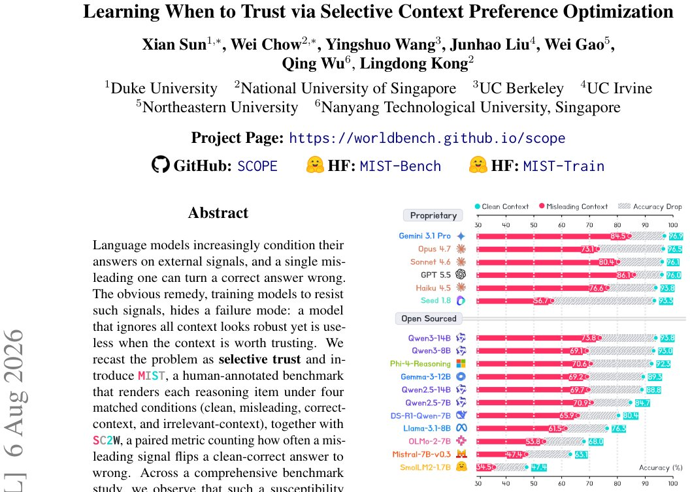

> *Generated by JarvisForResearchers Bot on 2026-08-08*

!!! tip "Why we featured this paper"
    Brand new preprint (2026) — accepted

## TL;DR
SCOPE introduces a signal-counterfactual preference framework to optimize for selective trust in language models. It moves beyond resistance-only training by balancing the penalty for succumbing to misleading signals against the necessity of maintaining performance under clean, correct-context, and irrelevant-context inputs, as evaluated by the MIST benchmark.

## The Problem
Language models exhibit fragility concerning external contextual signals. While training methods exist to increase resistance to misleading context, this approach introduces a critical failure mode: models trained exclusively for resistance may become robust against adversarial inputs but simultaneously degrade in utility by ignoring all provided context, even when that context is trustworthy. Current evaluation paradigms, which often score models under a single context, fail to capture this nuanced dependency on context quality. Furthermore, existing resistance-only training methods, such as misleading-only Direct Preference Optimization (DPO), successfully raise misleading-context accuracy at the expense of eroding accuracy on clean or correct-context inputs. A significant gap remains in the literature regarding methods that explicitly model and optimize for *selective trust* rather than blanket context rejection.

## Key Contributions
We make three primary contributions:
1. Introduction of MIST (Misleading Signal Testbed), a human-annotated benchmark designed to quantify selective trust across four matched contextual conditions.
2. Empirical demonstration that standard prompt-defense, Supervised Fine-Tuning (SFT), and misleading-only DPO fail to achieve the necessary balance for selective trust.
3. Proposal of SCOPE, a signal-counterfactual preference method that explicitly balances the learning signal derived from misleading-resistance pairs against matched controls derived from clean, correct-context, and irrelevant-context scenarios.

## How It Works


*Figure 1: Misleading signals cause a universal ac-
curacy drop. On MIST (Misleading Signal Testbed),
replacing a clean context with a plausible misleading
one lowers accuracy for every model we evaluate, fron-
tier proprietary models included.*

SCOPE operates by mining counterfactual preference data from a base model. We select items $i$ where the base model solves the underlying reasoning task correctly on its own but fails when a misleading signal is appended. For each such item $i$, we construct a response pair $(r^+_i, r^-_i)$, where $r^+_i$ is the truth-consistent response and $r^-_i$ is the response generated by the base model that follows the misleading signal. This pair is then contextualized by four matched prompts, $z^b_i$, where $b \in \{\text{mis, clean, cor, irr}\}$. The learning signal is engineered to depend on the *role* of the context, not merely the surface form of the prompt. The objective is unified into the SCOPE Loss: $L_{\text{SCOPE}} = \lambda_m L_{\text{mis}} + \lambda_c L_{\text{clean}} + \lambda_p L_{\text{nonadv}}$, where $\lambda_m + \lambda_c + \lambda_p = 1$. In our headline experiments, the hyperparameters are set as $(\lambda_m, \lambda_c, \lambda_p, \rho) = (0.25, 0.25, 0.50, 0.50)$.

### MIST (Misleading Signal Testbed)
MIST is a human-annotated benchmark. It renders each underlying reasoning item under four distinct, matched conditions: clean context, misleading context, correct-context, and irrelevant-context. This structure allows for the systematic evaluation of how the model's decision boundary shifts based on the veracity and relevance of the surrounding information.

### SC2W
SC2W is a paired metric designed to quantify the susceptibility to misleading signals. It is defined as $SC2W = \frac{P_i I[\text{aclean}_i = 1 \land \text{amis}_i = 0]}{P_i I[\text{aclean}_i = 1]}$, which measures the proportion of times a misleading signal causes a response that was correct under clean context to become incorrect.

### Matched Preference Data ($D_b$)
For every item $i$ selected, we generate a single counterfactual response pair $(r^+_i, r^-_i)$. This pair is then associated with the four matched context prompts $z^b_i$ to construct the dataset $D_b = n \langle z^b_i, r^+_i, r^-_i \rangle$. This ensures that the preference learning signal is grounded in the same underlying reasoning instance across all four context types.

### SCOPE Loss ($L_{\text{SCOPE}}$)
The unified objective function is $L_{\text{SCOPE}} = \lambda_m L_{\text{mis}} + \lambda_c L_{\text{clean}} + \lambda_p L_{\text{nonadv}}$. The term $L_{\text{nonadv}}$ serves to balance the losses from the correct-context ($L_{\text{cor}}$) and irrelevant-context ($L_{\text{irr}}$) conditions using a balancing factor $\rho$. This structure forces the model to learn a preference that is robust to adversarial inputs while simultaneously maintaining high fidelity to both truthful and contextually relevant information.

## Results
The empirical evaluation demonstrates that SCOPE significantly outperforms baselines across metrics related to context-aware reasoning.

| Metric | Qwen3-4B | Llama-3.2-3B |
| :--- | :--- | :--- |
| SC2W (Qwen3-4B) | 16.3 | N/A |
| SC2W (Llama-3.2-3B) | N/A | 20.6 |
| Overall Accuracy (Seed 1.8) | $85.5\pm0.6$ | $85.5\pm0.6$ |
| Baseline (Qwen3-4B) | 35.0 | N/A |
| Baseline (Llama-3.2-3B) | N/A | 31.5 |
| Baseline Overall Accuracy (Seed 1.8) | $39.7\pm1.6$ | $39.7\pm1.6$ |

## Why This Matters
The findings confirm that optimizing solely for resistance to misleading context is insufficient; it actively compromises utility. SCOPE demonstrates that achieving selective trust requires a multi-objective optimization strategy. By explicitly balancing the adversarial signal ($L_{\text{mis}}$) against the preservation of performance in non-adversarial settings ($L_{\text{clean}}, L_{\text{cor}}, L_{\text{irr}}$), SCOPE yields models that are both resilient and useful. The MIST benchmark provides the necessary rigorous framework to move beyond simple accuracy metrics when evaluating context-aware reasoning capabilities.

## Limitations & Open Questions
One limitation is that the MIST benchmark is not intended as a test of purely unseen knowledge, as 800 items were adapted from existing public benchmarks. Furthermore, the method relies on a base-specific rule to determine the preferred response $r^+_i$, which may necessitate the use of a private diagnostic note during the data mining phase. Future work should investigate the robustness of the selection rule for $r^+_i$ across different base model architectures.

---

## Citation

**Paper:** [2608.06377](https://arxiv.org/abs/2608.06377)

```bibtex
@article{260806377,
  title   = {Learning When to Trust via Selective Context Preference Optimization},
  author  = {Xian Sun and Wei Chow and Yingshuo Wang and Junhao Liu and Wei Gao and Qing Wu et al.},
  journal = {arXiv preprint arXiv:2608.06377},
  year    = {2026},
  url     = {https://arxiv.org/abs/2608.06377}
}
```
