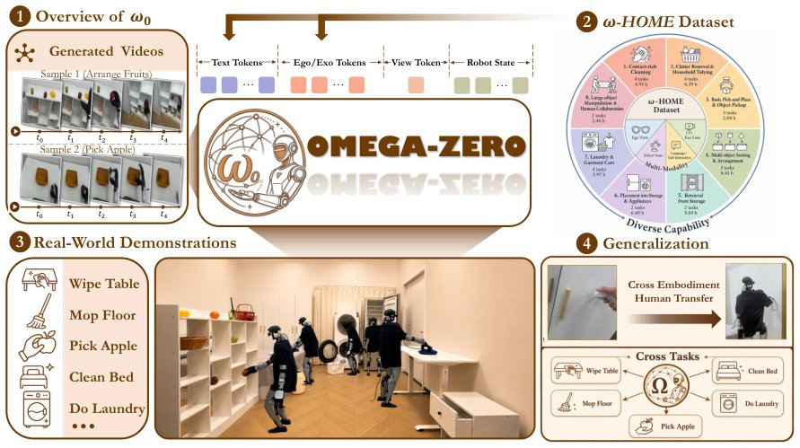

> *Generated by JarvisForResearchers Bot on 2026-08-09*

!!! tip "Why we featured this paper"
    Brand new preprint (2026) — accepted

## TL;DR
$\omega$-0 is a latent predictive whole-body world-action model designed for concurrent humanoid loco-manipulation, which couples lightweight future observation embedding prediction with diffusion-based whole-body action generation. It addresses the limitations of decomposing locomotion and manipulation by unifying these capabilities into a single latent prediction framework.

## The Problem
Humanoid household tasks inherently demand concurrent loco-manipulation—the simultaneous execution of locomotion (maintaining balance, adjusting posture) and manipulation (interacting with objects). Current robotic policies frequently suffer from a functional decomposition, treating locomotion and manipulation as separate, sequential sub-problems. Furthermore, existing World Action Models (WAMs) are often specialized, typically focusing on arm-centric manipulation or relying on video dynamics as the central intermediate representation. This reliance on video dynamics is brittle when confronted with the inherent noise and variability present in real-world visual observations.

## Key Contributions
We introduce $\omega$-0, a latent predictive whole-body humanoid world-action model. This model achieves concurrent loco-manipulation by coupling the prediction of future visual embedding states with the generation of whole-body actions via a diffusion process. We developed a staged training pipeline that is crucial for learning action-aware visual-language representations and for grounding general human or public visual-motion priors into robot-executable action latents, leveraging SONIC-based simulation replay. Finally, we curated $\omega$-HOME, a comprehensive 40-hour real-world household humanoid dataset containing synchronized multi-view RGB-D observations, whole-body SMPL motions, robot states, and corresponding action latents.

## How It Works


*Figure 1 Overview of ω-0 and the ω-HOME dataset. ω-0 generates whole-body action latents from language, multi-view
observations, and robot states, while ω-HOME provides 40h of multimodal household humanoid demonstrations for
training and evaluation.*

$\omega$-0 operates by mapping a language instruction ($\ell$), the current visual observation ($ov_t$) from a specific view ($v$), and the robot's proprioceptive state ($st$) to a sequence of future whole-body action latents ($z_{t:t+H}$). The architecture is structured around three primary functional blocks. First, a Whole-Body Action VLM translates the continuous space of whole-body actions into a discrete token sequence using a whole-body FAST tokenizer. Second, the Joint Video-Action Latent Predictor fuses diverse modalities—VLM features, T5 text features, V-JEPA visual features, view/motion queries—to predict compact embeddings representing future observations. Third, an Action DiT takes these future-aware motion features, alongside text and state information, and denoises a noisy action latent into a clean, controller-compatible whole-body action latent. This design strategically employs future visual prediction as a lightweight auxiliary supervision signal, thereby circumventing the need for large, computationally expensive video generation models.

### Whole-Body Action VLM
This component is implemented as a fine-tuned Qwen3-VL-2B-Instruct model. Its function is to autoregressively predict discrete whole-body action tokens. The input to this VLM comprises the language instruction ($\ell$), the current visual observation ($ov_t$), and a learnable view token ($ev$).

### Whole-Body FAST tokenizer
This module is responsible for encoding continuous whole-body action trajectories, which are defined in $\mathbb{R}^{H \times d_a}$, into a discrete sequence of action tokens ($c_{1:N}$). This encoding is achieved by minimizing a specific reconstruction error ($\mathcal{L}_{tok}$).

### Joint Video-Action Latent Predictor
This predictor serves as the central fusion mechanism. It integrates features derived from the VLM, T5 text embeddings, V-JEPA visual features, view tokens, motion queries, and video queries. Critically, the motion queries are utilized to guide the action generation process, while the video queries are tasked with predicting the future visual latent embeddings.

### Action DiT
The Action DiT operates as the generative refinement stage. It accepts several inputs: the future-aware motion feature, the text feature, the robot state feature, and an initial noisy action latent. Its objective is to denoise this input into a final, clean whole-body action latent chunk suitable for direct use by the controller.

### SONIC Controller
This is the low-level execution mechanism. It takes the predicted, controller-compatible whole-body action latents and executes them on the physical humanoid robot in a receding-horizon manner.

## Results
| Metric | Value | Baseline | Source |
| :--- | :--- | :--- | :--- |
| Execution Success | Demonstrate smooth manipulate-while-moving behaviors and consistently outperform representative imitation learning, VLA, humanoid, and WAM baselines. | Representative imitation learning, VLA, humanoid, and WAM baselines | Real-world experiments on 11 household tasks |

## Why This Matters
The $\omega$-0 framework provides a viable paradigm shift for complex robotic tasks. By shifting the predictive focus from generating full video sequences to predicting lightweight latent embeddings, we significantly reduce the computational overhead associated with world modeling while maintaining predictive power. The integration of a unified architecture allows the system to handle diverse household tasks without requiring the development of task-specific policies. Furthermore, the use of SONIC-based simulation replay allows us to effectively ground abstract, human-derived motion priors into concrete, executable action latents for the robot.

## Limitations & Open Questions
The current implementation is constrained by its reliance on a staged training pipeline, which necessitates the conversion of continuous actions into discrete tokens via the FAST tokenizer. Additionally, the process of grounding human or public visual-motion priors is inherently imperfect; it requires a filtering step to discard trajectories that cannot be reliably executed by the SONIC simulation environment. Future work must address the robustness of this tokenization scheme and explore methods to mitigate the dependency on simulation fidelity during prior grounding.

---

## Citation

**Paper:** [2608.06375](https://arxiv.org/abs/2608.06375)

```bibtex
@article{260806375,
  title   = {$ω$-0: A Latent Predictive World Action Model for Concurrent Humanoid Loco-Manipulation},
  author  = {Zhe Li and Zhenzhe Zhang and Yangyang Wei and Wenjie Zhang and Xichen Yuan and Peiyuan Zhi et al.},
  journal = {arXiv preprint arXiv:2608.06375},
  year    = {2026},
  url     = {https://arxiv.org/abs/2608.06375}
}
```
