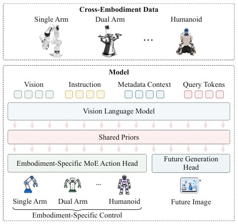

> *Generated by JarvisForResearchers Bot on 2026-08-10*

!!! tip "Why we featured this paper"
    Brand new preprint (2026) — accepted

## TL;DR
DyPES-VLA introduces a cross-embodiment Vision-Language-Action (VLA) framework that learns shared dynamics priors by predicting future states from multimodal inputs. It translates these shared priors into embodiment-specific controls using a Mixture-of-Experts (MoE) action head, thereby circumventing the necessity for manual action space alignment across diverse robotic morphologies.

## The Problem
Training a single, generalist policy capable of operating across heterogeneous robot embodiments using VLA models remains an open challenge. The core difficulties stem from two related issues: first, the underutilization of inherent shared dynamics priors that exist across diverse datasets of human and robot manipulation; and second, the substantial requirement for manual preprocessing to map embodiment-specific actions into a common, unified format suitable for a single policy.

Existing methodologies exhibit several limitations. Many current approaches restrict supervision solely to action prediction, which severely curtails the ability to leverage large corpora of unlabelled or sparsely labelled manipulation videos to extract robust, shared dynamics knowledge. Furthermore, methods that attempt to share information at the action level typically mandate manual mapping of heterogeneous controls into a common representation. This process often necessitates complex coordinate transformations or inverse kinematics, leading to poor scalability. Crucially, forcing disparate embodiments into a singular action format risks entangling fundamental interaction regularities—which should be shared—with the control semantics intrinsically unique to each robot's physical structure.

## Key Contributions
This work makes three primary contributions:
1. We propose a novel cross-embodiment learning paradigm designed to simultaneously learn abstract shared dynamics priors and generate embodiment-specific control policies.
2. We introduce DyPES-VLA, a system that learns these shared priors via future-supervised query states and realizes control through an embodiment-specific action head, entirely obviating the need for a common action format.
3. We demonstrate state-of-the-art performance across three distinct simulation benchmarks using a single checkpoint, establishing a transferable foundation for deploying policies across morphologies with varying physical characteristics.

## How It Works


*Figure 1 We propose a paradigm that learns from het-
erogeneous cross-embodiment data. Our DyPES-VLA
learns shared dynamics priors and embodiment-specific
control. The former is supervised by a future generation
head, and the latter is achieved by an MoE action head.*

DyPES-VLA operates by leveraging a pre-trained Vision-Language Model (VLM) to distill multimodal information—visual observations, natural language instructions, and embodiment metadata—into a set of shared query states, denoted as $Z$. These states serve as the central, embodiment-agnostic interface.

These query states $Z$ condition two parallel generative mechanisms. The first is the **Future Generation Head**, which, instantiated as a SANA image generator, is trained using a rectified-flow objective to synthesize future visual frames. This process effectively forces the model to learn the underlying, shared dynamics of the observed interactions. Concurrently, the same query states $Z$ condition the **Embodiment-Specific MoE Action Head**, which is implemented as a flow-matching Diffusion Transformer (DiT). This MoE head is designed to generate action chunks directly within each embodiment's native action space, utilizing statically routed experts.

The training proceeds in two distinct stages. Initially, the VLM and the Future Generation Head are pretrained exclusively on action-free videos to establish a strong foundation in visual-linguistic understanding and dynamics modeling. Subsequently, both heads are jointly optimized using action-labeled demonstrations. At inference time, the Future Generation Head is deactivated, relying solely on the learned dynamics priors encoded in $Z$ to guide the MoE action head.

### Vision Language Model (VLM)
The VLM serves as the initial encoder. It ingests the multimodal input stream, comprising visual observations, the textual instruction, and metadata describing the specific embodiment being considered. It processes these inputs alongside a set of learnable **Query Tokens (Q)**. The output of the VLM is the set of query states $Z \in \mathbb{R}^{N \times d_{VLM}}$, which encapsulate the necessary context for downstream prediction tasks.

### Query Tokens (Q)
These are learnable embedding vectors appended to the multimodal sequence fed into the VLM. Their role is to act as abstract placeholders that the VLM learns to condition upon, allowing the model to distill high-level, shared representations ($Z$) from the heterogeneous input data.

### Future Generation Head
This component is realized as a SANA image generator. It is conditioned directly on the shared query states $Z$. Its objective is to predict the subsequent frame given the current state and the instruction. This prediction is formalized using a rectified-flow objective, which compels the model to learn a latent representation of the system's dynamics independent of the specific control signals used to achieve the state transitions.

### Embodiment-Specific MoE Action Head
This head is implemented as a flow-matching Diffusion Transformer (DiT) and is conditioned on $Z$. Its critical feature is the use of statically routed experts. Instead of forcing all embodiments to use a single action space, the **Static Router** deterministically assigns each sample to a specific expert $r(e) \in \{1, \dots, K\}$ based on the embodiment metadata $m_e$. This routing ensures that the generation process for a specific robot morphology utilizes the expert best suited to its native action space.

### Static Router
The Static Router performs a deterministic assignment. Given the embodiment metadata $m_e$, it outputs a routing index $r(e)$. This index dictates which specific expert within the MoE structure will process the action generation for that particular embodiment, effectively isolating the control semantics to the appropriate expert.

### Per-Embodiment Encoder (Encr(e))
This lightweight encoder is responsible for preparing the noisy action chunk for the DiT within a specific embodiment $e$. It takes the noisy action chunk and the corresponding flow timestep as input, embedding them into a format suitable for the DiT's processing pipeline.

### Per-Embodiment Decoder (Decr(e))
The output from the DiT, which is an abstract representation of the action, must be translated back into a physically meaningful control signal. The Per-Embodiment Decoder maps the DiT's output back to a velocity vector $\mathbf{A}_e \in \mathbb{R}^{H_e \times d_e}$ that resides in the native action space of embodiment $e$.

## Results
The performance of DyPES-VLA across various benchmarks is summarized below:

| Metric | Value | Baseline | Source |
| :--- | :--- | :--- | :--- |
| Success Rate (LIBERO) | 98.0% | N/A | Section 4.1 |
| Success Rate (RoboCasa-GR1) | 59.25% | N/A | Section 4.1 |
| Success Rate (RoboTwin 2.0) | 89.02% | N/A | Section 4.1 |
| Average Success Rate (Real-World) | 75.6% | N/A | Section 4.1 |

## Why This Matters
The ability to learn shared dynamics priors from heterogeneous data is a significant step toward truly generalist robotics. By decoupling the learning of *what* the dynamics are (learned via future prediction) from *how* to execute them (learned via embodiment-specific MoE heads), DyPES-VLA achieves cross-embodiment generalization without the prohibitive engineering cost of manual action space harmonization. The practitioner takeaways highlight that future prediction offers a powerful, unsupervised signal for dynamics learning, while the MoE structure provides the necessary architectural flexibility to handle diverse kinematic constraints within a unified backbone.

## Limitations & Open Questions
Two primary limitations are noted. First, the reported results do not detail the model's performance when the Future Generation Head is utilized during inference, as the design mandates its removal for control execution. Second, the complexity introduced by the MoE action head—specifically the reliance on static routing and the inclusion of per-embodiment encoders and decoders—imposes a non-trivial architectural overhead compared to monolithic action heads. Future work should investigate dynamic routing mechanisms or explore the trade-offs associated with this architectural complexity.

---

## Citation

**Paper:** [2608.06374](https://arxiv.org/abs/2608.06374)

```bibtex
@article{260806374,
  title   = {DyPES-VLA: Learning Shared Dynamics Priors and Embodiment-Specific Control for Cross-Embodiment Manipulation},
  author  = {Junfeng Li and Junjie He and Zhide Zhong and Yangyang Zheng and Pingyue Sheng and Jiayu Dong et al.},
  journal = {arXiv preprint arXiv:2608.06374},
  year    = {2026},
  url     = {https://arxiv.org/abs/2608.06374}
}
```
