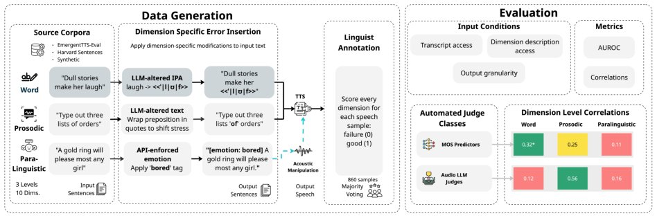

> *Generated by JarvisForResearchers Bot on 2026-08-12*

!!! tip "Why we featured this paper"
    Brand new preprint (2026) — accepted

## TL;DR
We introduce the first dimension-level meta-evaluation benchmark for Text-to-Speech (TTS) evaluators. This benchmark utilizes a linguistically grounded 10-dimension schema to audit the capabilities of existing MOS predictors and Audio-LLMs judges, demonstrating that current automated methods fail to reliably capture the distinct, interpretable aspects of speech quality.

## The Problem
It remains insufficiently clear how effectively automated Text-to-Speech (TTS) evaluation methods—specifically Mean Opinion Score (MOS) predictors and Audio Large Language Models (Audio-LLMs) judges—capture the granular, linguistically grounded aspects of speech that human listeners perceive. Current evaluation paradigms suffer from opacity: MOS predictors yield holistic quality signals without providing a diagnostic path when performance degrades, and LLM-based judges similarly produce holistic scores where the underlying perceptual drivers are obscured. Furthermore, existing benchmarks typically organize evaluation around broad scenario categories rather than a principled, fine-grained speech quality schema.

## Key Contributions
This work makes three primary contributions:
1. **Annotation Schema:** We present a linguistically grounded evaluation schema that decomposes the concept of naturalness into 10 distinct dimensions, grounded in phonological and phonetic attributes across word, prosodic, and paralinguistic levels.
2. **Meta-Evaluation Dataset:** We constructed a per-dimension annotated dataset comprising 860 utterances. These samples were meticulously labeled by trained linguist raters across all 10 defined dimensions.
3. **Dimension-Level Audit:** We conducted an evaluation of four neural MOS models and four Audio-LLMs judges across four distinct prompting conditions. This audit revealed significant heterogeneity in the phonetic, prosodic, and paralinguistic sensitivity of these automated judges.

## How It Works


*Figure 1: Dataset Construction Pipeline. Sentences from three sources (Harvard Sentences, EmergentTTS-Eval,
synthetic text) are fed through three error-generation pathways: LLM-modified plain text, LLM-modified IPA
transcriptions, and direct acoustic manipulation. All pathways pass through the TTS m*

The methodology involves constructing a benchmark by generating 860 utterances. These utterances are engineered to contain controlled errors specifically targeting the 10 dimensions defined in our schema. Error introduction is achieved via three distinct pathways: LLM-altered IPA, LLM-altered plain text, and direct Acoustic Manipulation. Following generation, these samples are annotated by three expert linguists. The subsequent evaluation audits four neural MOS predictors and four Audio-LLMs judges under four systematic prompting conditions. Performance is quantified using Kendall’s $\tau_b$, which measures the correlation between the model's predicted binary ground-truth label for a specific dimension and the actual human judgment for that dimension.

### Annotation Schema
The **Annotation Schema** operationalizes the concept of naturalness into 10 measurable attributes. These dimensions are categorized based on the linguistic level of the error:
*   **Word-level:** Phonetic Accuracy and Lexical Stress.
*   **Prosodic-level:** Intonation, Prosodic Stress, Prosodic Boundary Appropriateness, and Speech Rate Appropriateness.
*   **Paralinguistic-level:** Emotional Appropriateness, Expressiveness, Human Plausibility, and Speaker Identity Consistency.

### Error Generation Pathways
To ensure targeted testing, we employed three **Error Generation Pathways**:
*   **LLM-altered IPA:** This pathway was used to introduce errors specifically targeting Phonetic Accuracy and Lexical Stress.
*   **LLM-altered plain text:** This method was employed to induce errors related to Prosodic Stress and Prosodic Boundary Placement.
*   **Acoustic Manipulation:** This pathway was utilized to introduce perturbations affecting Intonation, Speech Rate, Expressiveness, Speaker Identity Consistency, and Human Plausibility.

### Automated Judges
We evaluated two classes of **Automated Judges**:
*   **Neural MOS predictors:** This group included four established models: UTMOSv2, DNSMOS-Pro, NISQA, and Audiobox-Aesthetics.
*   **Audio-LLMs judges:** This group comprised four different LLM implementations, such as Gemini 3.5 Flash and Qwen3 Omni.

### Prompting Conditions
The evaluation was structured around four **Prompting Conditions** to isolate the influence of the evaluation interface:
*   **Condition 1 (Underspecified MOS-style prompt):** A standard, holistic scoring prompt.
*   **Condition 2a (Schema-guided prompt, single score):** A prompt referencing the schema but requesting only a single, aggregate score.
*   **Condition 2b (Schema-guided prompt, per-dimension scores):** A prompt explicitly requesting scores for each of the 10 dimensions.
*   **Condition 3 (Isolated per-dimension prompts):** Prompts designed to test sensitivity to a single, specific dimension in isolation.

## Results
The dimension-level audit revealed significant variance in the ability of the judges to track human judgments across specific attributes.

| Metric | Value | Baseline | Source |
| :--- | :--- | :--- | :--- |
| Kendall’s $\tau_b$ | 0.606*** | N/A | Table 3 |
| Kendall’s $\tau_b$ | -0.615*** | N/A | Table 3 |
| Kendall’s $\tau_b$ | 0.412*** | N/A | Table 3 |

## Why This Matters
The findings underscore a critical limitation in current TTS evaluation: automated evaluators do not reliably capture the full spectrum of linguistically structured speech errors. Specifically, MOS predictors appear to correlate more strongly with general acoustic signal quality, whereas Audio-LLMs judges exhibit a detection capability that is highly selective and contingent upon the prompting strategy employed. This benchmark provides the necessary infrastructure to move beyond opaque holistic scores, enabling researchers to attribute TTS system failures to specific, interpretable linguistic dimensions.

## Limitations & Open Questions
A primary limitation is that neither the tested MOS predictors nor the Audio-LLMs judges demonstrated reliable error detection across all 10 dimensions under any of the tested conditions. Furthermore, the observed performance of Audio-LLMs judges is demonstrably selective and prompt-dependent, suggesting a lack of generalized perceptual understanding across the entire schema. Future work must address how to stabilize the sensitivity of LLM judges across diverse linguistic error types.

---

## Citation

**Paper:** [2608.09930](https://arxiv.org/abs/2608.09930)

```bibtex
@article{260809930,
  title   = {Beyond Naturalness: Probing Automated Text-To-Speech Evaluators on Linguistically Grounded Dimensions},
  author  = {Oluwanifemi Bamgbose and Simon Rosen and Jash Shah and Lindsay Devon Brin and Hoang H Nguyen and Anke Koelzer et al.},
  journal = {arXiv preprint arXiv:2608.09930},
  year    = {2026},
  url     = {https://arxiv.org/abs/2608.09930}
}
```
