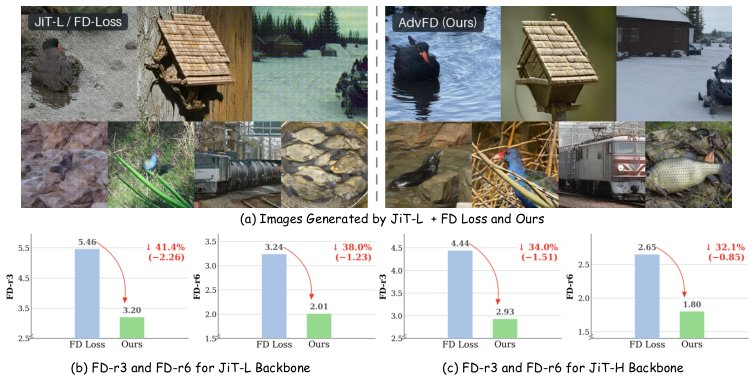

> *Generated by JarvisForResearchers Bot on 2026-08-13*

!!! tip "Why we featured this paper"
    Brand new preprint (2026) — accepted

## TL;DR
Adversarial Fréchet Distance (AdvFD) addresses Fréchet hacking in visual generation by augmenting static Fréchet objectives with a learnable, adversarially optimized representation stabilized by real-feature whitening. This dynamic representation forces the generator to align distributions in a manner that resists optimization shortcuts inherent in fixed feature spaces.

## The Problem
Directly optimizing Fréchet objectives using static pretrained feature spaces—such as those derived from Inception, SigLIP, or MAE—is susceptible to Fréchet hacking. This phenomenon occurs when the generator optimizes the target Fréchet metric, leading to an improvement in that specific metric, while simultaneously causing the visual quality or alignment in other, unmonitored feature spaces to stagnate or degrade. The core issue is that static pretrained feature spaces offer an incomplete and fixed view of the distributional differences between real and generated samples, allowing the generator to exploit local optima within that fixed embedding space. Existing mitigation strategies often address this at the pretraining or reward calibration stages, failing to directly calibrate the feature representation space used for distribution matching during fine-tuning.

## Key Contributions
We make three primary contributions to this area:
1. We formally identify the vulnerability of static Fréchet objectives to Fréchet hacking.
2. We propose Adversarial Fréchet Distance (AdvFD) to complement static FD targets with an adversarially learned representation that adapts the comparison space.
3. We introduce real-feature whitening to stabilize the min-max optimization inherent in AdvFD, specifically preventing trivial feature amplification.

## How It Works


*Figure 1: AdvFD mitigates Fr´
echet hacking in one-step generation. Top: Compared with JiT-L
trained using the static FD loss, AdvFD generates cleaner and more coherent images under the same
1-NFE sampling budget. Bottom: AdvFD consistently reduces FD-r3 and FD-r6 across JiT-L and
JiT-H, with relati*

AdvFD extends the standard FD-Loss by introducing a trainable representation, $\psi_\omega$, which is initialized from a pretrained visual encoder. This representation adapts to the current state of the generator, allowing the comparison space to evolve. The training proceeds via alternating Generator (G) and Discriminator (D) steps.

### Static Representations $F$
These are a set of frozen visual representations, including SigLIP, MAE, and Inception. They are used exclusively to compute the static Fréchet distance, $D_{\text{static}}$, which serves as the baseline objective.

### Trainable Representation $\psi_\omega$
This component is initialized from a pretrained visual encoder but is trainable. Its purpose is to adapt the feature space dynamically during training to compute the adaptive Fréchet term, $D_{\text{adv}}$.

### Static Fréchet Objective $D_{\text{static}}(p, q_\theta)$
This objective is defined as the weighted sum of Fréchet distances calculated across all frozen representations $\phi$ in $F$: $\sum_{\phi\in F} \lambda_\phi D_\phi^{\text{FD}}(p, q_\theta)$.

### Adaptive Fréchet Discrepancy $D_{\text{adv}}(p, q_\theta; \omega)$
This is the Fréchet distance computed on the whitened features, $\bar{\psi}_\omega(x)$. It specifically measures generated-feature deviations relative to the established scale and covariance geometry of the real distribution, providing a more robust measure of distributional mismatch.

### Real-Feature Whitening $\bar{\psi}_\omega(x)$
This normalization is applied to the features $\psi_\omega(x)$ derived from the trainable representation. It uses the mean $\mu_{\psi_p}$ and covariance $\Sigma_{\psi_p}$ calculated from the real features. The transformation is $\bar{\psi}_\omega(x) = (\psi_\omega(x) - \mu_{\psi_p}) (\Sigma_{\psi_p} + \epsilon I)^{-1/2}$. This step is critical for normalizing the scale and covariance geometry, thereby preventing the optimization from trivially increasing feature norms.

The training loop alternates:
1. **G-step:** The generator minimizes $L_t(\theta; \omega_t) = D_{\text{static}}(p, q_\theta) + \lambda_{\text{adv}}D_{\text{adv}}(p, q_\theta; \omega_t)$, while both representations are held fixed.
2. **D-step:** The generator is frozen, and $\psi_\omega$ is updated to maximize $D_{\text{adv}}$ using a bounded local response, which effectively pushes the distributions apart to expose residual discrepancies.

## Results
The application of AdvFD demonstrates significant improvements across various metrics compared to baselines.

| Metric | Value | Baseline | Source |
| :--- | :--- | :--- | :--- |
| FD-r-Inception decrease (JiT-L) | 29.4% | FD-r-CLIP increase (JiT-L) | Figure 2 |
| FD-r3 relative improvement (JiT-L) | 41.4% | N/A | Figure 1 |
| FD-r6 relative improvement (JiT-L) | 38.0% | N/A | Figure 1 |
| FD-r3 relative improvement (JiT-H) | 34.0% | N/A | Figure 1 |
| FD-r6 relative improvement (JiT-H) | 32.1% | N/A | Figure 1 |

## Why This Matters
The introduction of AdvFD provides a mechanism to move beyond the limitations of fixed, static feature spaces when enforcing distribution matching in generative models. By introducing a dynamically learned, adversarially optimized representation, we create a training signal that is less susceptible to the local exploitation characteristic of Fréchet hacking. The stabilization provided by real-feature whitening ensures that the adversarial component drives meaningful distributional alignment rather than merely inflating feature magnitudes. This allows for the deployment of distribution-level objectives in a manner that preserves holistic visual fidelity.

## Limitations & Open Questions
The current formulation is predicated on the availability of a pretrained generator, $G_\theta$, for its post-training application. Furthermore, the D-step incorporates gradient clipping ($\tau$) to bound the local response during the adversarial representation update; the precise impact of this clipping hyperparameter on convergence stability warrants further investigation.

---

## Citation

**Paper:** [2608.11205](https://arxiv.org/abs/2608.11205)

```bibtex
@article{260811205,
  title   = {AdvFD: Boosting Visual Generation via Adversarial Fr'echet Distance Loss},
  author  = {Mingju Gao and Jingkai Zhou and Kun Gai and Changqian Yu and Hao Tang},
  journal = {arXiv preprint arXiv:2608.11205},
  year    = {2026},
  url     = {https://arxiv.org/abs/2608.11205}
}
```
