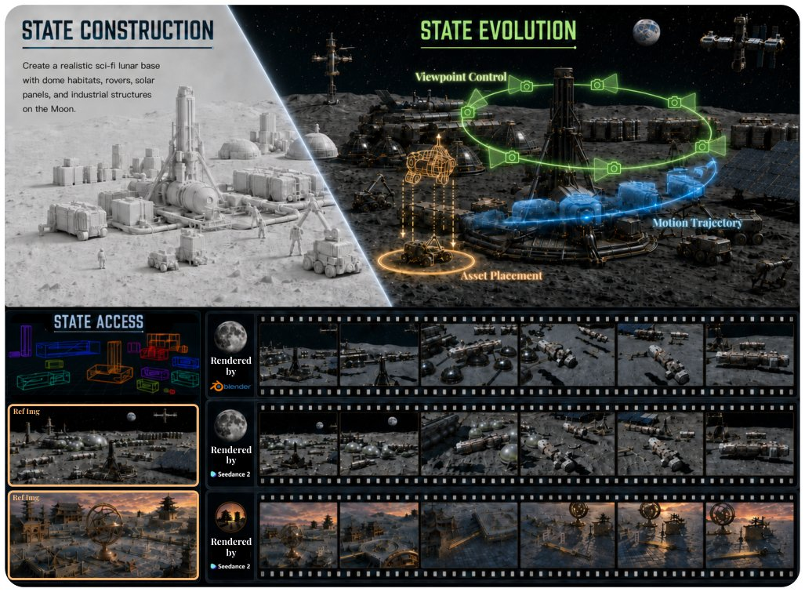

> *Generated by JarvisForResearchers Bot on 2026-08-14*

!!! tip "Why we featured this paper"
    Brand new preprint (2026) — accepted

## TL;DR
StateFlow reframes generative previsualization from one-shot synthesis to persistent 3D world-state modeling. It constructs, evolves, and accesses editable 3D worlds by unifying initialization (Prior-Guided Conflict-Aware Dual-View Initialization), evolution (Intent-Guided Structured State Transition), and viewing (World-State Camera Planning with Render-Feedback Reflection) around a core Structured 3D State ($W_t$).

## The Problem
Existing generative methods are fundamentally limited by their one-shot nature. They accept a prompt and produce a single image or video sequence, offering minimal control over the resulting scene. This paradigm fails to provide a persistent, editable state for local modifications—be it altering object placement, changing scene style, or planning subsequent camera movements. Furthermore, traditional 3D scene generation often treats scene construction as a terminal step, neglecting the necessary modeling of how that scene evolves or how it should be repeatedly accessed via controlled viewpoints. Agentic systems, while capable of sequential action, typically rely on high-level scripts rather than maintaining a unified, granular 3D representation of objects, their relationships, motion, and the camera itself.

## Key Contributions
We introduce a new formulation of generative previsualization centered on persistent 3D world-state modeling, shifting the objective from achieving a single visual output to constructing an editable, evolvable, and reusable 3D world. We propose StateFlow, a unified framework that manages the construction, evolution, and access of these 3D states through three coupled mechanisms: prior-guided initialization, intent-guided state transition, and render-feedback camera planning. Finally, we demonstrate that this approach yields high-quality, fine-grained results while naturally supporting complex workflows, including storyboard generation, shot planning, and 3D game prototyping.

## How It Works


*Figure 1. StateFlow turns a creative prompt into a complete, editable 3D world. Creators can construct scenes from reference images,
expand environments, change visual styles, control object motion, stage dynamic events, and direct cinematic cameras through high-
level intent. The same persistent wo*

StateFlow models the previsualization process as a sequence of state transformations: $W_0 = F_{build}(C)$, $W_{t+1} = F_{evolve}(W_t)$, and $y_t = F_{access}(W_t)$.

### Structured 3D State ($W_t$)
This is the central data structure. $W_t$ is defined as a set of object entities, $W_t = \{o_i\}_{i=1}^{N_t}$. Each entity $o_i$ is fully characterized by its geometry ($g_i$), its precise spatial placement ($p_i$), and its semantic attributes ($s_i$). This structured representation allows for precise, symbolic manipulation rather than relying solely on pixel-level diffusion.

### Prior-Guided Conflict-Aware Dual-View Initialization
This component handles the initial construction of the world state, $W_0$, from initial 2D inputs. It addresses the inherent ambiguity when fusing information from different views. We combine front-view semantic grounding with BEV (Bird's Eye View) spatial grounding. A Vision-Language Model (VLM) is employed to instantiate semantic-physical knowledge priors, which is critical for resolving conflicts that arise when the front-view appearance contradicts the BEV layout information.

### Intent-Guided Structured State Transition
This mechanism governs the evolution of the world state, $W_{t+1}$, from $W_t$. Instead of regenerating the entire scene, this component translates high-level user intent—such as "move the chair to the window" or "change the style to cyberpunk"—into compact, targeted updates applied directly to the structured state table. This supports local modifications, including scene expansion, style alterations, object pose/motion edits, and event-level asset substitution, without requiring a full world regeneration.

### World-State Camera Planning with Render-Feedback Reflection
This component manages the access phase, $y_t$, which generates the visual output. It couples proposals generated by a VLM regarding desirable camera viewpoints with a geometry-faithful rendering pipeline. The rendering output is then used in a feedback loop to guide local repairs and refine the proposed camera trajectories, ensuring that the resulting paths are not only aesthetically pleasing but also geometrically feasible within the current state $W_t$.

## Results
(No quantitative results were provided in the outline.)

## Why This Matters
The shift to a state-centric paradigm is crucial for moving generative AI from a novelty demonstration to a practical engineering tool. By maintaining an explicit, persistent 3D world state, StateFlow enables iterative design loops that are impossible with one-shot synthesis. The ability to decouple world evolution from full regeneration via structured state transitions drastically improves computational efficiency for local edits. Furthermore, the integration of dual-view inputs with VLM priors provides a robust mechanism for initializing complex, grounded 3D scenes from heterogeneous data.

## Limitations & Open Questions
The provided excerpt does not contain quantitative performance metrics, precluding a detailed analysis of empirical gains. Additionally, while the use of render-feedback mitigates some semantic ambiguities inherent in VLM reliance, the computational complexity associated with integrating and querying large-scale VLM semantics within the state transition logic remains a significant factor requiring further optimization.

---

## Citation

**Paper:** [2608.12314](https://arxiv.org/abs/2608.12314)

```bibtex
@article{260812314,
  title   = {StateFlow: Building, Evolving, and Accessing 3D World States for Previsualization},
  author  = {Yuyang Yin and Zixiang Li and Longxuan Deng and Hongkai Li and Shifang Zhao and Junnan Liu et al.},
  journal = {arXiv preprint arXiv:2608.12314},
  year    = {2026},
  url     = {https://arxiv.org/abs/2608.12314}
}
```
