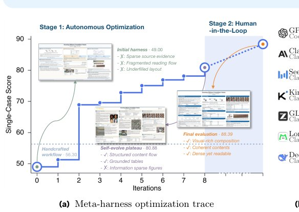

> *Generated by JarvisForResearchers Bot on 2026-08-15*

!!! tip "Why we featured this paper"
    Brand new preprint (2026) — accepted

## TL;DR
AutoDesign introduces a meta-harness optimization framework that enables a code agent to recursively refine a design harness. This framework transforms a static system into a self-improving entity capable of producing long-horizon, human-aligned multimodal artifacts, such as academic posters, by iteratively updating the harness components based on rollout feedback.

## The Problem
The challenge in modern multimodal design is not merely generating a single, high-quality output, but establishing a persistent, production-ready capability that adheres to complex human alignment criteria. Existing benchmarks typically evaluate isolated aspects of the output—such as layout quality, information extraction faithfulness, or visual aesthetics—in a static manner. Furthermore, prior work often treats human feedback as transient noise rather than actionable knowledge that can improve the underlying generation process. While some systems optimize declarative components or search code workflows, they fail to systematically update a reusable, end-to-end design harness based on the cumulative results of execution trajectories.

## Key Contributions
We introduce three primary contributions to address these gaps:

1. **AutoDesign:** A meta-harness optimization framework that evolves a static design harness into a recursively improving system specifically tailored for human-aligned multimodal design tasks.
2. **DesignHarness:** The concrete, executable system built by AutoDesign. This harness integrates editable generation capabilities with rendering pipelines, rule-based validation, and visual critic feedback to facilitate localized, targeted revisions.
3. **PosterBench:** A comprehensive evaluation protocol designed for paper-to-poster tasks. It employs a seven-dimensional rubric covering faithfulness, coverage, density, visual evidence, layout, readability, and aesthetics.

## How It Works


*Figure 1 AutoDesign progressively improves the design harness and the quality of the artifacts. (a) Score of the poster
generated by the design harness for one representative paper, tracked across meta-harness iterations. Autonomous
optimization improves the initial harness before reaching a plateau*

AutoDesign operates through a nested loop structure. The inner loop is governed by the **Design Harness (H)**, which transforms a multimodal source $x$ and context $c$ into a human-facing artifact $y$ via an execution trajectory $\pi$. This inner loop involves the **Designer (Mdesign)** generating or revising $y_k$, and the **Critic (Mcritic)** evaluating $y_k$ to produce feedback $f_k$ for the next iteration.

The outer loop is managed by the **Meta-Harness Optimizer (P)**. P analyzes the evaluation results derived from the trajectories $\pi$ across multiple tasks. Based on this analysis, P proposes a bounded update to one of the five **Functional Components (of H)**. This proposed update is then passed through an **Acceptance Gate**. The Gate enforces a strict criterion: the update must yield a measurable training gain while simultaneously preserving performance on the development set. Successful updates accumulate, leading to the progressive refinement of the **DesignHarness**.

### Design Harness (H)
The Design Harness (H) serves as the operational wrapper around a fixed generative model. Its function is to manage the entire process of transforming the multimodal source $x$ into the final artifact $y$ by orchestrating a sequence of operations defined by the execution trajectory $\pi$.

### Meta-Harness Optimizer (P)
The Meta-Harness Optimizer (P) is the supervisory layer. Its role is not to generate content, but to improve the *process* of content generation. It treats the harness $H$ as the object of optimization, aiming to maximize the expected quality $J(H)$ by intelligently modifying its internal structure.

### Functional Components (of H)
The harness $H$ is modularized into five distinct **Functional Components (of H)**: Context and Memory, Tools and Specifications, Execution Runtime, Orchestration, and Evaluation and Feedback. The Meta-Harness Optimizer (P) targets updates to these discrete components.

### Designer (Mdesign)
The Designer (Mdesign) is the generative engine within the inner loop. It is responsible for the actual creation and revision of the artifact $y_k$, utilizing the current state and the feedback $f_k$ provided by the Critic.

### Critic (Mcritic)
The Critic (Mcritic) operates in the inner loop to provide evaluative signals. It assesses the current artifact state $y_k$ against the required criteria derived from the source $x$ and context $c$, generating the necessary feedback $f_k$ to guide the Designer.

### Acceptance Gate
The Acceptance Gate acts as a stability constraint on the optimization process. It prevents catastrophic forgetting or overfitting by ensuring that any proposed modification to $H$ is validated against both the training set (requiring a gain) and the development set (requiring performance retention).

## Results
The application of AutoDesign resulted in measurable improvements across the evaluation protocol.

| Metric | Value | Baseline | Source |
| :--- | :--- | :--- | :--- |
| PosterBench Score (Main Track) | 78.32 | Claude Design | Section 5 |
| PosterBench Score (PosterBench-mini) | 67.39 | 54.99 | Section 1 |
| Average PosterBench Score Improvement | +12.4% | 54.99 | Section 1 |
| Autonomous Loop Execution | 253 tool calls and 11 editing turns within 40 minutes for under $3 | N/A | Section 1 |

## Why This Matters
The AutoDesign framework shifts the paradigm from prompt engineering or model fine-tuning to *system engineering* for AI agents. By optimizing the harness—the surrounding control flow, validation logic, and component interaction—we achieve robust, long-horizon performance gains without requiring expensive retraining of the core LLM. This methodology provides a blueprint for building reliable, production-grade agents capable of complex, iterative tasks where the final output quality depends on the entire workflow, not just the final token generation.

## Limitations & Open Questions
Currently, the **PosterBench** evaluation protocol is specifically tailored for poster generation. Furthermore, the scope of the updates proposed by the **Meta-Harness Optimizer (P)** is restricted to modifying one selected **Functional Components (of H)** per optimization step. Future work must address generalizing the update mechanism across multiple components simultaneously and expanding the evaluation scope beyond static poster artifacts.

---

## Citation

**Paper:** [2608.13560](https://arxiv.org/abs/2608.13560)

```bibtex
@article{260813560,
  title   = {AutoDesign: Meta-Harness Optimization for Long-Horizon Agentic Design},
  author  = {Yaxin Luo and Haobin Jiang and Jialv Zou and Xu Huang and Wenhao Yan and Haodong Li et al.},
  journal = {arXiv preprint arXiv:2608.13560},
  year    = {2026},
  url     = {https://arxiv.org/abs/2608.13560}
}
```
